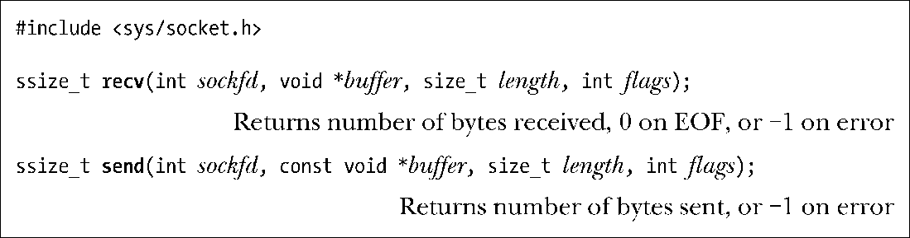

### 61.3　专用于套接字的I/O系统调用：recv()和send()

recv()和send()系统调用可在已连接的套接字上执行I/O操作。它们提供了专属于套接字的功能，而这些功能在传统的read()和write()系统调用中是没有的。

recv()和send()的返回值以及前3个参数同read()和write()一样。最后一个参数flags是一个位掩码，用来修改I/O操作的行为。对于recv()来说，该参数可以为下列值相或的结果。

##### MSG_DONTWAIT

让recv()以非阻塞方式执行。如果没有数据可用，那么recv()不会阻塞而是立刻返回，伴随的错误码为EAGAIN。我们可以通过fcntl()把套接字设为非阻塞模式（O_NONBLOCK）从而达到相同的效果。区别在于MSG_DONTWAIT允许我们在每次调用中控制非阻塞行为。

##### MSG_OOB

在套接字上接收带外数据。我们将在61.13.1节中简要描述这个特性。

##### MSG_PEEK

从套接字缓冲区中获取一份请求字节的副本，但不会将请求的字节从缓冲区中实际移除。这份数据稍后可以由其他的recv()或read()调用重新读取。

##### MSG_WAITALL

通常，recv()调用返回的字节数比请求的字节数（由length参数指定）要少，而那些字节实际上还在套接字中。指定了MSG_WAITALL标记后将导致系统调用阻塞，直到成功接收到length个字节。但是，就算指定了这个标记，当出现如下情况时，该调用返回的字节数可能还是会少于请求的字节。这些情况是：（a）捕获到一个信号；（b）流式套接字的对端终止了连接；（c）遇到了带外数据字节（参见61.13.1节）；（d）从数据报套接字接收到的消息长度小于length个字节；（e）套接字上出现了错误。（MSG_WAITALL标记可以取代我们在程序清单61-1中给出的readn()函数，区别在于我们实现的readn()函数在被信号处理例程中断后会重新得到调用。）

除了MSG_DONTWAIT之外，以上所有标记都在SUSv3中有规范。MSG_DONTWAIT也存在于其他一些UNIX实现中。这个标记加入到套接字API的时间比较晚，在一些老式的实现中并不存在。

对于send()，flags参数可以是以下值相或的结果。

##### MSG_DONTWAIT

让send()以非阻塞方式执行。如果数据不能立刻传输（因为套接字发送缓冲区已满），那么该调用不会阻塞，而是调用失败，伴随的错误码为EAGAIN。和recv()一样，可以通过对套接字设定O_NONBLOCK标记来实现同样的效果。

##### MSG_MORE（从Linux 2.4.4开始）

在TCP套接字上，这个标记实现的效果同套接字选项TCP_CORK（见61.4节）完成的功能相同。区别在于该标记可以在每次调用中对数据进行栓塞处理。从Linux 2.6版以来，这个标记也可以用于数据报套接字，但所代表的意义有所不同。在连续的send()或sendto()调用中传输的数据，如果指定了MSG_MORE标记，那么数据会打包成一个单独的数据报。仅当下一次调用中没有指定该标记时数据才会传输出去。（Linux也提供了类似的UDP_CORK套接字选项，这将导致在连续的send()或sendto()调用中传输的数据会累积成一个单独的数据报，当取消UDP_CORK选项时才会将其发送出去。）MSG_MORE标记对UNIX域套接字没有任何效果。

##### MSG_NOSIGNAL

当在已连接的流式套接字上发送数据时，如果连接的另一端已经关闭了，指定该标记后将不会产生SIGPIPE信号。相反，send()调用会失败，伴随的错误码为EPIPE。这和忽略SIGPIPE信号所得到的行为相同。区别在于该标记可以在每次调用中控制信号发送的行为。

##### MSG_OOB

在流式套接字上发送带外数据。参见61.13.1节。

以上标记中只有MSG_OOB在SUSv3中有规范。MSG_DONTWAIT标记也在其他一些UNIX实现中出现过，而MSG_NOSIGNAL和MSG_MORE都是Linux专有的。

send(2)和recv(2)的用户手册页中还描述了一些这里没有介绍到的标记。

