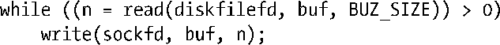
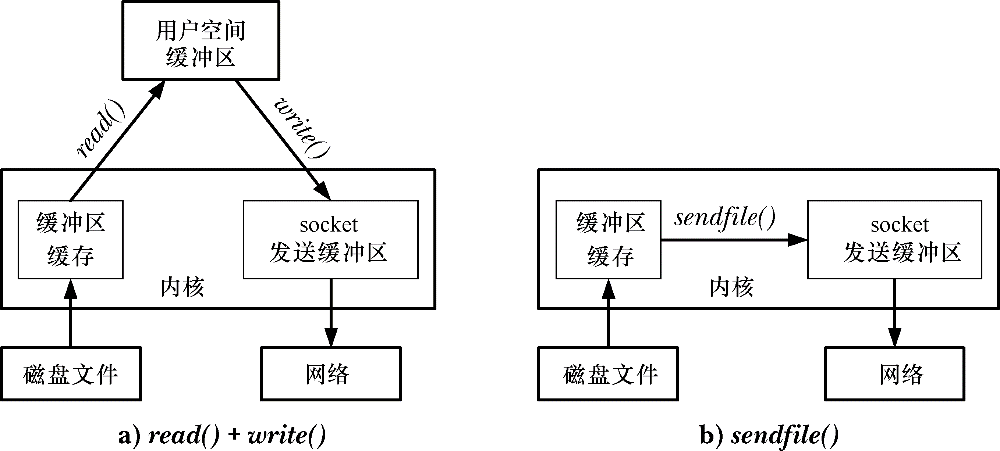
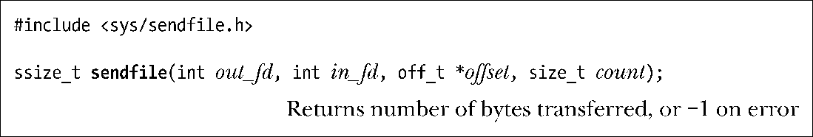
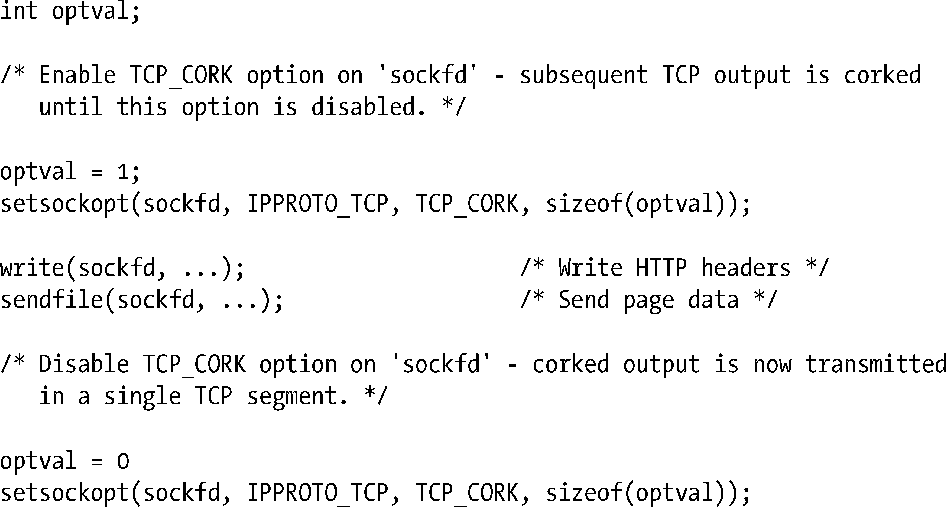

### 61.4　sendfile()系统调用

像Web服务器和文件服务器这样的应用程序常常需要将磁盘上的文件内容不做修改地通过（已连接）套接字传输出去。一种方法是通过循环按照如下方式处理。

对于许多应用程序来说，这样的循环是完全可接受的。但是，如果我们需要通过套接字频繁地传输大文件的话，这种技术就显得很不高效。为了传输文件，我们必须使用两个系统调用（可能需要在循环中多次调用）：一个用来将文件内容从内核缓冲区cache中拷贝到用户空间，另一个用来将用户空间缓冲区拷贝回内核空间，以此才能通过套接字进行传输。图61-1的左侧展示了这种场景。如果应用程序在发起传输之前根本不对文件内容做任何处理的话，那么这种两步式的处理就是一种浪费。系统调用sendfile()被设计为用来消除这种低效性。如图61-1右侧所示，当应用程序调用sendfile()时，文件内容会直接传送到套接字上，而不会经过用户空间。这种技术被称为零拷贝传输（zero-copy transfer）。

<b class="my_markdown">图61-1：将文件内容传送到套接字上</b>

系统调用sendfile()在代表输入文件的描述符in_fd和代表输出文件的描述符out_fd之间传送文件内容（字节）。描述符out_fd必须指向一个套接字。参数in_fd指向的文件必须是可以进行mmap()操作的。在实践中，这通常表示一个普通文件。这些局限多少限制了sendfile()的使用。我们可以使用sendfile()将数据从文件传递到套接字上，但反过来就不行。另外，我们也不能通过sendfile()在两个套接字之间直接传送数据。

> 如果sendfile()可以用来在两个普通文件之间传送字节，也可以获得性能上的优势。在Linux 2.4及早期版本中，out_fd是可以指向一个普通文件的。内核底层实现做了修改之后意味着这种用法在2.6版的内核中消失了。但是，这个功能在今后的内核版本中可能会重新启用。

如果参数offset不是NULL，它应该指向一个off_t值，该值指定了起始文件的偏移量，意即从in_fd指向的文件的这个位置开始，可以传输字节。这是一个传入传出参数（又叫值一结果参数）。在返回的值中，它包含从in_fd传输过来的紧靠着最后一个字节的下一个字节的偏移量①。在这里，serdfile()不会更改in_fd的文件偏移量。

如果参数offset指定为NULL的话，那么从in_fd传输的字节就从当前的文件偏移量处开始，且在传输时会更新文件偏移量以反映出已传输的字节数。

参数count指定了请求传输的字节数。如果在count个字节完成传输前就遇到了文件结尾符，那么只有文件结尾符之前的那些字节能传输。调用成功后，sendfile()会返回实际传输的字节数。

SUSv3中并没有指定sendfile()。还有几种不同版本的sendfile()在其他UNIX实现中也存在，但参数列表一般同Linux下的sendfile()不同。

> 从2.6.16版内核开始，Linux提供了3个新的（非标准的）系统调用——splice()，vmsplice()以及tee()——这些系统调用提供了sendfile()功能的超集。请参见用户手册页以获得更多细节。

#### TCP_CORK套接字选项

要进一步提高TCP应用使用sendfile()时的性能，采用Linux专有的套接字选项TCP_CORK常常会很有帮助。例如，Web服务器传送页面给浏览器，作为对请求的响应。Web服务器的响应由两部分组成：HTTP首部，也许会通过write()来输出；页面数据，可以通过sendfile()来输出。在这种场景下，通常会传输2个TCP报文段：HTTP首部在第一个（非常小）报文段中，而页面数据在第二个报文段中发送。这对网络带宽的利用率是不够高效的。可能还会在发送和接收TCP报文时做些不必要的工作，因为在许多情况下HTTP首部和页面数据都比较小，足以容纳在一个单独的TCP报文段中。套接字选项TCP_CORK正是被设计为用来解决这种低效性。

当在TCP套接字上启用了TCP_CORK选项后，之后所有的输出都会缓冲到一个单独的TCP报文段中，直到满足以下条件为止：已达到报文段的大小上限、取消了TCP_CORK选项、套接字被关闭，或者当启用TCP_CORK后，从写入第一个字节开始已经经历了200毫秒。（如果应用程序忘记取消TCP_CORK选项，那么超时时间可确保被缓冲的数据能得以传输。）

我们通过setsockopt()系统调用（见61.9节）来启用或取消TCP_CORK选项。下面的代码（省略错误检查）说明了在我们假想的HTTP服务器例子中应该如何使用TCP_CORK选项。

在我们的应用中，通过构建一个单独的数据缓冲区，可以避免出现需要发送两个报文段的情况，之后可以通过一个单独的write()将缓冲区数据发送出去。（可选的方式是，我们可以通过writev()将两个独立的缓冲区结合为一次单独的输出操作。）但是，如果我们希望将sendfile()的零拷贝高效性和传输文件数据时在第一个报文段中包含HTTP首部信息的能力结合起来的话，那么我们需要用到TCP_CORK。

> 在61.3节中，我们提到MSG_MORE标记提供了同TCP_CORK相似的功能，只是MSG_MORE是基于每次调用的（即，可以在每次调用中调整，而TCP_CORK是全局性的）。这并不一定是优点。我们可能会在套接字上设定TCP_CORK选项，之后通过调用另一个程序在继承而来的文件描述符上执行输出，此时不必知道TCP_CORK选项的存在。与之相反，如果使用MSG_MORE的话，需要显式地修改程序的源代码。
> FreeBSD中的TCP_NOPUSH选项提供了类似于TCP_CORK的功能。

