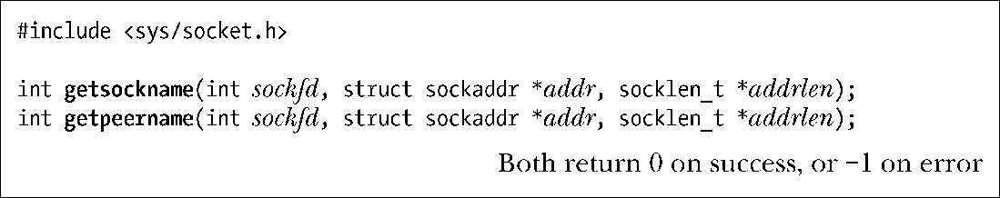
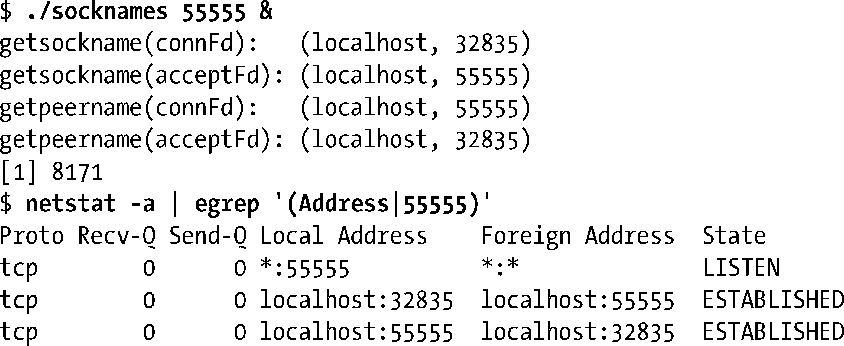
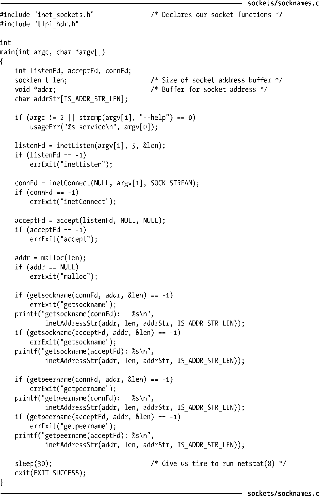

### 61.5　获取套接字地址

getsockname()和getpeername()这两个系统调用分别返回本地套接字地址以及对端套接字地址。

对于这两个系统调用，sockfd 表示指向套接字的文件描述符，而 addr 是一个指向sockaddr 结构体的指针，该结构体包含着套接字的地址。这个结构体的大小和类型取决于套接字域。Addrlen 是一个保存结果值的参数。在执行调用之前，addrlen 应该被初始化为addr所指向的缓冲区空间的大小。调用返回后，addrlen 中包含实际写入到这个缓冲区中的字节数。

getsockname()可以返回套接字地址族，以及套接字所绑定到的地址。如果套接字绑定到了另一个程序（比如inetd(8)），且套接字文件描述符在经过exec()调用后仍然得到保留，那么此时getsockname()就能派上用场了。

当隐式绑定到一个Internet域套接字上时，如果我们想获取内核分配给套接字的临时端口号，那么调用getsockname()也是有用的。内核会在出现如下情况时执行一个隐式绑定。

+ 已经在TCP套接字上执行了connect()或listen()调用，但之前还没有通过bind()绑定到一个地址上。
+ 当在UDP套接字上首次调用sendto()时，该套接字之前还没有绑定到地址上。
+ 调用bind()时将端口号（sin_port）指定为0。这种情况下bind()会为套接字指定一个IP地址，但内核会选择一个临时的端口号。

系统调用getpeername()返回流式套接字连接中对端套接字的地址。如果服务器想找出发出连接的客户端地址，这个调用就特别有用，主要用于TCP套接字上。对端套接字的地址信息也可以在执行accept()时获取，但是如果服务器进程是由另一个程序调用的，而accept()是由该程序（比如inetd）所执行，那么服务器进程可以继承套接字文件描述符，但由accept()返回的地址信息就不存在了。

程序清单61-3中的程序说明了getsockname()和getpeername()的用法。该程序用到了我们在程序清单59-9中定义的函数，程序执行如下的步骤。

**1．** 通过inetListen()函数创建监听套接字listenFd，并绑定到通配IP地址上，端口号通过程序的命令行参数指定。（端口号可以以数字方式指定，也可以通过服务名称指定。）参数len返回该套接字域的地址结构体的长度。稍后会将len返回的值传递给malloc()以分配一段缓冲区空间，这段空间用来保存getsockname()和getpeername()所返回的套接字地址。

**2．** 通过inetConnect()函数创建第二个套接字connFd。该套接字用来向第1步中创建的监听套接字发起连接请求。

**3．** 在监听套接字上调用accept()以创建第3个套接字acceptFd。该套接字同前一步中创建的套接字之间建立起连接。

**4．** 调用getsockname()和getpeername()获取本地（connFd）和对端（acceptFd）套接字的地址。在这两个调用之后，程序通过inetAddressStr()函数将套接字地址转换为可打印的形式。

**5．** 让程序休眠几秒钟，这样我们可以运行netstat程序以确认套接字地址信息。（我们将在61.7节中描述netstat。）

下面的shell会话展示了运行该程序的例子。

根据上面的输出，我们可以看到连接套接字（connFd）绑定到了临时端口32835上。netstat命令为我们展示出了由程序创建的3个套接字的所有相关信息，并允许我们对两个连接套接字的端口信息进行确认，这两个套接字都处于ESTABLISHED状态（参见61.6.3节中描述）。

程序清单61-3：使用getsockname()和getpeername()

