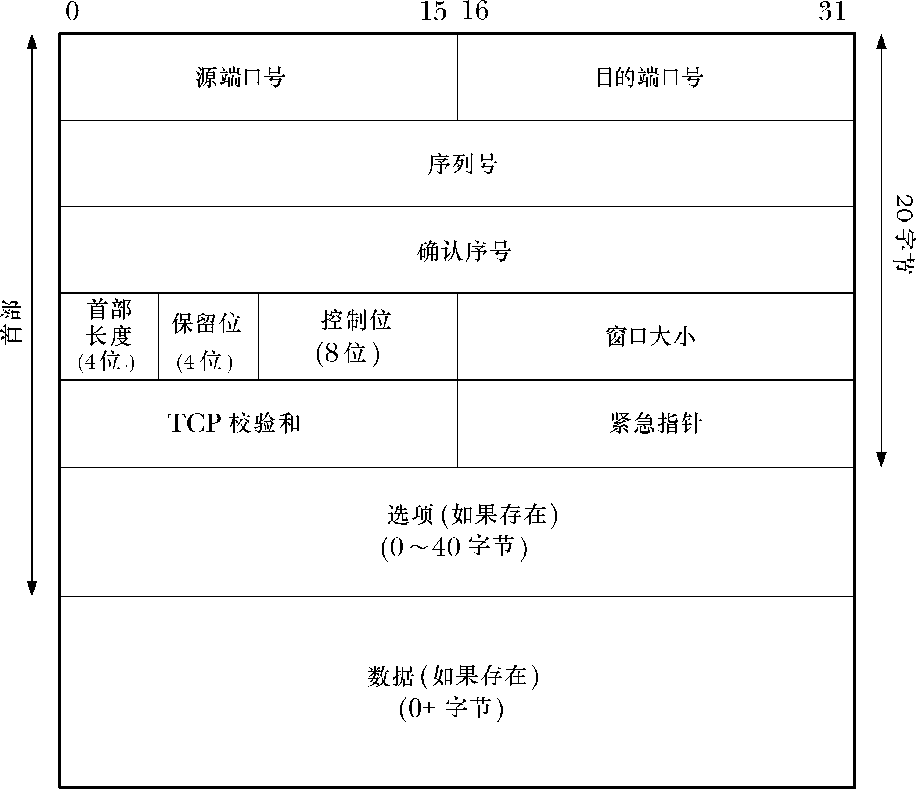

### 61.6.1　TCP报文的格式

图61-2展示了在一个TCP连接中两个结点之间交换的TCP报文格式。这些字段的含义如下。

<b class="my_markdown">图61-2：TCP报文的格式</b>

+ 源端口号（source port number）：这是TCP发送端的端口号。
+ 目的端口号（destination port number）：这是TCP接收端的端口号。
+ 序列号（sequence number）：如58.6.3节中的描述所述，这是该报文的序列号，标识从TCP发端向TCP收端发送的数据字节流，它表示在这个报文段中的第一个数据字节上。
+ 确认序号（acknowledgement number）：如果设定了ACK位（见下文），那么这个字段包含了接收方期望从发送方接收到的下一个数据字节的序列号。
+ 首部长度（header length）：该字段用来表示TCP报文首部的长度，首部长度单位是32位。由于这个字段只占4个比特位，因此首部总长度最大可达到60字节（15个字长）。该字段使得TCP接收端可以确定变长的选项字段（options）的长度，以及数据域的起始点。
+ 保留位（reserved）：该字段包含4个未使用的比特位（必须置为0）。
+ 控制位（control bit）：该字段由8个比特位组成，能进一步指定报文的含义。
      + CWR：拥塞窗口减小标记（congestion window reduced flag）。
    + ECE：显式的拥塞通知回显标记（explicit congestion notification echo flag）。CWR和ECE标记用在TCP/IP的显示拥塞通知（ECN）算法中。ECN加入到TCP/IP的时间相对较新，在RFC 3168和[Floyd, 1994]中有详尽描述。Linux自从2.4版内核以来就实现了ECN，可以为Linux专有的文件/proc/sys/net/ipv4/tcp_ecn设置一个非零值来开启这个功能。
    + URG：如果设置了该位，那么紧急指针字段包含的信息就是有效的。
    + ACK：如果设置了该位，那么确认序号字段包含的信息就是有效的（即，该字段可用来确认由对端发送过来的上一个数据）。
    + PSH：将所有收到的数据发给接收的进程。RFC993和[Stevens, 1994]中描述了这个标记。
    + RST：重置连接。该字段用来处理多种错误情况。
    + SYN：同步序列号。在建立连接时，双方需要交换设置了该位的报文。这样使得TCP连接的两端可以指定初始序列号，稍后用于在双向传输数据。
    + FIN：发送端提示已经完成了发送任务。

可以在报文段中设定多个控制位（或者全都不设置），使得单个报文段能用于多种用途。例如，稍后我们将看到在建立TCP连接时，报文段会同时设置SYN和ACK。

+ 窗口大小（window size）：该字段用在接收端发送 ACK 确认时提示自己可接受数据的空间大小。（该字段同滑动窗口机制有关，在58.6.3节中有简要描述。）
+ 校验和（checksum）：16位的检验和包括 TCP 首部和 TCP 的数据域。

> TCP校验和不只包含TCP首部和数据域，还包含了常被称为TCP伪首部的12个字节。伪首部由如下部分组成：源地址和目的地址IP（各占4字节）；2字节用来指定TCP报文的大小（这个值是计算出来的，但既不属于IP首部也不属于TCP首部）；TCP/IP协议族中针对TCP的唯一协议号，单字节，值为6；以及1个字节的填充域，该字节全为0（这样伪首部的长度就是16位的整数倍了）。在计算校验和时要包含伪首部的原因是允许TCP的接收端可以重新核对接收到的报文是否已经到达正确的目的地（即，IP层没有错误地将应该发往另一台主机的数据报接收，或者将应该发往另一个上层协议的数据包转发给了TCP层）。UDP计算校验和的方式和原因都类似于TCP。请参见[Stevens, 1994]以获取有关伪首部的细节信息。

+ 紧急指针（Urgent pointer）：如果设定了URG位，那么就表示从发送端到接收端传输的数据为紧急数据。我们将在 61.13.1 节中简单讨论紧急数据。
+ 选项（Options）：这是一个变长的字段，包含了控制 TCP 连接操作的选项。
+ 数据（Data）：这个字段包含了该报文段中传输的用户数据。如果报文段没有包含任何数据的话，这个字段的长度就为0（例如，如果只是一个简单的 ACK 报文）。

