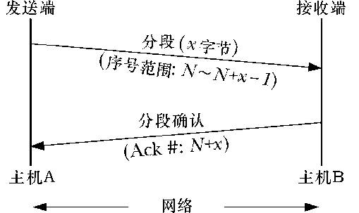

### 61.6.2　TCP序列号和确认机制

每个通过TCP连接传送的字节都由TCP协议分配了一个逻辑序列号。（在一条连接中，双向数据流都有各自的序列号。）当传送一个报文时，该报文的序列号字段被设为该传输方向上的报文段数据域第一个字节的逻辑偏移。这样TCP接收端就可以按照正确的顺序对接收到的报文段重新组装，并且当发送一个确认报文给发送端时就表明自己接收到的是哪一个数据。

要实现可靠的通信，TCP采用了主动确认的方式。也就是，当一个报文段被成功接收后，TCP接收端会发送一个确认消息（即，设置了ACK位的报文段）给 TCP 发送端，如图61-3所示。该消息的确认序号字段被设置为接收方所期望接收的下一个数据字节的逻辑序列号。（换句话说，确认序号字段的值就是上一个成功收到的数据字节的序列号加1。）

<b class="my_markdown">图61-3：TCP协议的确认机制</b>

当TCP发送端发送报文时会设置一个定时器。如果在定时器超时前没有接收到确认报文，那么该报文会重新发送。

> 图61-3以及稍后出现的相似的图示旨在说明两个结点间交换的TCP报文。从上到下看这些图时，倾斜的箭头隐含表示了发送报文所需要的时间。

