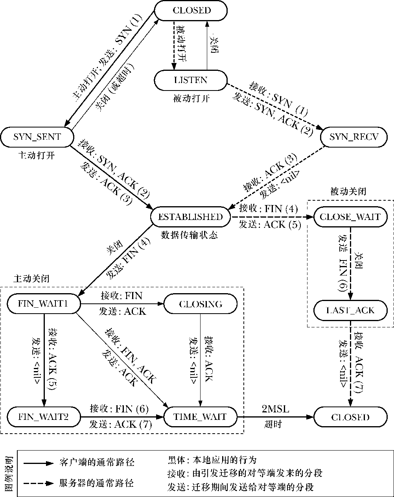

### 61.6.3　TCP协议状态机以及状态迁移图

维护一个TCP连接需要同步协调这个连接的两端。为了减小这项任务的复杂度，TCP结点以状态机的方式来建模。这意味着TCP结点可以处于一组固定状态中的其中一种，并且根据对事件的响应来从一种状态迁移到另一种状态。比如可根据TCP上层的应用程序所执行的系统调用，又或者是从对端TCP结点接收到了TCP报文。TCP的状态有如下几种。

+ LISTEN：TCP正等待从对端TCP结点发来的连接请求。
+ SYN_SENT：TCP发送了一个SYN报文，代表应用程序执行了一个主动打开的操作，并等待对端回应以此完成连接的建立。
+ SYN_RECV：之前处于LISTEN状态的TCP结点收到了对端发送的SYN报文，并已经通过发送SYN/ACK 报文做出了响应（即，这个 TCP 报文同时设置了SYN和ACK位），正等待对端TCP结点发送一个ACK以此完成连接的建立。
+ ESTABLISHED：与对端TCP结点间的连接建立完成。数据报文此时可以在两个TCP结点间双向交换。
+ FIN_WAIT1：应用程序关闭了连接。TCP结点发送一个FIN报文到对端，以此终止本端的连接，并等待对端发来的ACK。这个状态以及接下来的3种状态都与应用程序执行主动关闭有关——也就是，首先关闭本端连接的应用程序。
+ FIN_WAIT2：之前处于FIN_WAIT1状态的TCP节点现在已经收到了对端TCP结点发来的ACK。
+ CLOSING：之前处于FIN_WAIT1状态的TCP节点正在等待对端发送ACK，但却收到了FIN。这表示对端也正在尝试执行一个主动关闭。（换句话说，这两个TCP结点几乎在同一时刻发送了FIN报文。这种情况非常罕见。）
+ TIME_WAIT：完成主动关闭后，TCP结点接收到了FIN报文。这表示对端执行了一个被动关闭。此时这个TCP结点将在TIME_WAIT状态中等待一段固定的时间，这是为了确保TCP连接能够可靠地终止，同时也是为了确保任何老的重复报文在重新建立同样的连接之前在网络中超时消失。（我们将在61.6.7节中详细解释TIME_WAIT状态的细节。）当这个固定的时间段超时后，连接就关闭了，相关的内核资源都得到释放。
+ CLOSE_WAIT：TCP 结点从对端收到FIN报文后将处于 CLOSE_WAIT 状态。该状态以及接下来的一个状态都同应用程序执行的被动关闭有关，也就是第二个执行关闭操作的应用。
+ LAST_ACK：应用程序执行被动关闭，而之前处于CLOSE_WAIT状态的TCP结点发送一个FIN报文给对端，并等待对端的确认。当收到对端发来的确认ACK报文时，连接关闭，相关的内核资源都会得到释放。

除了上述这些状态外，RFC 793中还增加了一个虚拟的状态CLOSED，代表没有连接时的状态（即，没有内核资源被分配来描述一个TCP连接）。

> 在上述列表中，我们对TCP各个状态的名词拼写采用的是Linux内核源码中的写法。这同RFC 793中的拼写稍有区别。

图61-4展示了TCP协议的状态迁移图。（这张图基于RFC 793以及[Stevens et al., 2004]中的图表。）这张图展示了一个 TCP 节点通过响应各种事件从一种状态迁移到另一种状态。每个箭头表示一种可能出现的迁移，并以触发这个迁移的相应事件做了标记。这个标记要么是应用程序做执行的操作（以粗体表示），要么是字符串recv，表示从对端接收到一个报文。当TCP节点从一种状态迁移到另一种状态时，可能会发送报文到对端节点，这种现象由send标志来标记。例如从ESTABLISHED到FIN_WAIT1状态的迁移，箭头表示触发迁移的事件是本地应用程序执行close()所产生，在迁移过程中，TCP节点发送一个FIN报文到对端。

<b class="my_markdown">图61-4：TCP协议状态迁移图</b>

在图61-4中，客户端TCP节点通常的迁移路径以重实线箭头表示，而服务器端TCP节点通常的迁移路径以重虚线箭头表示。（以其他箭头表示的路径比较少经历。）观察路径中箭头括号里的数字，我们可以看到由两个TCP结点发送和接收的报文彼此之间互为倒影镜像。（在ESTABLISHED状态之后，如果是由服务器执行主动关闭，那么服务器端TCP节点和客户端TCP节点所经过的路径可能与图中所示的恰好相反。）

> 图61-4并没有展示出TCP状态机所有可能的迁移路径，只是说明了那些我们主要感兴趣的部分。更详细的TCP状态迁移图可以在http://www.cl.cam.ac.uk/~pes20/Netsem/poster.pdf找到。

