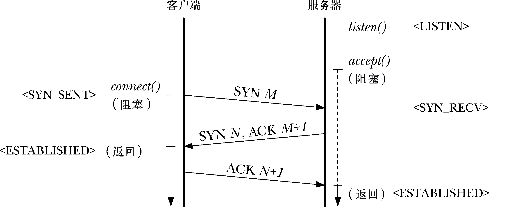

### 61.6.4　TCP连接的建立

在套接字API层，两个流式套接字通过以下步骤来建立连接（参见图56-1）。

**1．** 服务器调用 listen()在套接字上执行被动打开，然后调用 accept()阻塞服务器进程直到连接建立完成。

**2．** 客户端调用connect()在套接字上执行主动打开，以此来同服务器端的被动打开套接字之间建立连接。

TCP协议建立连接所执行的步骤请参见图61-5。这几个步骤通常被称为3次握手，因为在两个TCP结点间有3个报文需要传递。步骤如下。

<b class="my_markdown">图61-5：TCP连接建立时的3次握手</b>

**1．** connect()调用导致客户端 TCP 结点发送一个 SYN 报文到服务器端 TCP 结点。这个报文将告知服务器有关客户端TCP结点的初始序列号（在图中以M来标记）。这个信息是必要的，因为序列号不会从0开始，参见58.6.3节。

**2．** 服务器端TCP结点必须确认客户端发送来的TCP SYN报文，并告知客户端自己的初始序列号（在图中以N来标记）。（需要两个序列号是因为流式套接字是双向的。）服务器端TCP结点返回一个同时设定了SYN和ACK控制位的报文，这样就能同时执行这两种操作。（我们说ACK承载在SYN上。）

**3.**  客户端TCP结点发送一个ACK报文来确认服务器端 TCP 结点的 SYN 报文。

> 在3次握手中，前两个步骤中交换的SYN报文可能会包含TCP首部中的options字段信息，这是用来确定连接的多个相关参数的。请参见[Stevens et al., 2004]、[Stevens, 1994]以及[Wright & Stevens, 1995]以获取更多细节。

图61-5中尖括号中的标记（例如<LISTEN>）表示 TCP 连接中任意一侧的状态。

SYN 标记占据了序列号字段中的1 个字节，这么做是必要的，因为设定了 SYN 位的报文可能还会包含数据字节，因此这样才能准确确认这个标记。这就是为什么在图61-5中我们通过ACK M+1报文来确认SYN M。

