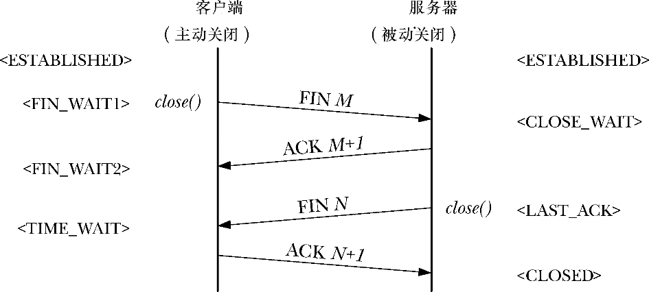

### 61.6.5　TCP连接的终止

关闭一个TCP连接通常会以如下几种方式进行。

**1．** 在一个TCP连接中， 其中一端的应用程序执行close()调用。（通常是由客户端发起，但这并不是必须的。）我们说这个应用程序正在执行一个主动关闭。

**2．** 稍后，连接另一端的应用程序（服务器）也执行一个close()调用。这被称为被动关闭。

图61-6展示了 TCP 协议所执行的相关步骤（这里，我们假设是由客户端发起主动关闭）。步骤如下。

<b class="my_markdown">图61-6：TCP连接的终止</b>

**1．** 客户端执行一个主动关闭，这将导致客户端TCP结点发送一个FIN报文给服务器。

**2．** 在接收到FIN报文后，服务器端TCP结点发出ACK报文作为响应。之后在服务器端，任何对read()操作的尝试都会产生文件结尾（即返回0）。

**3．** 稍后，当服务器关闭自己这端的连接时，服务器端TCP结点发送FIN报文到客户端。

**4．** 客户端TCP结点发送ACK报文作为响应，以此来确认服务器端发来的FIN报文。

以 SYN 标记为例，基于同样的理由，FIN 标记也会占据序列号字段的 1 个字节。这就是为什么我们在图61-6中展示对FIN M报文的确认时，确认报文应该是ACK M+1。

