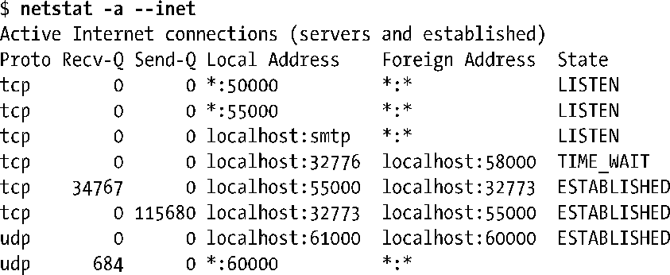

### 61.7　监视套接字：netstat

netstat程序可以显示系统中Internet和UNIX域套接字的状态。当编写套接字应用程序时，netstat是个非常有用的调试工具。大多数UNIX实现都会提供一种版本的netstat，尽管在不同的实现中命令行参数的语法有些差别。

默认情况下，当执行netstat时如果不给出命令行选项，那么它会同时显示出UNIX域和 Internet 域已连接的套接字信息。我们可以通过一些命令行选项来改变所显示的信息。其中一些选项如表61-1所示。

<b class="my_markdown">表61-1：netstat命令的选项</b>

| 选　　项 | 描　　述 |
| :-----  | :-----  | :-----  | :-----  |
| -a | 显示所有套接字的信息，包括监听套接字 |
| -e | 显示出扩展信息（包括套接字属主的用户ID） |
| -c | 连续重新显示套接字信息（每秒刷新显示一次） |
| -l | 只显示监听套接字的信息 |
| -n | 显示IP地址、端口号并以数字形式显示出用户名称 |
| -p | 显示进程ID号以及套接字所归属的程序名称 |
| --inet | 显示Internet域套接字的信息 |
| --tcp | 显示Internet域TCP（流）套接字的信息 |
| --udp | 显示Internet域UDP（数据报）套接字的信息 |
| --unix | 显示UNIX域套接字的信息 |

这里有个简单的例子，我们使用 netstat 来列出当前系统上所有的 Internet 域套接字信息，下面是输出。

对于每个Internet域套接字，我们可以看到如下的信息。

+ Proto：表示套接字所使用的协议——例如tcp或udp。
+ Recv-Q：表示套接字接收缓冲区中还未被本地应用读取的字节数。对于 UDP 套接字来说，该字段不只包含数据，还包含 UDP 首部及其他元数据所占的字节。
+ Send-Q：表示套接字发送缓冲区中排队等待发送的字节数。和Recv-Q字段一样，对于UDP套接字，该字段还包含了 UDP 首部和其他元数据所占的字节。
+ Local Address：该字段表示套接字绑定到的地址，以主机IP:端口号的形式表示。默认情况下，主机地址和端口号都以名称形式来显示，除非数值形式无法解析到对应的主机和服务名称。地址中主机部分的星号（*）表示这是一个通配IP地址。
+ Foreign Address：这是对端套接字所绑定的地址。字符串*:*表示没有对端地址。
+ State：表示当前套接字所处的状态。对于TCP套接字来说，这就是61.6.3节中描述的那些状态中的其中一种。

要获得更多细节，请参阅netstat(8)用户手册页。

目录/proc/net中有多个专属于Linux的文件，这些文件允许程序读取到同netstat的输出类似的信息。这些文件名称为tcp、udp、tcp6、udp6以及unix，意义非常明显。要得到更多的细节，请参阅proc(5)用户手册页。

