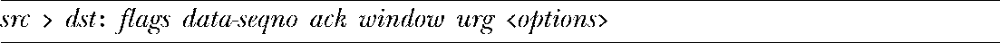
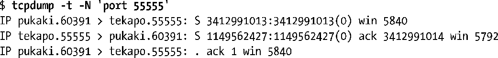
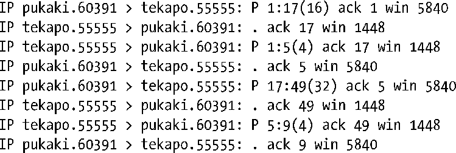

### 61.8　使用tcpdump来监视TCP流量

tcpdump是一个很有用的调试工具，可以让超级用户监视网络中的实时流量，实时生成文本信息，这些文本信息所表达的意思类似于61-3的图示。尽管工具的名称是tcpdump，但实际上它可以用来显示所有类型的 TCP/IP 数据包流量（例如，TCP 报文、UDP 数据报以及 ICMP 报文）。对于每个网络报文，tcpdump 都会显示出像时间戳、源 IP 地址、目的IP地址以及更多协议特有的细节信息。可以根据协议类型、源和目的 IP 地址、端口号以及其他一些标准来选择需要监视的数据包。全部的细节可以在 tcpdump 的用户手册页中找到。

> wireshark（之前叫做ethereal，http://www.wireshark.org/）程序可完成同tcpdump类似的任务，但流量信息是通过图形界面来显示的。

对于每个TCP报文，tcpdump都会按照如下方式显示。

这些字段的含义如下。

+ src: 表示源IP地址和端口号。
+ dst: 表示目的IP地址和端口号。
+ flags: 该字段包含的内容为零个或多个下列字符的组合，每个字符对应于一个TCP控制位，61.6.1节中已描述过，它们是S（SYN）、F（FIN）、P（PSH）、R（RST）、E（ECE）以及C（CWR）。
+ data-seqno: 该字段表示这个数据包中的序列号范围。

> 默认情况下，序列号范围的显示与该方向上所监视的数据流的第一个字节相关。tcpdump的-S选项可以让序列号以绝对格式显示。

+ ack: 这是一个形式为“ack num”的字符串，表示连接的另一端所期望的下一个字节的序列号。
+ window: 这是一个形式为“win num”的字符串，表示在这条连接相反方向上用于传输的接收缓冲区的空间大小。
+ urg: 这是一个形式为“urg num”的字符串，表示报文段在指定的偏移上包含紧急数据。
+ options: 这个字符串描述了包含在该报文段中的任意TCP选项。

其中src、dst和flags字段总是会显示。其他剩余的字段只在合适的时候才会显示。

下面的shell会话展示了应该如何使用tcpdump来监视客户端（运行于主机pukaki上）和服务器（运行在主机tekapo上）之间的流量。在这个shell会话中，我们用了两个tcpdump的选项，使得输出信息变得更为简洁。-t选项取消了时间戳信息的显示，-N选项使得在显示主机名时去掉了域名限定。此外，为了简洁而且由于我们不会对TCP的各个选项做细致的描述，我们从tcpdump的输出中去掉了options字段。

服务器工作于55555端口上，因此我们的tcpdump命令应该选择那个端口上的流量。输出显示了在建立连接时所交换的3个报文。

这三个报文是在三次握手时交换的SYN、SYN/ACK以及ACK（参见图61-5）。

在接下来的输出中，客户端发送给服务器两条消息，分别包含有16和32字节。而服务器每次都响应一条4字节的消息。

对于每个数据包，我们都可以看到 ACK 报文在相反的方向上发送。

最后，我们看看在连接终止时所交换的报文（首先由客户端关闭它这一端的连接，然后再由服务器关闭另一端）。

上述输出展示了在连接终止过程中所交换的报文（见图61-6）。

