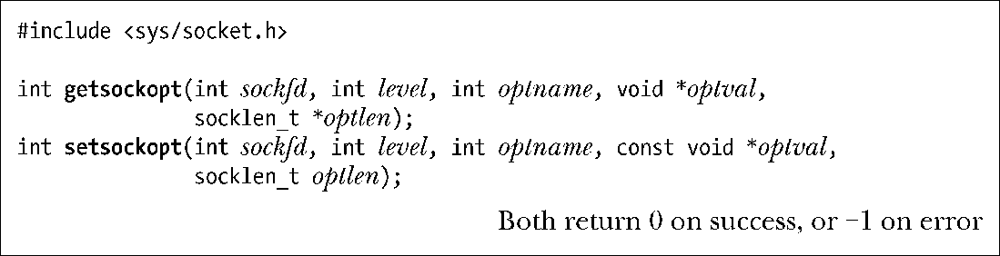
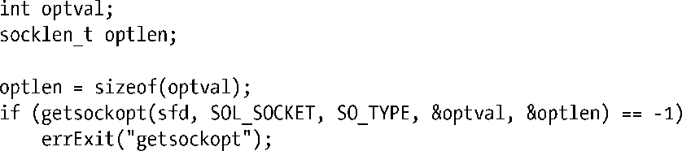

### 61.9　套接字选项

套接字选项能影响到套接字操作的多个功能。在本书中，我们在众多的套接字选项中只介绍了其中几个选项。涵盖大多数标准套接字选项的详细讨论可以在[stevens et al., 2004]中找到。请参阅tcp(7)、udp(7)、ip(7)、socket(7)以及unix(7)的用户手册页以得到更多Linux上特有的细节信息。

系统调用setsockopt()和getsockopt()是用来设定和获取套接字选项的。

对于setsockopt()和getsockopt()来说，参数sockfd代表指向套接字的文件描述符。

参数level指定了套接字选项所适用的协议——比如，IP或者TCP。对于本书中我们描述的大多数套接字选项来说，level都会设为SOL_SOCKET，这表示选项作用于套接字API层。

参数optname标识了我们希望设定或取出的套接字选项。参数optval是一个指向缓冲区的指针，用来指定或者返回选项的值。根据选项的不同，这个参数可以是一个指向整数或结构体的指针。

参数 optlen 指定了由 optval 所指向的缓冲区空间大小（字节数）。对于 setsockopt()来说，这个参数是按值传递的。对于 getsockopt()来说，optlen 是一个保存结果值的参数。在调用之前，我们将optlen初始化为由optval所指向的缓冲区空间大小值；调用返回后，该参数被设为实际写入到缓冲区中的字节数。

61.11 节中已经详细说明了由 accept()返回的套接字文件描述符从监听套接字中继承了可设定的套接字选项值。

套接字选项与打开的文件描述相关联（参见图 5-2）。这表示通过dup()或fork()调用复制而来的文件描述符副本同原始的文件描述符一起共享套接字选项集合。

套接字选项的一个简单例子是SO_TYPE，可以用来找出套接字的类型，比如：

经过这个调用之后，optval就包含了套接字类型——比如，SOCK_STREAM或者SOCK_DGRAM。在通过exec()继承了套接字文件描述符的程序中，比如由inetd所调用的程序，这种情况下该调用会很有用——因为程序可能并不知道它继承而来的套接字是什么类型。

SO_TYPE是只读套接字选项的一个例子。不能用setsockopt()来修改套接字类型。

