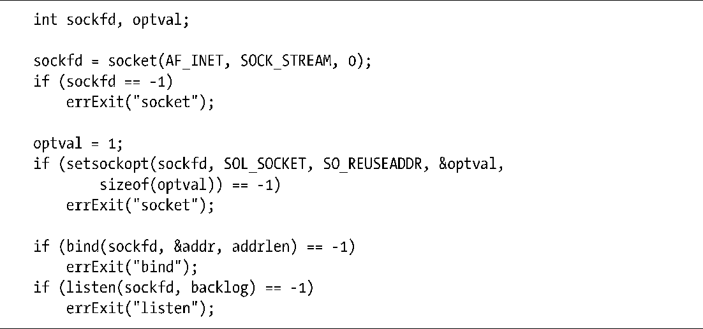

### 61.10　SO_REUSEADDR套接字选项

SO_REUSEADDR套接字选项可用作多种用途（见[Stevens et al., 2004]第7章以获得更多细节）。我们这里只关注一种最常见的用途：避免当TCP服务器重启时，尝试将套接字绑定到当前已经同TCP结点相关联的端口上时出现的EADDRINUSE（地址已使用）错误。这个问题通常会在下面两种情况中出现。

+ 之前连接到客户端的服务器要么通过close()，要么是因为崩溃（例如被信号杀死）而执行了一个主动关闭。这就使得TCP结点将处于TIME_WAIT状态，直到2倍的MSL超时过期为止。
+ 之前，服务器先创建一个子进程来处理客户端的连接。稍后，服务器终止，而子进程继续服务客户端，因而使得维护的 TCP 结点使用了服务器的知名端口号（well-known port）。

在以上两种情况中，剩下的TCP结点无法接受新的连接。尽管如此，针对这两种情况，默认情况下大多数的TCP实现会阻止新的监听套接字绑定到服务器的知名端口上。

> EADDRINUSE错误在客户端上不常出现，因为它们一般使用的是临时端口，这些临时端口不会是当前处于TIME_WAIT状态下的那些端口。但是，如果客户端绑定到一个指定的端口上，那么还是会遇到这个错误。

要理解SO_REUSEADDR套接字选项的操作，回到我们早先针对流式套接字（见56.5节）的电话类比上会很有帮助。就像打电话一样（忽略电话会议的概念），一个TCP套接字连接通过一对互联的结点来标识。accept()操作就类似于公司内部总机（“服务器”）的接线员。当有新的电话打进来时，接线员将它转接到公司某个内部的电话上（“一个新的套接字”）。从外部来看是没法找出那个内部电话的。当多个外部打来的电话都通过总机来处理时，唯一可以区别它们的方法就是通过外部电话的电话号码和总机号码的组合。（当考虑到可能会有多个公司的总机处于同一个电话网络时，总机号码也是必须要知道的。）类比来看，每次当我们在监听套接字上接受一个套接字连接时都会创建出一个新的套接字。唯一可区分它们的方法是通过它们所连接到的不同的对端套接字。

换句话说，一个已连接的TCP套接字是由一个4元组（即，4个值的联合）来唯一标识的，形式如下。

TCP规范要求每个这样的4元组都是唯一的，也就是说只有一个对应的连接（“打来的电话”）可以存在。问题是大多数实现（包括Linux）都强制施加了一个更为严格的约束：如果主机上有任何可匹配到本地端口的TCP连接，则本地端口不能被重用（即，对bind()的调用）。正如本节开头描述的场景，甚至当 TCP 不能再接受新的连接时这条规定也是强制执行的。

启用 SO_REUSEADDR 套接字选项可以解放这个限制，使得更接近 TCP 的需求。默认情况下该选项的值为 0，表示被关闭。我们可以在绑定套接字之前为该选项设定一个非零值来启用它，见程序清单61-4。

在本节开头描述的两种情况下，尽管有另一个TCP结点绑定到了同一个端口上，我们也可以通过设定 SO_REUSEADDR 选项允许我们将套接字绑定到这个本地端口上。大多数TCP服务器都应该开启这个选项。在程序清单 59-6 和程序清单 59-9 中我们已经看过一些使用这个选项的例子了。

程序清单61-4：设定SO_REUSEADDR套接字选项

