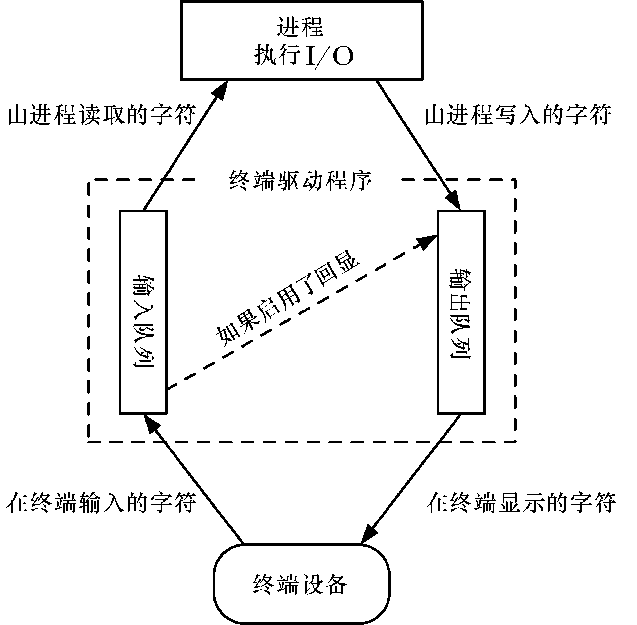

### 62.1　整体概览

传统型终端和终端模拟器都需要同终端驱动程序相关联，由驱动程序负责处理设备上的输入和输出。（如果是终端模拟器，这里的设备就是一个伪终端。我们在第64章介绍了伪终端。）终端驱动程序可以由本章中介绍的函数来控制其多个方面的操作。

当执行输入时，驱动程序可以工作在以下两种模式下。

+ 规范模式：在这种模式下，终端的输入是按行来处理的，而且可进行行编辑操作。每一行都由换行符来结束，当用户按下回车键时可产生换行符。在终端上执行的read()调用只会在一行输入完成之后才会返回，且最多只会返回一行。（如果read()请求的字节数少于当前行中的可用字节，那么剩下的字节在下次 read()调用时可用。）这是默认的输入模式。
+ 非规范模式：终端输入不会被装配成行。像 vi、more 和 less 这样的程序会将终端置于非规范模式，这样不需要用户按下回车键它们就能读取到单个的字符了。

终端驱动程序也能对一系列的特殊字符做解释，比如中断字符（通常为Ctrl-C）以及文件结尾符（通常是Ctrl-D）。当有信号为前台进程组产生时，又或者是程序在从终端读取时出现某种类型的输入条件，此时就可能会出现这样的解释操作。将终端置于非规范模式下的程序通常也会禁止处理某些或者所有这些特殊字符。

终端驱动程序会对两个队列做操作（参见图62-1）：一个用于从终端设备将输入字符传送到读取进程上，另一个用于将输出字符从进程传送到终端上。如果开启了终端回显功能，那么终端驱动程序会自动将任意的输入字符插入到输出队列的尾部，这样输入字符也会成为终端的输出。

<b class="my_markdown">图62-1：终端设备的输入和输出队列</b>

> SUSv3规定了MAX_INPUT上限，在实现中可用来表示终端输入队列的最大长度。还有一个相关的上限MAX_CANON，定义了处于规范模式下一行输入的最大字节数。在Linux上，sysconf(_SC_MAX_INPUT)和sysconf(_SC_MAX_CANON)都会返回255。但是，内核实际上并不会采用这些限制，而只是简单地在输入队列上加上了4096字节的限制。相对的，输出队列上也有一个这样的限制。然而应用程序不需要关心这些限制，这是因为如果一个进程产生输出的速度比终端驱动程序处理的速度还要快的话，内核会暂停执行写进程，直到输出队列的空间再次可用为止。
> 在Linux上，我们通过调用ioctl(fd, FIONREAD, &cnt)来获取终端输入队列中的未读取字节数，文件描述符fd指向的就是终端。这个特性在SUSv3中并没有规定。

