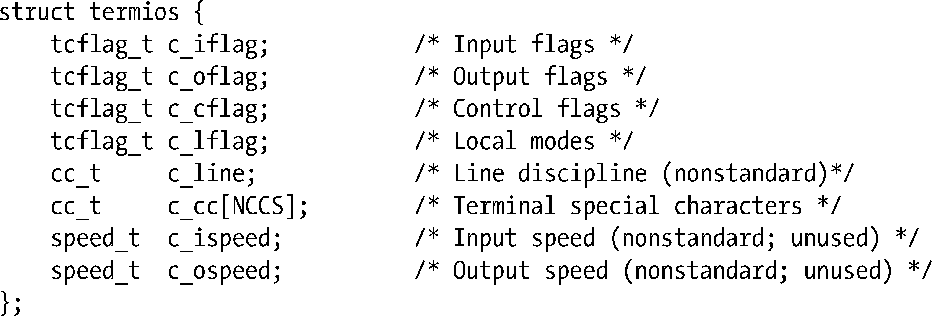
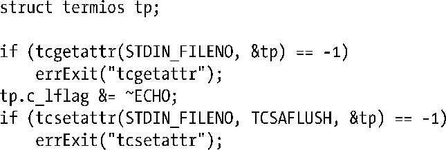

### 62.2　获取和修改终端属性

函数tcgetattr()和tcsetattr()可以用来获取和修改终端的属性。

参数fd是指向终端的文件描述符。（如果fd不指向终端，调用这些函数就会失败，伴随的错误码为ENOTTY。）

参数termios_p是一个指向结构体termios的指针，用来记录终端的各项属性。

结构体termios中的前4个字段都是位掩码（数据类型tcflag_t是合适大小的整数类型），包含有可控制终端驱动程序各方面操作的标志。

+ c_iflag包含控制终端输入的标志。
+ c_oflag包含控制终端输出的标志。
+ c_cflag包含与终端线速的硬件控制相关的标志。
+ c_lflag包含控制终端输入的用户界面的标志。

所有在上述字段中用到的标志都列在表62-2中。

c_line字段指定了终端的行规程（line discipline）。为了达到对终端模拟器编程的目的，行规程将一直设为N_TTY，也就是所谓的新规程。这是内核中处理终端的代码中的一个组件，实现了规范模式下的I/O处理。行规程的设定同串口编程有关。

数组c_cc包含着终端的特殊字符（中断、挂起等），以及用来控制非规范模式下输入操作的相关字段。数据类型cc_t是无符号整型，适合于保存这些值。常整数NCCS指定了数组中的元素个数。我们在62.4节中会对终端特殊字符进行描述。

c_ispeed和 c_ospeed 字段在 Linux 上没有使用到（并且也没有在SUSv3中规定）。我们将在62.7节中讲解Linux是如何保存终端线速的。

> 随着时间的推移，第7版及早期的BSD终端驱动程序（也称作tty驱动）已经得到了发展，它只用了不到4个不同的数据结构来代表同termios结构体相同的信息。System V用一个单独的结构体termio取代了这种巴洛克式的组织方式。最初的POSIX委员会选定了System V的API作为标准，在这个过程中将其改名为termios。

当通过tcsetattr()来修改终端属性时，参数optional_actions用来确定何时这些修改将生效。该参数可以被指定为下列值中的一种。

##### TCSANOW

修改立刻得到生效。

##### TCSADRAIN

当所有当前处于排队中的输出已经传送到终端之后，修改得到生效。通常，该标志应该在修改影响终端的输出时才会指定，这样我们就不会影响到已经处于排队中、但还没有显示出来的输出数据。

##### TCSAFLUSH

该标志的产生的效果同TCSADRAIN，但是除此之外，当标志生效时那些仍然等待处理的输入数据都会被丢弃。这个特性很有用，比如，当读取一个密码时，此时我们希望关闭终端回显功能，并防止用户提前输入。

通常（也是推荐做法）修改终端属性的方法是调用tcgetattr()来获取一个包含有当前设定的termios结构体，然后调用tcsetattr()将更新后的结构体传回给驱动程序。（这种方法可确保我们传递给tcsetattr()的是一个完全初始化过的结构体。）例如，我们可以采用下列代码将终端的回显功能关闭。

如果任何一个对终端属性的修改请求可以执行的话，函数tcsetattr()将返回成功；它只会在没有任何修改请求能执行时才会返回失败。这意味着当我们修改多个属性时，有时可能有必要再调用一次tcgetattr()来获取新的终端属性，并同之前的修改请求做对比。

> 在34.7.2节中，我们注明了如果tcsetattr()由后台进程组中的一个进程调用的话，那么终端驱动程序会通过发送SIGTTOU信号来暂停这个进程组。因此，如果从孤儿进程组中调用的话，tcsetattr()会失败，伴随的错误码为EIO。同样的道理也适用于本章中描述的多个其他的函数，包括tcflush()、tcflow()、tcsendbreak()以及tcdrain()。
> 在早期的UNIX实现中，终端属性是通过ioctl()来访问的。和本章描述的其他几个函数一样，函数tcgetattr()和tcsetattr()都是在POSIX中创建的，被设计用来解决由于在ioctl()中第三个参数没法做类型检查的问题。在Linux上，和其他许多UNIX实现一样，这些库函数是在ioctl()层之上的。

