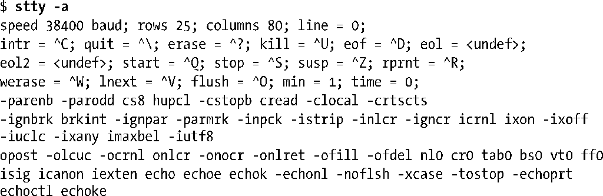
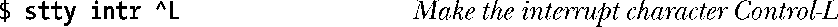
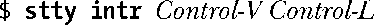
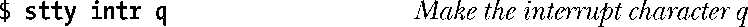
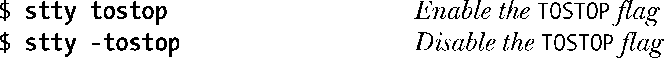
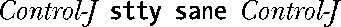
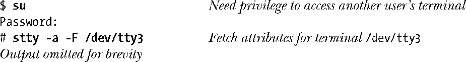
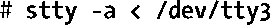

### 62.3　stty命令

stty命令是以命令行的形式来模拟函数tcgetattr()和tcsetattr()的功能，允许我们在shell上检视和修改终端属性。当我们监视、调试或者取消程序修改的终端属性时，这个工具非常有用。

我们可以采用如下的命令检视所有终端的当前属性（这里是在一个虚拟控制台上执行的）。

上述输出的第一行显示出了终端的线速（比特每秒）、终端的窗口大小以及以数值形式给出的行规程（0代表N_TTY，即新行规程）。

接下来的3行显示出了有关各种终端特殊字符的设定。^C表示Ctrl-C，以此类推。字符串<undef>表示相应的终端特殊字符目前没有定义。min和time的值与非规范模式下的输入有关，它们将在62.6.2节中描述。

剩下的几行显示出了termios结构体中c_cflag、c_iflag、c_oflag以及c_lflag字段中各个标志的设定（按顺序显示）。这里的标志名前带有一个连字符（-）的表示目前被禁用，否则表示当前已设定。

如果输入命令时不加任何命令行参数，那么 stty 只会显示出线速、行规程以及任何其他偏离了正常值的设定。

我们可以采用如下的命令修改有关终端特殊字符的设定。

当指定了一个控制字符作为最后的命令行参数时，我们能够以多种方式来完成。

+ 以2个字符为序列，^跟着一个相关的字符（如上所示）。
+ 以8进制或16进制数来表示（014或0xC）。
+ 直接输入实际的字符本身。

如果我们采用最后那种选择，且待处理的字符在shell或终端驱动程序中有着特别的含义，那么我们必须在其之前加上文本形式的next（literal next）字符（通常是Ctrl-V）。

（尽管基于可读性的考虑，上述例子在Control-V和Control-L之间显示了一个空格。实际上在Control-V和所期望的字符之间是不需要键入空格符的。）

尽管不常见，但还是有可能将终端特殊字符定义为非控制字符。

当然了，当我们这么做时就无法以正常的方式使用q了（即，产生字符q）。

要修改终端标志，例如TOSTOP标志，我们可以使用下列命令。

有时候当开发修改终端属性的程序时，可能会出现程序崩溃，使得终端处于可以显示但不可用的状态。在终端模拟器中，我们可以奢侈地关闭终端窗口然后重新开启另一个。另一种方法是，我们可以输入下列字符序列，将终端标志和特殊字符还原到一个合理的状态。

Control-J字符才是真正的换行符（十进制ASCII码为10）。我们使用这个字符是因为在某些模式下，终端驱动程序可能不再将Enter键（十进制ASCII码为13）映射为一个换行符了。我们首先输入一个 Control-J 是为了确保得到一个新行，前面没有任何字符。假如终端回显功能已经关闭的话，就没那么容易看出是否得到一个新行了。

Stty 命令工作于终端的标准输入之上。通过-F（关于权限检查）选项，我们可以监视并设定运行着stty命令的终端属性。

-F 选项是 stty 命令在 Linux 上的扩展。在许多其他的 UNIX 实现中，stty 总是工作在终端的标准输入上，而且我们必须使用下面这种形式的命令（在Linux上同样适用）。

