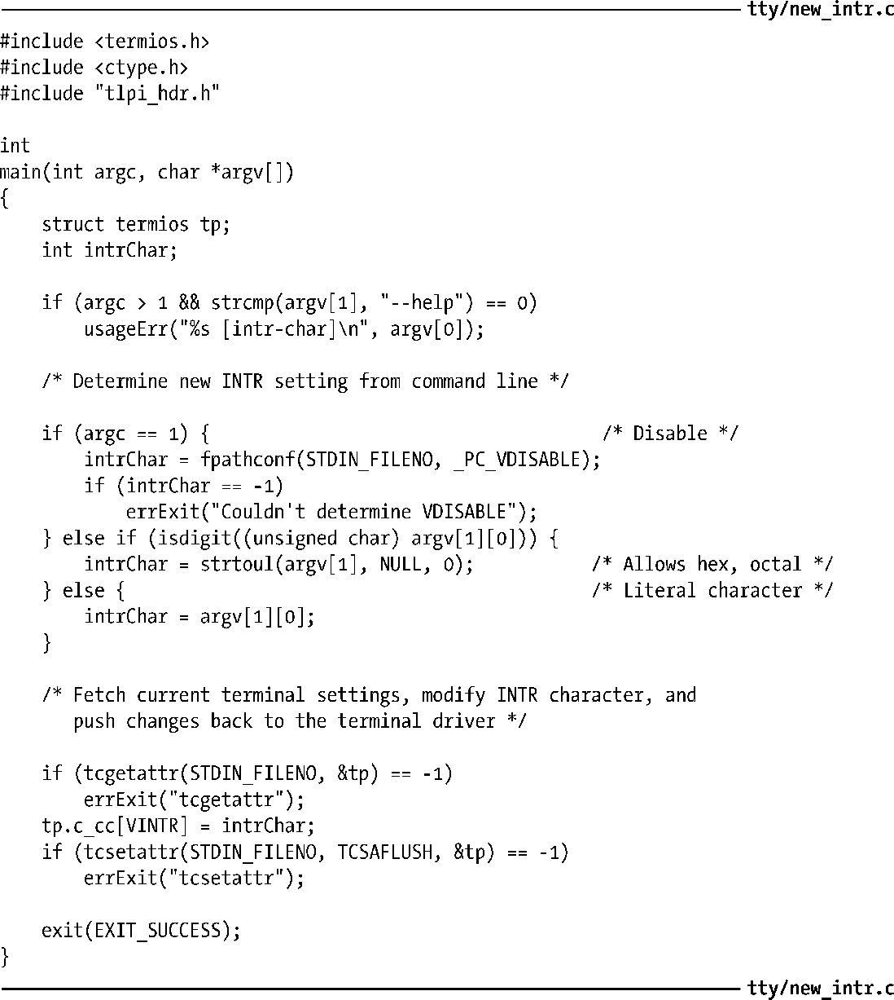
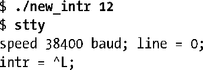
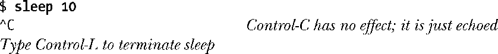
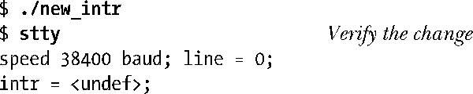
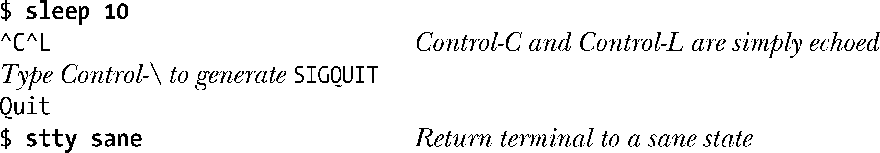

### 62.4　终端特殊字符

表62-1列出了Linux终端驱动程序所能识别的特殊字符。前两列显示了字符的名称以及对应在c_cc数组中用作下标的常量值。（可以看到，这些常量只是简单地在字符名前加上了V作为前缀。）CR和NL字符没有对应的c_cc下标，因为这些字符的值不能改变。

<b class="my_markdown">表62-1：终端特殊字符</b>

| 字　　符 | c_cc下标 | 描　　述 | 默 认 设 定 | 相关的位掩码标志 | SUSv3 |
| :-----  | :-----  | :-----  | :-----  | :-----  | :-----  | :-----  | :-----  |
| CR | （无） | 回车 | ^M | ICANON、IGNCR、ICRNL、OPOST、OCRNL、ONOCR | ● |
| DISCARD | VDISCARD | 丢弃输出 | ^O | （未实现） |
| EOF | VEOF | 文件结尾 | ^D | ICANON | ● |
| EOL | VEOL | 行结尾 |  | ICANON | ● |
| EOL2 | VEOL2 | 另一种行结尾 |  | ICANON，IEXTEN |
| ERASE | VERASE | 擦除字符 | ^? | ICANON | ● |
| INTR | VINTR | 中断（SIGINT） | ^C | ISIG | ● |
| KILL | VKILL | 擦除一行 | ^U | ICANON | ● |
| LNEXT | VLNEXT | 字面化下个字符 | ^V | ICANON、IEXTEN |
| NL | （无） | 换行 | ^J | ICANON、INLCR、ECHONL、 OPOST、ONLCR、ONLRET | ● |
| QUIT | VQUIT | 退出（SIGQUIT） | ^\ | ISIG | ● |
| REPRINT | VREPRINT | 重新打印输入行 | ^R | ICANON、IEXTEN、ECHO |
| START | VSTART | 开始输出 | ^Q | IXON、IXOFF | ● |
| STOP | VSTOP | 停止输出 | ^S | IXON、IXOFF | ● |
| SUSP | VSUSP | 暂停（SIGTSTP） | ^Z | ISIG | ● |
| WERASE | VWERASE | 擦除一个字 | ^W | ICANON、IEXTEN |

表格中默认设定这一列显示了特殊字符通常的默认值。除了能够将终端特殊字符设定为指定值之外，还可以通过将该值设定为fpathconf(fd, _PC_VDISABLE)的返回值来关闭该字符，这里的fd表示指向终端的文件描述符。（在大多数UNIX实现中，该调用返回0。）

每个特殊字符的操作受 termios 结构体位掩码字段中的各种标志设定的影响（参见 62.5节），请参见表格中倒数第2列。

表格的最后一列表示这些特殊字符中有哪些是在 SUSv3 中规定的。无论 SUSv3 是怎么规定的，大部分这些字符在所有的UNIX实现中都得到了支持。

接下来的段落为这些终端特殊字符提供了更加详细的解释和说明。注意到如果终端驱动程序对这些输入字符执行了特殊的解释，那么除了CR、EOL、EOL2以及NL之外，其他字符都会被丢弃（即，不会将字符传给任何正在读取输入的进程）。

#### CR

CR 是回车符。这个字符会传递给正在读取输入的进程。在默认设定了 ICRNL 标志（在输入中将CR映射为NL）的规范模式下（设定ICANON标志），这个字符首先被转换为一个换行符（ASCII码十进制为 10，^J），然后再传递给读取输入的进程。如果设定了 IGNCR（忽略CR）标志，那么就在输入上忽略这个字符（此时必须用真正的换行符来作为一行的结束）。输出一个CR字符将导致终端将光标移动到一行的开始处。

#### DISCARD

DISCARD 是丢弃输出字符。尽管这个字符定义在了数组 c_cc 中，但实际上在 Linux上没有任何效果。在一些其他的 UNIX 实现中，一旦输入这个字符将导致程序输出被丢弃。这个字符就像一个开关——再输入一次将重新打开输出显示。当程序产生大量输出而我们希望略过其中一些输出时这个功能就非常有用。（在传统的终端上这个功能更加有用，因为此时线速会更加缓慢，而且也不存在什么其他的“终端窗口”。）这个字符不会发送给读取进程。

#### EOF

EOF是传统模式下的文件结尾字符（通常是Ctrl-D）。在一行的开始处输入这个字符会导致在终端上读取输入的进程检测到文件结尾的情况（即，read()返回0）。如果不在一行的开始处，而在其他地方输入这个字符，那么该字符会立刻导致read()完成调用，返回这一行中目前为止读取到的字符数。在这两种情况下，EOF字符本身都不会传递给读取的进程。

#### EOL以及EOL2

EOL和EOL2是附加的行分隔字符，对于规范模式下的输入，其表现就如同换行（NL）符一样，用来终止一行输入并使该行对读取进程可见。默认情况下，这些字符是未定义的。如果定义了它们，它们是会被发送给读取进程的。EOL2字符只有当设置了IEXTEN（扩展输入处理）标志时（默认会设置）才能工作。

用到这些字符的机会很少。一种应用是在telnet中。通过将EOL或EOL2设定为telnet的换码符（通常是Ctrl-]，或者如果工作在rlogin模式下时为~），telnet能立刻捕获到字符，就算是正在规范模式下读取输入时也是如此。

#### ERASE

在规范模式下，输入ERASE字符会擦除当前行中前一个输入的字符。被擦除的字符以及ERASE字符本身都不会传递给读取输入的进程。

#### INTR

INTR是中断字符。如果设置了 ISIG （开启信号）标志（默认会设置），输入这个字符会产生一个中断信号（SIGINT），并发送给终端的前台进程组（见34.2节）。INTR字符本身是不会发送给读取输入的进程的。

#### KILL

KILL是擦除行（也称为kill line）字符。在规范模式下，输入这个字符使得当前这行输入被丢弃（即，到目前为止输入的字符连同KILL字符本身，都不会传递给读取输入的进程了）。

#### LNEXT

LNEXT 是下一个字符的字面化表示（literal next）。在某些情况下，我们可能希望将终端特殊字符的其中一个看作是一个普通字符，将其作为输入传递给读取进程。输入 LNEXT字符后（通常是 Ctrl-V）使得下一个字符将以字面形式来处理，避免终端驱动程序执行任何针对特殊字符的解释处理。因而，我们可以输入Ctrl-V Ctrl-C这样的2字符序列，提供一个真正的Ctrl-C字符（ASCII码为3）作为输入传递给读取进程。LNEXT字符本身并不会传递给读取进程。这个字符只有在设定了IEXTEN标志（默认会设置）的规范模式下才会被解释。

#### NL

NL是换行符。在规范模式下，该字符终结一行输入。NL字符本身是会包含在行中返回给读取进程的。（规范模式下，CR字符通常会转换为NL。）输出一个NL字符导致终端将光标移动到下一行。如果设置了OPOST和ONLCR（将NL映射为CR-NL）标志（默认会设置），那么在输出中，一个换行符就会映射为一个 2 字符序列——CR 加上 NL。（同时设定ICRNL和ONLCR标志意味着一个输入的 CR 字符会转换为NL，然后回显为CR加上NL。）

#### QUIT

如果设置了ISIG标志（默认会设置），输入QUIT字符会产生一个退出信号（SIGQUIT），并发送到终端的前台进程组中（见34.2节）。QUIT字符本身并不会传递给读取进程。

#### REPRINT

REPRINT字符代表重新打印输入。在规范模式下，如果设置了IEXTEN标志（默认会设置），输入该字符会使得当前的输入行（还没有输入完全）重新显示在终端上。如果某个其他的程序（例如 wall(1)或者 write(1)）输出已经使终端的显示变得混乱不堪，那么此时这个功能就特别有用了。REPRINT字符本身是不会传递给读取进程的。

#### START和STOP

START和STOP分别代表开始输出和停止输出字符。当设定了 IXON （启动开始/停止输出控制）标志时（默认会设定），这两个字符才能工作。（START 和 STOP 字符在一些终端模拟器中不会生效。）

输入 STOP 字符会暂停终端输出。STOP 字符本身不会传递给读取进程。如果设定了IXOFF 标志，且终端的输入队列已满，那么终端驱动程序会自动发送一个 STOP 字符来对输入进行节流控制。

输入START字符会使得之前由STOP暂停的终端输出得到恢复。START字符本身不会传递给读取进程。如果设定了IXOFF（启动开始/停止输入控制）标志（默认是不会设定的），且终端驱动程序之前由于输入队列已满已经发送过了一个 STOP 字符，那么一旦当输入队列中又有了空间，此时终端驱动程序会自动发送一个START字符以恢复输出。

如果设定了IXANY标志，那么任何字符，不仅仅只是START，都可以按顺序输入以重启输出（同样，这个字符也不会传递给读取进程）。

START 和 STOP 字符可用于在计算机和终端设备间实现双向的软件流控。这些字符的一种功能是允许用户停止和启动终端的输出。可以通过设定IXON标志来使能输出流控制。但是，另一个方向上的流控（即，从设备到计算机的输入流控制，通过设定IXOFF标志开启）也同样重要，比如当终端设备是一台调制解调器或另一台计算机时。如果应用程序处理输入的速度较慢，而内核的缓冲区很快就被填满时，输入流控制可确保不会丢失数据。

随着目前越来越普遍的高线速，软件流控已经被硬件流控（RTS/CTS）所取代了。在硬件流控中，通过串口上两条不同线缆上发送的信号来开启或关闭数据流。（RTS代表请求发送，CTS代表清除发送。）

#### SUSP

SUSP代表暂停字符。如果设定了ISIG标志（默认会设定），输入这个字符会产生终端暂停信号（SIGTSTP），并发送给终端的前台进程组（见34.2节）。SUSP字符本身不会发送给读取进程。

#### WERASE

WERASE是擦除单词字符。在规范模式下，设定了 IEXTEN 标志（默认会设定）后输入这个字符会擦除前一个单词的所有字符。一个单词被看做是一串字符序列，可包含数字和下划线。（在某些UNIX实现中，单词被看做是由空格分隔的字符序列。）

#### 其他的终端特殊字符

其他的UNIX实现还提供了除表62-1中之外的特殊终端字符。

BSD中还提供了 DSUSP和STATUS字符。DSUSP字符（通常为Ctrl-Y）工作的方式类似于 SUSP 字符，但只有当尝试读取该字符时才会暂停前台进程组（即，在之前所有的输入都被读取之后）。在几个非源自 BSD 的 UNIX 实现中同样也提供了DSUSP 字符。

STATUS字符（通常为Ctrl-T）使内核将状态信息显示在终端上（包括前台进程的状态以及它所消耗的CPU时间），并发送一个SIGINFO信号到前台进程组。如果需要的话，进程可以捕获这个信号并显示进一步的状态信息。（Linux通过神奇的SysRq键提供了类似的功能。细节请参见内核源文件中的Documentation/sysrq.txt。）

System V的衍生系统提供了SWITCH字符。这个字符用来在shell层下切换不同的shell。shell层是System V作业控制的前身。

#### 示例程序

程序清单62-1展示了用tcgetattr()和tcsetattr()来修改终端的中断字符。该程序将中断字符设定为程序命令行参数中指定字符的数值形式，如果没有提供命令行参数就关闭中断字符。

程序清单62-1：修改终端的中断字符

下面列出的shell会话说明了该程序的使用方法。我们将中断字符设为Ctrl-L（ASCII码为12），然后通过stty命令对修改做验证。

之后我们启动一个进程，运行 sleep(1)。我们发现输入 Ctrl-C 已经不会产生终止进程的效果了，而输入Ctrl-L才会终止进程。

现在我们显示出shell变量$?的值，该值会给出上一条命令的终止状态。

我们看到进程终止的状态为130。这表示该进程由信号130 – 128 = 2来杀死，而信号2正是SIGINT。

接下来我们通过该程序来关闭中断字符。

现在我们发现无论是Ctrl-C还是Ctrl-L都不会产生SIGINT信号了，我们必须使用Ctrl-\来终止这个进程。

