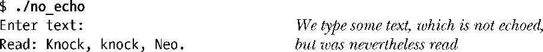
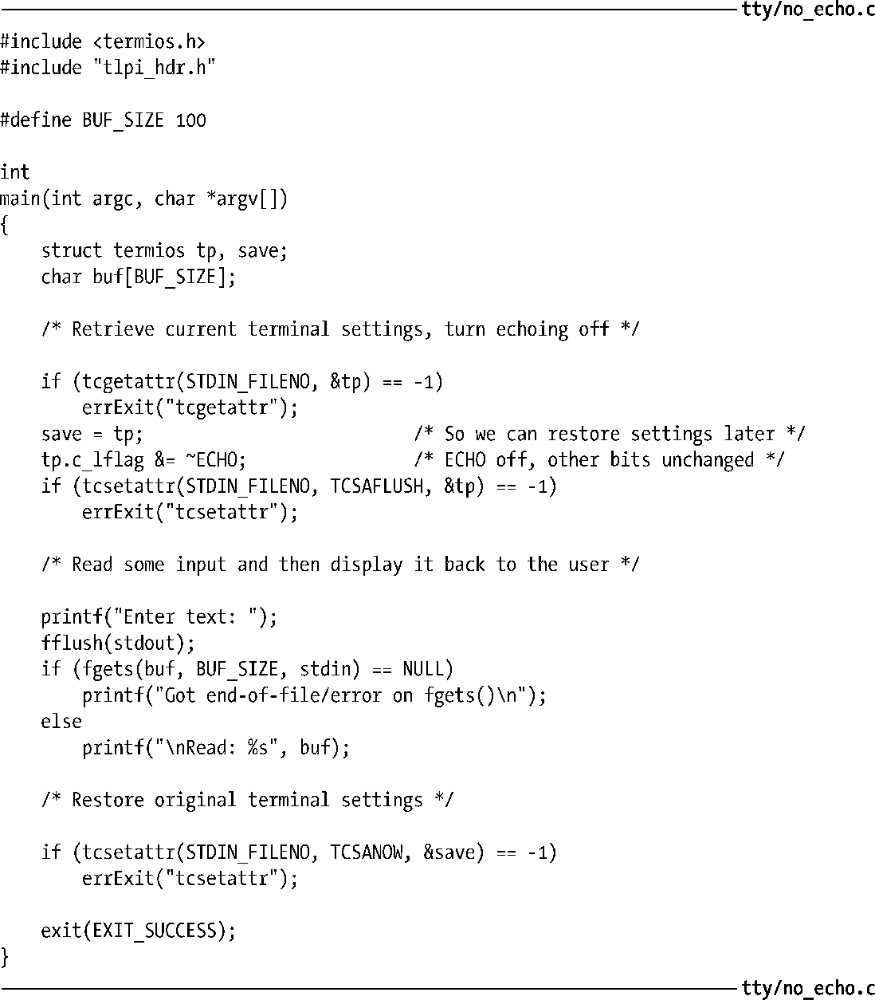

### 62.5　终端标志

表62-2 中列出了 termios结构体中4个标志字段所控制的设置。表格中列举出的常量都对应于单个比特位，除了那些可指定掩码（mask）的值。这些值会跨越多个比特位，可能会包含在某个范围的值之中，掩码在括号中给出。表格中标记为SUSv3的列表示该标志是否在SUSv3中规定，而标记为默认的这一列给出了登录虚拟控制台时的默认设置。

<b class="my_markdown">表62-2：终端标志</b>

| 字段/标志 | 描　　述 | 默　　认 | SUSv3 |
| :-----  | :-----  | :-----  | :-----  | :-----  | :-----  |
| c_iflag |
| BRKINT | 在BREAK状态下发出信号中断（SIGINT） | 打开 | ● |
| ICRNL | 在输入中将CR映射为NL | 打开 | ● |
| IGNBRK | 忽略BREAK状态 | 关闭 | ● |
| IGNCR | 在输入中忽略CR | 关闭 | ● |
| IGNPAR | 忽略有奇偶校验错误的字符 | 关闭 | ● |
| IMAXBEL | 终端输入队列满时发出铃响（未使用） | （打开） | ● |
| INLCR | 在输入中将NL映射为CR | 关闭 | ● |
| INPCK | 开启输入奇偶校验检查 | 关闭 | ● |
| ISTRIP | 从输入字符中去掉最高位（bit 8） | 关闭 | ● |
| IUTF8 | 输入为UTF-8编码（从Linux 2.6.4开始） | 关闭 |
| IUCLC | 在输入中将大写字符映射为小写字符（如果IEXTEN也同时设置的话） | 关闭 |
| IXANY | 允许用任意字符来重启已停止的输出 | 关闭 | ● |
| IXOFF | 启动开始/停止输入流控 | 关闭 | ● |
| IXON | 启动开始/停止输出流控 | 打开 | ● |
| PARMRK | 标记奇偶校验错误（带有两个前缀字节：0377 + 0） | 关闭 | ● |
| c_oflag |
| BSDLY | 退格延时掩码（BS0、BS1） | BS0 | ● |
| CRDLY | CR延时掩码（CR0、CR1、CR2、CR3） | CR0 | ● |
| FFDLY | 换页符延时掩码（FF0、FF1） | FF0 | ● |
| NLDLY | 换行延时掩码（NL0、NL1） | NL0 | ● |
| OCRNL | 在输出中将CR映射为NL（参阅ONOCR） | 关闭 | ● |
| OFDEL | 用DEL（0177）作为填充符；否则用NUL（0） | 关闭 | ● |
| OFILL | 采用填充符作为延迟（而不是定时延迟） | 关闭 | ● |
| OLCUC | 在输出中将小写字符映射为大写字符 | 关闭 |
| ONLCR | 在输出中将NL映射为CR-NL | 打开 | ● |
| ONLRET | 假定NL执行CR的功能（移动到一行的开始处） | 关闭 | ● |
| ONOCR | 如果已经在一行的开始处就不输出CR | 关闭 | ● |
| OPOST | 执行输出后续处理 | 打开 | ● |
| TABDLY | 水平制表符延时掩码（TAB0、TAB1、TAB2、TAB3） | TAB0 | ● |
| VTDLY | 垂直制表符延时掩码（VT0、VT1） | VT0 | ● |
| c_cflag |
| CBAUD | 波特率（比特率）掩码（B0、B2400、B9600等） | B38400 |
| CBAUDEX | 扩展波特率（比特率）掩码（针对速率大于38400） | 关闭 |
| CIBAUD | 输入波特率（比特率），如果同输出波特率不同（未使用） | （关闭） |
| CLOCAL | 忽略调制解调器的状态行（不检查载波信号） | 关闭 | ● |
| CMSPAR | 使用奇偶校验（标记/空格） | 关闭 |
| CREAD | 允许输入被接收 | 打开 | ● |
| CRTSCTS | 启动RTS/CTS（硬件）流控 | 关闭 |
| CSIZE | 字符大小掩码（第5到第8位：CS5、CS6、CS7、CS8） | CS8 | ● |
| CSTOPB | 每字符使用2个停止位；否则只使用1个 | 关闭 | ● |
| HUPCL | 在上次关闭时挂起（丢弃调制解调器连接） | 打开 | ● |
| PARENB | 启动奇偶校验 | 关闭 | ● |
| PARODD | 使用奇数奇偶校验；否则使用偶数奇偶校验 | 关闭 | ● |
| c_lflag |
| ECHO | 回显输入字符 | 打开 | ● |
| ECHOCTL | 以可视方式回显控制字符（例如，^L） | 打开 |
| ECHOE | 以可视方式回显ERASE字符 | 打开 | ● |
| ECHOK | 以可视方式回显KILL字符 | 打开 | ● |
| ECHOKE | 在回显的KILL字符后不输出新的行 | 打开 |
| ECHONL | 回显NL（在规范模式下），即使禁止了回显功能 | 关闭 | ● |
| ECHOPRT | 向后删除回显的字符（在\和/之间） | 关闭 |
| FLUSHO | 输出被刷新（未使用） | — |
| ICANON | 规范模式（一行接一行）输入 | 打开 | ● |
| IEXTEN | 启动对输入字符的扩展处理 | 打开 | ● |
| ISIG | 启动信号产生字符（INTR、QUIT、SUSP） | 打开 | ● |
| NOFLSH | 禁止在INTR、QUIT和SUSP上进行刷新 | 关闭 | ● |
| PENDIN | 在下一次读操作时重新显示等待的输入（未实现） | （关闭） |
| TOSTOP | 为后台输出产生SIGTTOU信号（见34.7.1节） | 关闭 | ● |
| XCASE | 规范大/小写表示（未实现） | （关闭） |

许多shell都提供了命令行编辑功能，shell本身可以控制表62-2中列出的标志。这表示如果我们试着用stty(1)来检验这些设置的话，那么当输入shell命令时这些修改可能不会生效。若要绕过这种行为，我们必须在shell中禁止命令行编辑。比如，在启动bash时可以通过指定命令行选项--noediting来禁止命令行编辑功能。

表 62-2 中列出的一些标志在老式的终端上只提供有限的能力，且这些标志在现代的系统上使用的很少。比如，IUCLC、OLCUC和XCASE标志只能用在仅可以显示大写字符的终端上。在许多老式的UNIX系统上，如果用户尝试以用户名的大写形式来登录，login程序会假设用户使用的正是这样的终端，并且会设置这些标志。之后给出的输入密码提示将变成：

从这一刻开始，所有的小写字符都会以大写形式输出，而真正的大写字符会在前面加上反斜杠\。同样的，对于输入，真正的大写字符可以通过加上一个反斜杠前缀来指定。ECHOPRT标志同样也是设计用于功能有限的终端。

各式各样的延时掩码也同样有着历史渊源，能够允许终端和打印机用更长的时间来回显字符，比如回车和换页符。相关的标志 OFILL 和 OFDEL 指定了这样的延时是如何执行的。大多数这些标志在 Linux 上都未使用。有一个例外是用来设定 TABDLY 标志的TAB3掩码，使得制表符能够以空格输出（最多8个空格）。

下面的段落将对termios的一些标志做详细说明。

##### BRKINT

如果设定了BRKINT，且没有设定IGNBRK标志，那么当出现BREAK状态时会发送SIGINT信号到前台进程组。

> 大多数常规的哑终端都提供了一个BREAK键。按下这个键并不会产生一个字符，而是产生一个BREAK状态，此时在一段给定的时间内会有一系列0比特发送给终端驱动程序，一般来说会持续0.25或0.5秒（即，多于传送一个字节所需要的时间）。（除非已经设定了IGNBRK标志，终端驱动程序会发送一个单独的全0字节到读取进程上。）在许多UNIX系统中，BREAK状态就表现为一个发送给远端主机的信号，用来将线速（波特率）调整为适合于终端的数值。因此，用户会按住BREAK键直到屏幕上出现有效的登录提示信息，表示此时的线速已经可以适用于终端了。
> 在虚拟控制台上，我们可以通过按下Ctrl-Break来产生一个BREAK状态。

##### ECHO

设置了ECHO标志将开启回显输入字符的功能。当读取密码时，禁止回显是很有用的。在vi的命令模式下回显也是被禁止的，此时由键盘产生的字符被解释为编辑命令而不是文本输入。ECHO标记在规范和非规范模式下都是有效的。

##### ECHOCTL

如果设置了ECHO标志，那么开启ECHOCTL标志会导致除了制表符、换行符、START和STOP之外的控制字符都将以类似^A（Ctrl-A）的形式回显出来。如果关闭ECHOCTL标志，控制字符将不再回显。

> 控制字符是指那些ASCII码值小于32的字符，再加上字符DEL（ASCII码十进制为127）。一个控制字符x，在回显时以^紧跟着表达式（x ^ 64）的结果所代表的字符来表示。除了DEL外，对于所有的字符，该表达式中异或操作XOR（^）的结果就是在代表该字符的ASCII码值上加上64。因此，Ctrl-A（ASCII 1）将回显为^A（A的ASCII码为65）。对于DEL字符，该表达式的结果为从127中减去64，得到的值为63，也就是?的ASCII码，因此DEL被回显为^?。

##### ECHOE

在规范模式下，设定ECHOE标志使得ERASE能以可视化的方式执行，将退格-空格-退格这样的序列输出到终端上。如果关闭了ECHOE标志，那么ERASE字符本身就会回显出来（例如以^?的形式），但仍然会完成删除一个字符的功能。

##### ECHOK和ECHOKE

ECHOK和ECHOKE标志控制着在规范模式下使用KILL（擦除行）字符时的可视化显示。在默认情况下（同时设置两个标志），一行文本以可视化的方式擦除（参见ECHOE）。如果其中任一标志被关闭，那么就不会执行可视化的擦除（但输入行仍然会被丢弃），而KILL字符本身会被回显出来（例如以^U的形式）。如果设定了ECHOK而关闭了ECHOKE，那么也会输出一个换行符。

##### ICANON

设定了ICANON标志将启动规范模式输入。输入会集中成行，并且会打开对特殊字符EOF、EOL、EOL2、ERASE、LNEXT、KILL、REPRINT以及WERASE的解释处理（但需要注意下面描述到的IEXTEN标志所产生的效果）。

##### IEXTEN

设定IEXTEN标志将打开对输入字符的扩展处理功能。必须设定这个标志（同 ICANON一样），才能正确解释 EOL2、LNEXT、REPRINT 以及 WERASE 这样的特殊字符。要使IUCLC 标志生效，也必须要设定IEXTEN标志才行。SUSv3 中只是说到 IEXTEN 标志可以打开扩展的功能（由实现来定义），具体细节在其他的 UNIX 实现中可能有所不同。

##### IMAXBEL

Linux上忽略了IMAXBEL标志的设定。在登录控制台上，当输入队列已满时总是会响起响铃声。

##### IUTF8

设定IUTF8标志将打开加工模式（cooked mode）（见62.6.3节），以此当执行行编辑时能够正确地处理UTF-8输入。

##### NOFLSH

默认情况下，当输入INTR、QUIT或SUSP字符而产生信号时，任何在终端输入和输出队列中未处理完的数据都会被刷新（丢弃）。设定NOFLSH标志后将关闭这种刷新行为。

##### OPOST

设定OPOST标志后将打开输出的后续处理功能。必须设定该标志才能使termios结构体中c_oflag字段中的标志生效。（相反，关闭OPOST标志将禁止对所有的输出做后续处理。）

##### PARENB、IGNPAR、INPCK、PARMRK以及PARODD

PARENB、IGNPAR、INPCK、PARMRK以及PARODD标志同奇偶校验生成和检查有关。

PARENB标志可为输出字符打开奇偶校验位，并为输入字符做奇偶校验检查。如果我们只希望生成输出的奇偶校验，那么我们可以通过关闭 INPCK 标志来禁止对输入做奇偶校验检查。如果设定了 PARODD 标志，那么在输入和输出上都会采用奇数奇偶校验，否则就会采用偶数奇偶校验。

剩下的标志规定了当输入字符出现奇偶校验错误时应该如何处理。如果设定了IGNPAR标志，那么字符将被丢弃（不会传递给读取进程）。否则，如果设定了PARMRK标志，那么该字符会传递给读取进程，但会在前面加上2字节的序列0377 + 0。（如果设定了PARMRK标志，但关闭了ISTRIP标志，那么字符0377会加倍成0377 + 0377。）如果关闭PARMRK标志，但设定了 INPCK 标志，那么字符被丢弃，且不会传递给读取进程任何字节。如果IGNPAR、PARMRK或INPCK都没有设定，那么该字符会传递给读取进程。

#### 示例程序

程序清单62-2展示了如何使用tcgetattr()和tcsetattr()来关闭ECHO标记，从而使得输入字符不会被回显。下面是我们运行该程序时会看到的结果示例。

程序清单62-2：关闭终端回显功能

