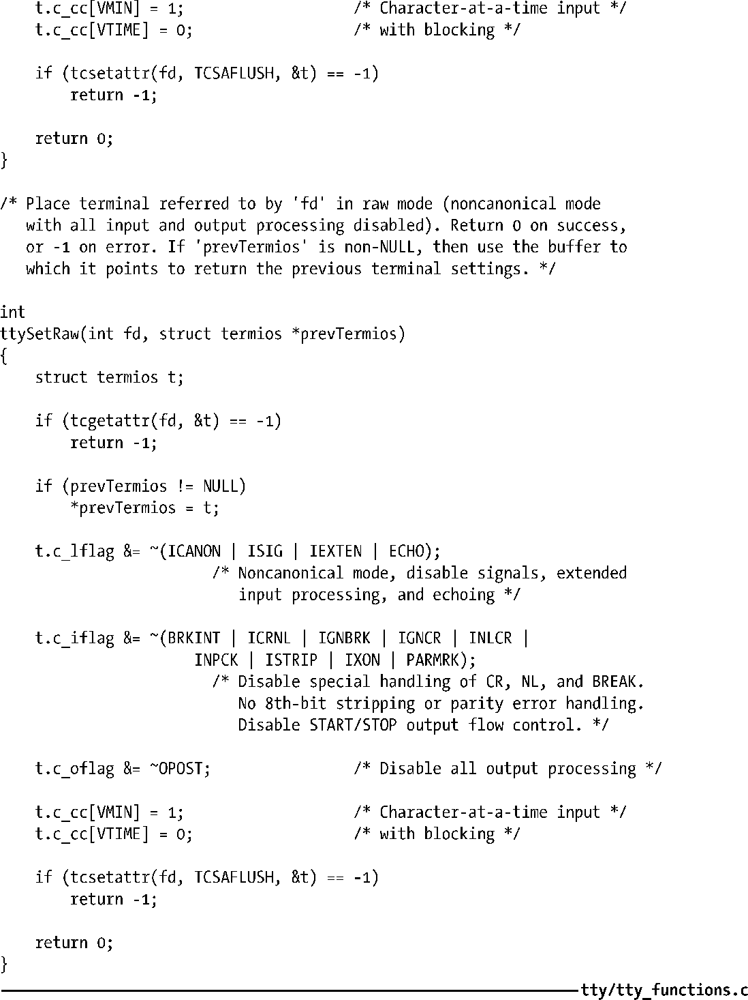
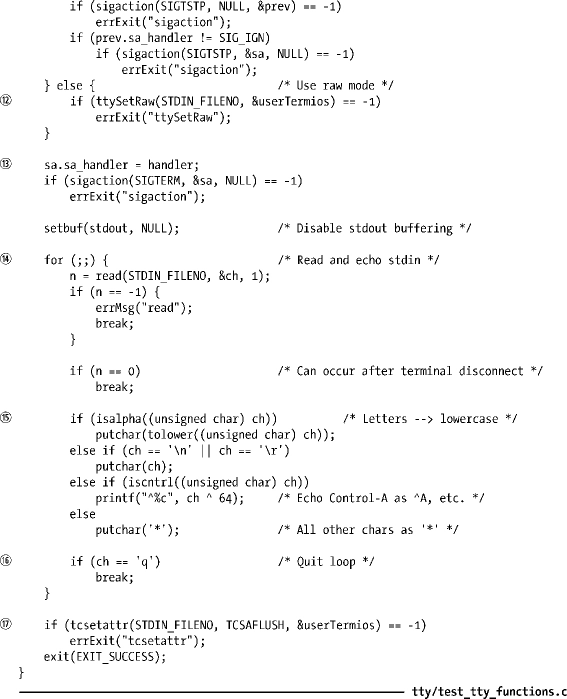
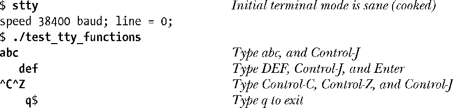
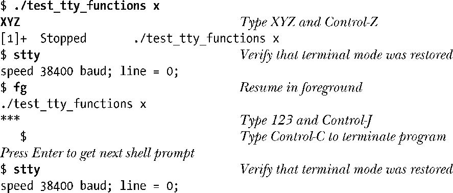

### 62.6.3　加工模式、cbreak模式以及原始模式

第7版UNIX操作系统（以及早期的BSD系统）中的终端驱动程序能够以3种方式处理输入，分别是：加工模式（cooked mode），cbreak模式和原始模式。这3种模式之间的区别总结如表62-3所示。

<b class="my_markdown"><!--StartFragment--></b>

<b class="my_markdown">表62-3：加工模式、cbreak模式和原始模式之间的区别</b>

| 功 能 特 性 | 模　　式 |
| :-----  | :-----  | :-----  | :-----  |
| 加 工 模 式 | Cbreak模式 | 原 始 模 式 |
| 输入处理 | 按行 | 按字符 | 按字符 |
| 行编辑？ | 是 | 否 | 否 |
| 对产生信号的字符做解释？ | 是 | 是 | 否 |
| 是否解释START/STOP字符？ | 是 | 是 | 否 |
| 是否解释其他的特殊字符？ | 是 | 否 | 否 |
| 是否执行其他的输入处理？ | 是 | 是 | 否 |
| 是否执行其他的输出处理？ | 是 | 是 | 否 |
| 是否回显输入？ | 是 | 可能会 | 否 |

加工模式本质上就是带有处理默认特殊字符功能的规范模式（可以对CR、NL和EOF进行解释；打开行编辑功能；处理可产生信号的字符；设定ICRNL、OCRNL标志等）。

原始模式则恰好相反，它属于非规范模式，所有的输入和输出都不能做任何处理，而且不能回显。（如果应用程序需要确保终端驱动程序绝对不会对传输的数据做任何修改，那就应该使用这种模式。）

cbreak模式处于加工模式和原始模式之间。输入是按照非规范的方式来处理的，但产生信号的字符会被解释，且仍然会出现各种输入和输出的转换（取决于个别标志的设定）。cbreak模式并不会禁止回显，但采用这种模式的应用程序通常都会禁止回显功能。cbreak模式在与屏幕处理相关的应用程序中很有用（比如less），这类程序允许逐个字符的输入，但仍然需要对INTR、QUIT以及SUSP这样的字符做解释。

#### 示例程序

在第 7 版 UNIX 以及原始的 BSD 系统的终端驱动程序中，可以通过调整终端驱动程序数据结构中的单个比特位（称作RAW和CBREAK）在原始和cbreak模式间切换。由于过渡到了POSIX termios接口上（现在已经在所有的UNIX实现上得以支持），现在已经无法再通过单个比特位在原始和 cbreak 模式之间做选择了。因此如果应用程序要模拟出这些模式，必须显式地修改termios结构体中的相关字段。程序清单62-3给出了两个函数ttySetCbreak()以及ttySetRaw()，它们实现了对应的终端模式。

> 用到了 ncurses 库的应用程序可以调用函数 cbreak()以及 raw()。它们实现的功能同程序清单62-3中给出的函数类似。

程序清单62-3：将终端切换到cbreak和原始模式中

将终端置于原始或cbreak模式下的程序，当它终止时必须小心地将终端返回到一个可用的模式下。除了其他任务之外，需要处理所有可能会发送给程序的信号，这样该程序就不会过早终止执行。（cbreak模式下，作业控制信号仍然可以从键盘上产生。）

程序清单62-4给出了一个如何完成这些任务的例子。该程序执行以下的步骤。

+ 根据是否提供有命令行参数（任意字符串），将终端设为cbreak模式或原始模式。以前的终端设置都保存在全局变量userTermios中。
+ 如果终端处于cbreak模式下，那么信号可以从终端中产生。这些信号需要得到处理，这样当程序终止或挂起时会将终端置于用户所期望的状态中。程序为信号SIGQUIT和SIGINT安装同样的处理例程。信号SIGTSTP需要一些特别处理，因此这个信号需要安装一个不同的处理例程。
+ 为信号SIGTERM安装处理例程，这是为了捕获由kill命令默认发送的信号。
+ 执行一个循环，从标准输入（stdin）上一次读取一个字符，并在标准输出上回显。程序在将字符输出之前会对各种各样的输入字符做特殊处理。
      + 在输出之前将所有的字符转换为小写形式。
    + 换行符（\n）和回车符（\r）不做任何修改就直接回显。
    + 除了换行符和回车符之外的控制字符都以2字符序列的形式回显：^加上对应的大写字符（例如，Ctrl-A回显为^A）。
    + 所有其他的字符都回显为星号（*）。
    + 字母q使循环终止。  
+ 退出循环后，将终端恢复到上次用户设定的状态，然后终止程序。

程序为信号 SIGQUIT、SIGINT 以及 SIGTERM 安装同一个处理例程。该处理例程将终端状态恢复到上一次用户的设定，然后终止程序。

信号SIGTSTP的处理例程以34.7.3节中所描述的方式来处理该信号。对于这个信号处理例程，需要注意如下几点细节。

+ 刚开始时，处理例程保存当前的终端设置（保存到ourTermios中）。启动该程序时，在再次引发 SIGTSTP 信号而终止进程之前，将终端重置为生效的设定（保存在userTermios中）。
+ 在接收到信号 SIGCONT 后，程序恢复执行。处理例程再次将当前的终端设定保存到userTermios中，由于当程序停止执行时用户可能已经修改了设置（比如通过stty命令）。之后处理例程就可以将终端返回到程序所要求的状态中（ourTermios）。

程序清单62-4：演示cbreak模式以及原始模式

当我们请求程序清单62-4使用原始模式时，下面是我们会看到的输出示例。

在上述shell会话的最后一行中，我们看到shell将自己的提示符同导致程序终止的字符q打印在了同一行上。

下面是采用cbreak模式时的输出示例。

