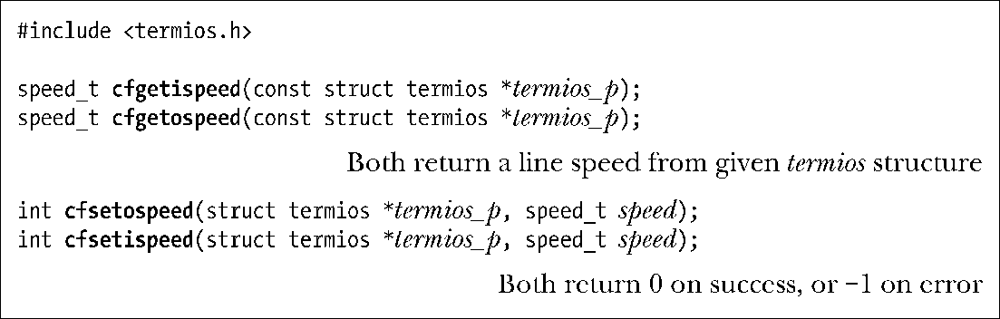
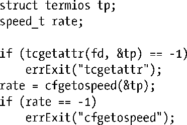
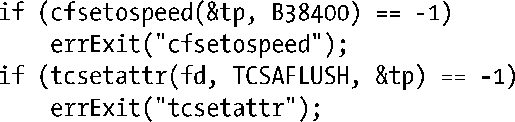

### 62.7　终端线速（比特率）

不同的终端之间（以及串行线）传输和接收的速率（位数每秒）是不同的。函数cfgetispeed()和cfsetispeed()用来获取和修改输入的线速。函数cfgetospeed()和cfsetospeed()用来获取和修改输出的线速。

> 术语波特（baud）通常被当做是终端线速（位数每秒）的同义词，尽管这种用法在技术上来说并不正确。准确地说，波特（baud）是线路中信号每秒可以变化的频率，和每秒可传送的位数不是一回事，因为后者取决于比特位要如何编码为信号。不过，术语波特（baud）依然继续被用作位率（位数每秒）的同义词。（术语“波特率”（baud rate）常常用作波特baud的同义词，但这么说是冗余的，因为波特定义的就是速率。）为了避免这些混淆，我们通常就用线速或位率这样的术语。

这里每一个函数用到的termios结构体都必须先通过tcgetattr()来初始化。

比如，要找出当前终端的输出线速，我们可以这样做：

如果我们希望修改这个线速，可以继续按照下面这样处理：

数据类型speed_t用来保存线速。这里没有直接以数值形式来设置线速，而是采用了一组符号常量（定义在<termios.h>中）。这些常量定义了一系列离散的值。关于这些常量，有一些例子比如B300、B2400、B9600以及B38400，分别各自对应于线速300、2400、9600以及38400位数每秒。使用一组离散的数值也反应出一个事实，那就是终端通常都被设计为工作在一组固定的不同线速上（已标准化的）。这些线速都从某个基准线速派生而来（例如115200通常用于个人电脑），基准线速除以某个整数得到这些线速（例如，115200 / 12 = 9600）。

SUSv3规定了终端线速应该保存在termios结构体中，但并没有规定（故意的）保存在哪个字段中。包括Linux在内的许多实现中，都是在c_cflag字段中通过CBAUD掩码和CBAUDEX标志来维护这些值。（在62.2节中，我们提到过在Linux中，termios结构体中的非标准字段c_ispeed和c_ospeed是不被使用的。）

尽管函数cfsetispeed()和cfsetospeed()可以分开指定输入和输出线速，但是在许多终端上这两个速率必须是一样的。此外，Linux 只用一个单独的字段来保存线速（即，假定这两个速率值总是一样的），这表示所有同输入和输出线速率相关的函数访问的都是相同的termios结构体字段。

> 在cfsetispeed()中将speed设置为0表示将输入线速设定为稍后调用tcsetattr()时得到的任何输出线速值。在那些将这两个线速分开维护的系统中，这种方法十分有用。

