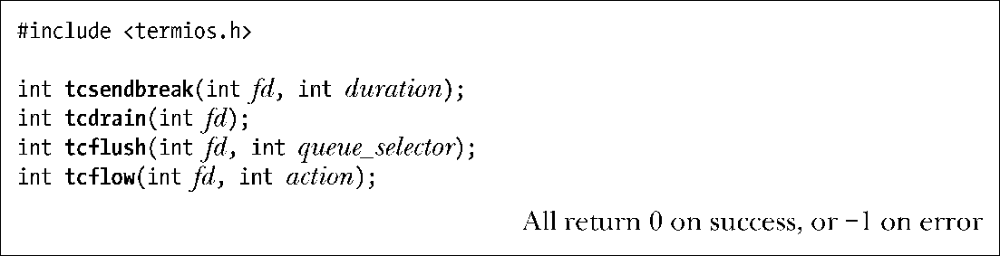

### 62.8　终端的行控制

函数tcsendbreak()、tcdrain()、tcflush()以及tcflow()所执行的任务通常都归类在行控制（line control）下。（这些函数都是POSIX中创建的，被设计用来取代各种ioctl()操作。）

在每个函数中，参数fd表示文件描述符，它指向终端或串行线上的其他远程设备。

tcsendbreak()函数通过传输连续的0比特流产生一个BREAK状态。参数duration指定了传输持续的时间。如果 duration 为 0，那么传输 0 比特序列的时间将持续0.25秒。（SUSv3规定这个时间至少要有0.25秒，但不超过0.5秒。）如果duration的值大于0，传输0比特序列的时间就会持续duration个毫秒。SUSv3对于这种情况没有做任何规定，对于非零值的duration应该如何处理，在不同的UNIX实现中区别很大（这里讨论的细节只针对于glibc）。

函数tcdrain()刷新（丢弃）终端输入队列、终端输出队列或者这两者中的数据（见图62-1）。刷新输入队列将丢弃已经由终端驱动程序接收但还没有被任何进程读取的数据。比如，一个应用程序可以使用tcflush()来丢弃提示输入密码之前就已经输入到终端的数据。刷新输出队列将丢弃已经写入（传递到终端驱动程序）但还没有传递给设备的数据。参数queue-selector指定了表62-4中所示的其中一个值。

> 注意，术语刷新（flush）在tcflush()中的含义和我们在谈论文件I/O时是不一样的。对于文件I/O，刷新意味着通过标准输入的fflush()将输出从用户空间内存上强制传输到缓冲区cache上，或者通过fsync()、fdatasync()以及sync()强制将数据从缓冲区cache传输到磁盘上。

<b class="my_markdown"><!--StartFragment--></b>

<b class="my_markdown">表62-4：tcflush()中参数queue_selector的值</b>

| 值 | 描　　述 |
| :-----  | :-----  | :-----  | :-----  |
| TCIFLUSH | TCOFLUSH | TCIOFLUSH | 刷新输入队列 | 刷新输出队列 | 输入队列和输出队列都得到刷新 |

函数tcflow()控制着数据在计算机和终端（或者其他的远程设备）之间的数据流方向。参数action为表62-5中所示的值之一。TCIOFF和TCION只有在终端能够解释STOP和START字符时才有效，在这种情况下这些操作将分别导致终端暂停和恢复发送数据到计算机。

<b class="my_markdown">表62-5：tcflush()中参数action的值</b>

| 值 | 描　　述 |
| :-----  | :-----  | :-----  | :-----  |
| TCOOFF | 暂停终端上的输出 |
| TCOON | 恢复终端上的输出 |
| TCIOFF | 传送一个STOP字符给终端 |
| TCION | 传送一个START字符给终端 |

