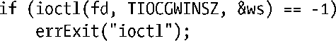
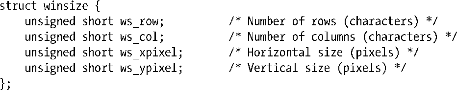
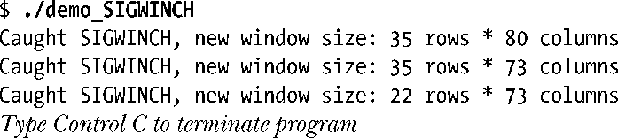
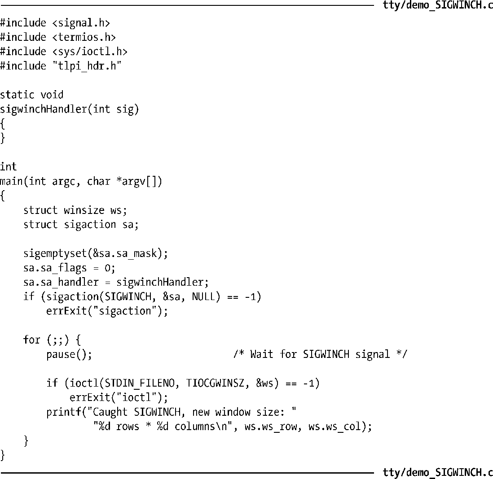
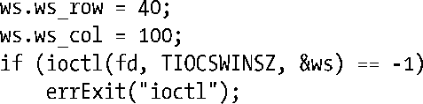

### 62.9　终端窗口大小

在一个窗口环境中，一个处理屏幕的应用程序需要能够监视终端窗口的大小，这样当用户修改了窗口大小时能够适当地重新绘制屏幕。内核对此提供了两种方式来 支持。

+ 在终端窗口大小改变后发送一个SIGWINCH信号给前台进程组。默认情况下，该信号被忽略。
+ 在任意时刻——通常是在接收到SIGWINCH信号之后——进程可以使用 ioctl()的TIOCGWINSZ操作来获取终端窗口的当前大小。

ioctl()的TIOCGWINSZ操作应该按照如下方式来使用。

参数fd表示指向终端窗口的文件描述符。ioctl()的最后一个参数是指向winsize结构体（定义在<sys/ioctl.h>中）的指针，用来返回终端窗口的大小。

和许多其他的实现一样，Linux没有使用winsize结构体中与像素大小相关的字段。

程序清单62-5演示了信号SIGWINCH以及ioctl()的TIOCGWINSZ操作的用法。下面是运行该程序时的输出示例，该程序运行在一个窗口管理器下，而且终端窗口大小改变了3次。

程序清单62-5：监视终端窗口大小的改变

也可以在ioctl()的TIOCSWINSZ操作中传入一个初始化过的winsize结构体来修改终端驱动程序对于窗口大小的设定。

如果winsize结构体中的值与终端驱动程序当前对于终端窗口大小的设定不一致，那么会发生两件事情：

+ 终端驱动程序的数据结构得到更新，使用的值正是在参数ws中提供的新值；
+ 发送一个SIGWINCH信号到终端的前台进程组中。

然而需要注意的是，这些事件本身并不足以改变实际的窗口显示尺寸，这是由内核之外的软件所控制的（比如窗口管理器或终端模拟器程序）。

尽管并没有在SUSv3中得到规范化，大多数UNIX实现都提供了本节介绍的ioctl()操作来访问终端的窗口大小。

