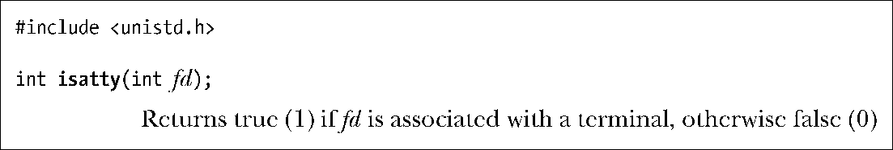
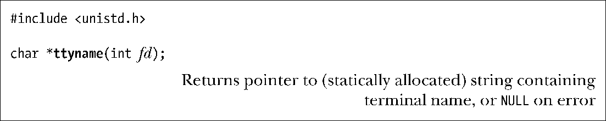

### 62.10　终端标识

在34.4节中，我们介绍了ctermid()函数，该函数返回进程控制终端的名称（在UNIX系统上通常为/dev/tty）。本节描述的函数对于标识终端也同样有用。

函数isatty()使我们能够判断文件描述符fd是否同一个终端相关联（相比于其他的文件类型）。

函数isatty()对于编辑器和其他需要判断标准输入和输出是否要定向到终端上的屏幕处理程序来说十分有用。

给定一个文件描述符，函数ttyname()返回与之相关的终端设备名称。

要得到终端的名称，ttyname()通过调用18.8节中描述的函数opendir()和readdir()来遍历包含终端设备名称的目录，查找每个目录，直到找到的设备 ID 号（stat结构体中的st_rdev字段）同文件描述符fd所关联的设备相匹配。终端设备通常都保存在两个目录下：/dev和/dev/pts。/dev目录中包含了有关虚拟控制台的条目（比如，/dev/tty1）和 BSD 伪终端。/dev/pts目录则包含了（System V风格）伪终端从设备。（我们在第64章中讨论伪终端。）

> ttyname()还有一个形式为ttyname_r()的可重入版本。
> tty(1)命令可以显示出与它的标准输入相关联的终端名称，它是函数ttyname()的命令行模拟。

