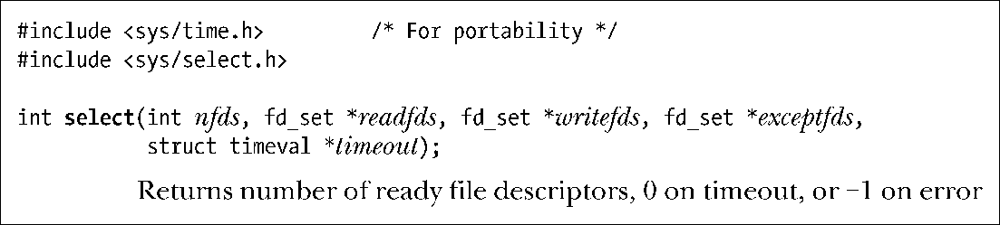
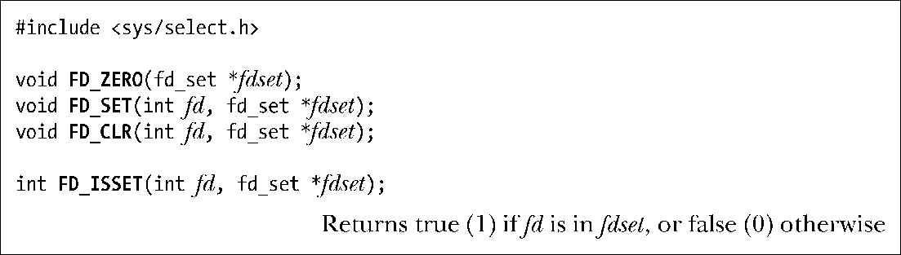
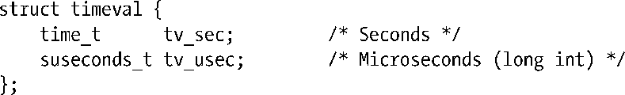
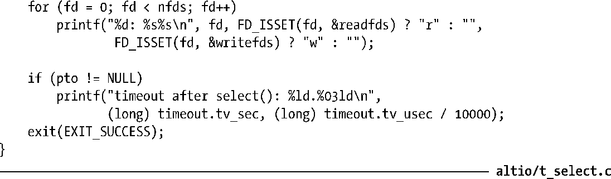
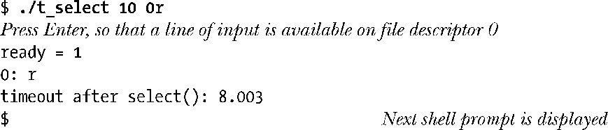
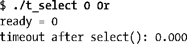
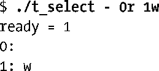

### 63.2.1　select()系统调用

系统调用select()会一直阻塞，直到一个或多个文件描述符集合成为就绪态。

参数nfds、readfds、writefds和exceptfds指定了select()要检查的文件描述符集合。参数timeout可用来设定select()阻塞的时间上限。我们接下来详细描述这些参数的意义。

> 上文给出的select()函数原型中我们包含了头文件<sys/time.h>，因为这是SUSv2中指定的头文件，而且其他一些UNIX实现中需要这个头文件。（Linux中也提供有头文件<sys/time.h>，包含它没什么坏处。）

#### 文件描述符集合

参数readfds、writefds以及exceptfds都是指向文件描述符集合的指针，所指向的数据类型是fd_set。这些参数按照如下方式使用。

+ readfds是用来检测输入是否就绪的文件描述符集合。
+ writefds是用来检测输出是否就绪的文件描述符集合。
+ exceptfds是用来检测异常情况是否发生的文件描述符集合。

术语“异常情况”常常被误解为在文件描述符上出现了一些错误，这并不正确。在 Linux上，一个异常情况只会在下面两种情况下发生（其他的UNIX实现也类似）。

+ 连接到处于信包模式下的伪终端主设备上的从设备状态发生了改变（见64.5节）。
+ 流式套接字上接收到了带外数据（见61.13.1节）。

通常，数据类型fd_set以位掩码的形式来实现。但是，我们并不需要知道这些细节，因为所有关于文件描述符集合的操作都是通过四个宏来完成的：FD_ZERO()，FD_SET()，FD_CLR()以及FD_ISSET()。

这些宏按如下方式工作。

+ FD_ZERO()将fdset所指向的集合初始化为空。
+ FD_SET()将文件描述符fd添加到由fdset所指向的集合中。
+ FD_CLR()将文件描述符fd从fdset所指向的集合中移除。
+ 如果文件描述符fd是fdset所指向的集合中的成员，FD_ISSET()返回true。

文件描述符集合有一个最大容量限制，由常量FD_SETSIZE来决定。在Linux上，该常量的值为1024。（其他UNIX实现对于该限制也有类似的常量值来限定。）

> 尽管 FD_*宏操作的是用户空间数据结构，select()的内核实现却能处理更大的文件描述符集合。在glibc中没有什么简单的方法可以修改FD_SETSIZE的定义。如果我们想修改这个限制，必须修改 glibc 头文件中的定义。但是，基于本章稍后提到的原因，如果我们需要检查大量的文件描述符，那么使用 epoll 可能比 select()更加可取。

参数 readfds、writefds 和 exceptfds 所指向的结构体都是保存结果值的地方。在调用select()之前，这些参数指向的结构体必须初始化（通过FD_ZERO()和FD_SET()），以包含我们感兴趣的文件描述符集合。之后select()调用会修改这些结构体，当select()返回时，它们包含的就是已处于就绪态的文件描述符集合了。（由于这些结构体会在调用中被修改，如果要在循环中重复调用 select()，我们必须保证每次都要重新初始化它们。）之后这些结构体可以通过FD_ISSET()来检查。

如果我们对某一类型的事件不感兴趣，那么相应的fd_set参数可以指定为NULL。我们将在63.2.3节中对这三种事件类型做更准确的解释。

参数nfds必须设为比3个文件描述符集合中所包含的最大文件描述符号还要大1。该参数让select()变得更有效率，因为此时内核就不用去检查大于这个值的文件描述符号是否属于这些文件描述符集合。

#### timeout参数

参数timeout控制着select()的阻塞行为。该参数可指定为NULL，此时select()会一直阻塞。又或者指向一个timeval结构体。

如果结构体timeval的两个域都为0的话，此时 select()不会阻塞，它只是简单地轮询指定的文件描述符集合，看看其中是否有就绪的文件描述符并立刻返回。否则，timeout将为select()指定一个等待时间的上限值。

尽管结构体timeval能支持微秒级的精度，该调用的准确度仍受软件时钟粒度的限制（见10.6节）。SUSv3规定，当timeout不是该粒度的整数倍时将向上取整。

> SUSv3要求最大允许的超时间隔至少为31天。大多数UNIX实现允许一个相当高的限制值。由于Linux/x86-32使用32位整数作为time_t的类型，因此上限值高达数年。

当timeout设为NULL，或其指向的结构体字段非零时，select()将阻塞直到有下列事件发生：

+ readfds、writefds或exceptfds中指定的文件描述符中至少有一个成为就绪态；
+ 该调用被信号处理例程中断；
+ timeout中指定的时间上限已超时。

> 在缺少亚秒级sleep调用（例如nanosleep()）的老式UNIX实现中，select()被用来模拟这个功能。这可以通过指定nfds为0，readfds、writefds以及exceptfds全设为NULL，而期望的休眠时间在timeout中指定来完成。

在Linux上，如果select()因为有一个或多个文件描述符成为就绪态而返回，且如果参数timeout非空，那么select()会更新timeout所指向的结构体以此来表示剩余的超时时间。但是，这种行为是与具体实现相关的。SUSv3中还允许系统不去修改timeout所指向的结构体，且大多数UNIX实现都不会修改这个结构体。在循环中使用了select()的可移植的应用程序应该总是确保timeout所指向的结构体在每次调用select()之前都要得到初始化，而且在调用完成后应该忽略该结构体中返回的信息。

SUSv3中规定由timeout所指向的结构体只有在select()调用成功返回后才有可能被修改。但是，在 Linux上如果select()被一个信号处理例程中断的话（因此select()会产生EINTR错误码），那么该结构体也会被修改以表示剩余的超时时间（其作用相当于 select()成功返回）。

> 如果我们使用Linux专有的personality()系统调用来设定包含了STICKY_TIMEOUTS位的进程运行域，那么select()将不会修改由timeout所指向的结构体。

#### select()的返回值

作为函数的返回值，select()会返回如下几种情况中的一种。

+ 返回−1表示有错误发生。可能的错误码包括 EBADF 和 EINTR。EBADF 表示readfds、writefds或者exceptfds中有一个文件描述符是非法的（例如当前并没有打开）。EINTR表示该调用被信号处理例程中断了。（如21.5节所述，如果被信号处理例程中断，select()是不会自动恢复的。）
+ 返回0表示在任何文件描述符成为就绪态之前select()调用已经超时。在这种情况下，每个返回的文件描述符集合将被清空。
+ 返回一个正整数表示有1个或多个文件描述符已达到就绪态。返回值表示处于就绪态的文件描述符个数。在这种情况下，每个返回的文件描述符集合都需要检查（通过 FD_ISSET()），以此找出发生的 I/O 事件是什么。如果同一个文件描述符在readfds、writefds和exceptfds中同时被指定，且它对于多个I/O事件都处于就绪态的话，那么就会被统计多次。换句话说，select()返回所有在 3 个集合中被标记为就绪态的文件描述符总数。

#### 示例程序

程序清单63-1中的程序说明了select()的用法。通过命令行参数，我们可以指定超时时间以及我们希望检查的文件描述符。第一个命令行参数指定了select()中的timeout参数，以秒为单位。如果这里指定了连字符（-），那么select()的timeout参数就设为NULL，表示会一直阻塞。剩下的命令行参数用来指定需要检查的文件描述符个数，跟着的字符表示需要被检查的事件类型。我们这里可以指定的是r（读就绪）和w（写就绪）。

程序清单63-1：使用select()来检查多个文件描述符

在下面的shell会话日志中，我们说明了程序清单63-1的用法。在第一个例子中，我们请求检查文件描述符0上的输入，超时时间定为10秒。

上面的输出告诉我们select()确定了有一个文件描述符已处于就绪态。文件描述符0已经准备好读取数据了。我们也可以看到timeout已经被修改了。最后一行输出只有shell提示符$，这是因为t_select程序并没有读取让文件描述符0处于读就绪态的换行符，因此这个字符由shell读取，结果就是打印出了另一个shell提示符。

在下一个示例中，我们再次检查文件描述符 0 的输入状态，但这一次将超时时间设为0秒。

select()调用立刻返回，且发现没有文件描述符处于就绪态。

下一个示例中，我们检查文件描述符0上是否有输入，以及文件描述符1上是否有输出。在这种情况下，我们将参数timeout设为NULL（第一个命令行参数为连字符-），表示一直阻塞下去。

select()调用立刻返回，并告诉我们文件描述符1上有输出。

