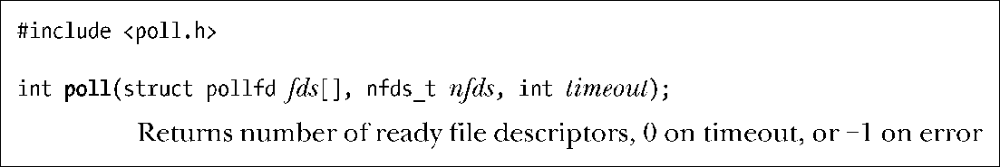
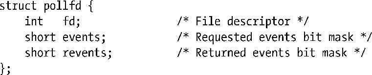
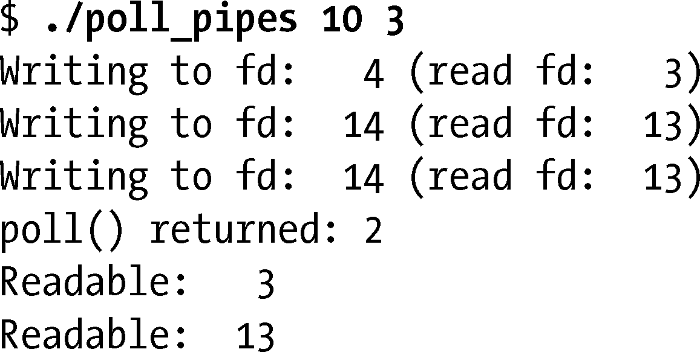
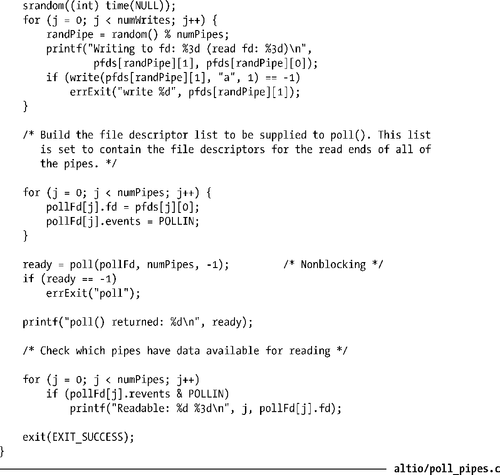

### 63.2.2　poll()系统调用

系统调用poll()执行的任务同select()很相似。两者间主要的区别在于我们要如何指定待检查的文件描述符。在select()中，我们提供三个集合，在每个集合中标明我们感兴趣的文件描述符。而在poll()中我们提供一列文件描述符，并在每个文件描述符上标明我们感兴趣的事件。

参数fds列出了我们需要poll()来检查的文件描述符。该参数为pollfd结构体数组，其定义如下。

参数nfds指定了数组fds中元素的个数。数据类型nfds_t实际为无符号整形。

pollfd结构体中的events和revents字段都是位掩码。调用者初始化events来指定需要为描述符fd做检查的事件。当poll()返回时，revents被设定以此来表示该文件描述符上实际发生的事件。

表63-2列出了可能会出现在events和revents字段中的位掩码。该表中第一组位掩码（POLLIN、POLLRDNORM、POLLRDBAND、POLLPRI以及POLLRDHUP）同输入事件相关。下一组位掩码（POLLOUT、POLLWRNORM以及POLLWRBAND）同输出事件相关。第三组位掩码（POLLERR、POLLHUP以及POLLNVAL）是设定在revents字段中用来返回有关文件描述符的附加信息。如果在events字段中指定了这些位掩码，则这三位将被忽略。在Linux系统中，poll()不会用到最后一个位掩码POLLMSG。

<b class="my_markdown">表63-2：pollfd结构体中events和revents字段中出现的位掩码值</b>

| 位　掩　码 | events中的输入 | 返回到revents | 描　　述 |
| :-----  | :-----  | :-----  | :-----  | :-----  | :-----  |
| POLLIN | ● | ● | 可读取非高优先级的数据 |
| POLLRDNORM | ● | ● | 等同于POLLIN |
| POLLRDBAND | ● | ● | 可读取优先级数据（Linux中不使用） |
| POLLPRI | ● | ● | 可读取高优先级数据 |
| POLLRDHUP | ● | ● | 对端套接字关闭 |
| POLLOUT | ● | ● | 普通数据可写 |
| POLLWRNORM | ● | ● | 等同于POLLOUT |
| POLLWRBAND | ● | ● | 优先级数据可写入 |
| POLLERR |  | ● | 有错误发生 |
| POLLHUP |  | ● | 出现挂断 |
| POLLNVAL |  | ● | 文件描述符未打开 |
| POLLMSG |  |  | Linux中不使用（SUSv3中未指定） |

> 在提供有STREAMS设备的UNIX实现中，POLLMSG表示包含有SIGPOLL信号的消息已经到达stream头部。Linux中没有使用到POLLMSG，因为Linux并没有实现STREAMS。

如果我们对某个特定的文件描述符上的事件不感兴趣，可以将events设为0。另外，给fd字段指定一个负值（例如，如果值为非零，取它的相反数）将导致对应的events字段被忽略，且revents字段将总是返回0。这两种方法都可以用来（也许只是暂时的）关闭对单个文件描述符的检查，而不需要重新建立整个fds列表。

注意，下面进一步列出的要点主要是关于poll()的Linux实现。

+ 尽管被定义为不同的位掩码，POLLIN和POLLRDNORM是同义词。
+ 尽管被定义为不同的位掩码，POLLOUT 和 POLLWRNORM 是同义词。
+ 一般来说POLLRDBAND是不被使用的，也就是说它在events字段中被忽略，也不会设定到revents中去。

> 唯一用到POLLRDBAND的地方是在实现DECnet网络协议的代码中（已过时）。

+ 尽管在特定情形下可用于对套接字的设定，POLLWRBAND并不会传达任何有用的信息。（不会出现当POLLOUT和POLLWRNORM没有设定，而设定了POLLWRBAND的情况。）

> POLLRDBAND和POLLWRBAND对于提供有System V STREAMS实现的系统来说是有意义的（Linux没有实现STREAMS）。在STREAMS下，消息可以附上一个非零的优先级，这样的消息在接收端排队时按照优先级递减的方式排列，会排在普通消息（优先级为0）的前面。

+ 必须定义_XOPEN_SOURCE 测试宏，这样才能在头文件<poll.h>中得到常量POLLRDNORM、POLLRDBAND、POLLWRNORM以及POLLWRBAND的定义。
+ POLLRDHUP是Linux专有的标志位，从2.6.17版内核以来就一直存在。要在头文件<poll.h>中得到它的定义，必须定义_GNU_SOURCE测试宏。
+ 如果指定的文件描述符在调用poll()时关闭了，则返回POLLNVAL。

总结以上要点，poll()真正关心的标志位就是POLLIN、POLLOUT、POLLPRI、POLLRDHUP、POLLHUP以及POLLERR。我们在63.2.3节中以更详尽的方式讨论这些标志位的意义。

#### timeout参数

参数timeout决定了 poll()的阻塞行为，具体如下。

+ 如果timeout等于−1，poll()会一直阻塞直到 fds 数组中列出的文件描述符有一个达到就绪态（定义在对应的events字段中）或者捕获到一个信号。
+ 如果timeout等于0，poll()不会阻塞——只是执行一次检查看看哪个文件描述符处于就绪态。
+ 如果timeout大于0，poll()至多阻塞timeout毫秒，直到fds列出的文件描述符中有一个达到就绪态，或者直到捕获到一个信号为止。

同select()一样，timeout的精度受软件时钟粒度的限制（见10.6节），而SUSv3中规定，如果timeout的值不是时钟粒度的整数倍，将总是向上取整。

#### poll()的返回值

作为函数的返回值，poll()会返回如下几种情况中的一种。

+ 返回−1表示有错误发生。一种可能的错误是EINTR，表示该调用被一个信号处理例程中断。（如21.5节中所注明的，如果被信号处理例程中断，poll()绝不会自动恢复。）
+ 返回0表示该调用在任意一个文件描述符成为就绪态之前就超时了。
+ 返回正整数表示有1个或多个文件描述符处于就绪态了。返回值表示数组fds中拥有非零revents字段的pollfd结构体数量。

> 注意select()同poll()返回正整数值时的细小差别。如果一个文件描述符在返回的描述符集合中出现了不止一次，系统调用select()会将同一个文件描述符计数多次。而系统调用poll()返回的是就绪态的文件描述符个数，且一个文件描述符只会统计一次，就算在相应的revents字段中设定了多个位掩码也是如此。

#### 示例程序

程序清单63-2给出了一个使用poll()的简单演示。这个程序创建了一些管道（每个管道使用一对连续的文件描述符），将字节写到随机选择的管道写端，然后通过poll()来检查看哪个管道中有数据可进行读取。

下面的 shell 会话展示了当我们运行该程序时会看到什么结果。程序的命令行参数指定了应该创建10个管道，而写操作应该随机选择其中的3个管道。

从上面的输出我们可知poll()发现两个管道上有数据可读取。

程序清单63-2：使用poll()来检查多个文件描述符

