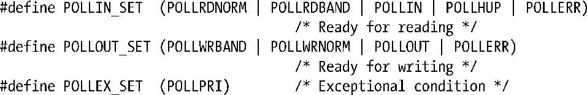

### 63.2.4　比较select()和poll()

本节中，我们讨论一些select()和poll()之间的异同点。

#### 实现细节

在Linux内核层面，select()和poll()都使用了相同的内核poll例程集合。这些poll例程有别于系统调用 poll()本身。每个例程都返回有关单个文件描述符就绪的信息。这个就绪信息以位掩码的形式返回，其值同poll()系统调用中返回的revents字段中的比特值相关（见表63-2）。poll()系统调用的实现包括为每个文件描述符调用内核poll例程，并将结果信息填到对应的revents字段中去。

为了实现select()，我们使用一组宏将内核poll例程返回的信息转化为由select()返回的与之对应的事件类型。

这些宏定义展现了 select()和 poll()所返回的信息之间的语义关系。（观察63.2.3节的表格中select()和poll()这两列，可以发现每个系统调用提供的信息都同上述宏保持一致。）唯一一点我们需要额外增加的是，如果被检查的文件描述符当中有一个关闭了，poll()会在 revents 字段中返回 POLLNVAL，而 select()会返回−1且将错误码设为EBADF。

#### API之间的区别

以下是系统调用select()和poll()之间的一些区别。

+ select()所使用的数据类型fd_set对于被检查的文件描述符数量有一个上限限制（FD_SETSIZE）。在Linux下，这个上限值默认为1024，修改这个上限需要重新编译应用程序。与之相反，poll()对于被检查的文件描述符数量本质上是没有限制的。
+ 由于select()的参数fd_set同时也是保存调用结果的地方，如果要在循环中重复调用select()的话，我们必须每次都要重新初始化fd_set。而 poll()通过独立的两个字段events（针对输入）和revents（针对输出）来处理，从而避免每次都要重新初始化参数。
+ select()提供的超时精度（微秒）比poll()提供的超时精度（毫秒）高。（这两个系统调用的超时精度都受软件时钟粒度的限制。）
+ 如果其中一个被检查的文件描述符关闭了，通过在对应的 revents 字段中设定POLLNVAL标记，poll()会准确告诉我们是哪一个文件描述符关闭了。与之相反，select()只会返回−1，并设错误码为 EBADF。通过在描述符上执行 I/O 系统调用并检查错误码，让我们自己来判断哪个文件描述符关闭了。通常这些区别都不重要，因为应用程序一般都会自己跟踪已经关闭的文件描述符。

#### 可移植性

历史上，select()比poll()使用得更加广泛。如今这两个接口都在SUSv3中标准化了，且都广泛存在于现代的UNIX实现中。但是如63.2.3节中提到的，poll()在不同的实现中行为上会有一些差别。

#### 性能

当如满足如下两条中任意一条时，poll()和select()将具有相似的性能表现。

+ 待检查的文件描述符范围较小（即，最大的文件描述符号较低）。
+ 有大量的文件描述符待检查，但是它们分布得很密集。（即，大部分或所有的文件描述符号都在0到某个上限之间）。

然而，如果被检查的文件描述符集合很稀疏的话，select()和 poll()的性能差异将变得非常明显。比如，最大文件描述符号 N 是个很大的整数，但在 0 到 N 之间只有 1 个或几个文件描述符要被检查。在这种情况下，poll()的性能表现将优于select()。我们可以通过传递给这两个系统调用的参数来理解这其中的原因。在select()中，我们传递一个或多个文件描述符集合，以及比待检查的集合中最大的文件描述符号还要大1的nfds。不管我们是否要检查范围0到nfds−1之间的所有文件描述符，nfds的值都不变。无论哪种情况，内核都必须在每个集合中检查nfds个元素，以此来查明到底需要检查哪个文件描述符。与之相反，当使用 poll()时，只需要指定我们感兴趣的文件描述符即可，内核只会去检查这些指定的文件描述符。

> Linux 2.4版中poll()和select()在稀疏的描述符集合中性能表现差异很大。在2.6版内核中通过一些优化手段，这个性能差异已经被极大地缩小了。

我们将在63.4.5节中进一步讨论select()和poll()的性能，在那一节中我们将比较这两个系统调用同epoll之间的性能差异。

