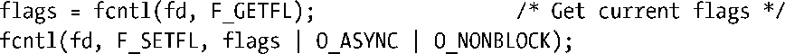
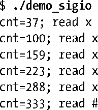
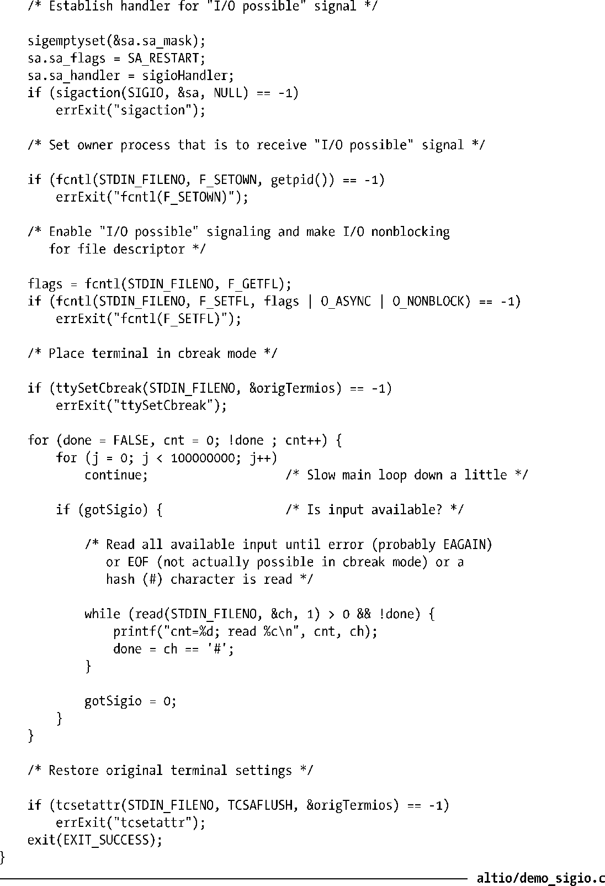
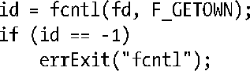

### 63.3　信号驱动I/O

在I/O多路复用中，进程是通过系统调用（select()或poll()）来检查文件描述符上是否可以执行I/O操作。而在信号驱动I/O中，当文件描述符上可执行I/O操作时，进程请求内核为自己发送一个信号。之后进程就可以执行任何其他的任务直到I/O就绪为止，此时内核会发送信号给进程。要使用信号驱动I/O，程序需要按照如下步骤来执行。

**1．** 为内核发送的通知信号安装一个信号处理例程。默认情况下，这个通知信号为SIGIO。

**2．** 设定文件描述符的属主，也就是当文件描述符上可执行I/O时会接收到通知信号的进程或进程组。通常我们让调用进程成为属主。设定属主可通过fcntl()的F_SETOWN操作来完成：

**3．** 通过设定O_NONBLOCK标志使能非阻塞I/O。

**4．** 通过打开O_ASYNC标志使能信号驱动I/O。这可以和上一步合并为一个操作，因为它们都需要用到fcntl()的F_SETFL操作（见5.3节）。

**5．** 调用进程现在可以执行其他的任务了。当I/O操作就绪时，内核为进程发送一个信号，然后调用在第1步中安装好的信号处理例程。

**6．** 信号驱动I/O提供的是边缘触发通知（见63.1.1节）。这表示一旦进程被通知I/O就绪，它就应该尽可能多地执行I/O（例如尽可能多地读取字节）。假设文件描述符是非阻塞式的，这表示需要在循环中执行I/O系统调用直到失败为止，此时错误码为EAGAIN或EWOULDBLOCK。

在Linux 2.4版及更早的时候，信号驱动I/O能应用于套接字、终端、伪终端以及其他特定类型的设备上。Linux 2.6版上信号驱动I/O还可以应用到管道和FIFO上。自Linux 2.6.25版以来，inotify文件描述符上也可以使用信号驱动I/O了。

在下面几页中，我们先给出一个使用信号驱动 I/O 的例子，然后详细解释上述这些步骤。

> 历史上，信号驱动 I/O 有时也被称为异步 I/O，这一点从相关的打开文件标志（O_ASYNC）中就能看出来。但是，如今术语异步I/O是用来表示由POSIX AIO规范所提供的功能。使用POSIX AIO时，进程请求内核执行一次I/O操作，内核启动该操作之后立刻将控制权还给调用进程，稍后当I/O操作完成或有错误发生时，该进程会得到通知。
> O_ASYNC在POSIX.1g中指定，但并不包含在SUSv3中，因为对这个标志所要求的行为规范并不足。
> 其他一些UNIX实现，尤其是比较老的实现中并没有在fcntl()中定义O_ASYNC常量。相反，这个常量被命名为FASYNC，而glibc将这个名字定义为O_ASYNC的别名。

#### 示例程序

程序清单63-3提供了一个使用信号驱动I/O的简单例子。该程序执行前文描述的步骤，在标准输入上使能信号驱动I/O，之后将终端置为cbreak模式（见62.6.3节），这样每次输入只会有一个字符。之后程序进入无限循环，所做的工作就是递增变量cnt，同时等待输入就绪。当有输入存在时，SIGIO 信号处理例程就设定一个标志gotSigio，该标志由主程序监控。当主程序看到该标志被设定后，就读取所有存在的输入字符并将它们连同变量cnt的当前值一起打印出来。如果输入中读取到了井字符（#），程序就退出。

下面是当我们运行该程序时会看到的输出，我们输入字符x多次，最后跟着一个井字符（#）。

程序清单63-3：在终端上使用信号驱动I/O

#### 在启动信号驱动I/O前安装信号处理例程

由于接收到SIGIO信号的默认行为是终止进程运行，因此我们应该在启动信号驱动I/O前先为SIGIO信号安装处理例程。如果我们在安装SIGIO信号处理例程之前先启动了信号驱动I/O，那么会存在一个时间间隙，此时如果I/O就绪的话内核发送过来的SIGIO信号就会使进程终止运行。

> 在其他一些UNIX实现上，信号SIGIO的默认行为是被忽略。

#### 设定文件描述符属主

我们使用fcntl()来设定文件描述符的属主，方式如下。

我们可以指定一个单独的进程或者是进程组中的所有进程在文件描述符I/O就绪时收到信号通知。如果参数pid为正整数，就解释为进程ID号。如果参数pid是负数，它的绝对值就指定了进程组ID号。

> 在老式的UNIX实现中，我们使用ioctl()的FIOSETOWN或SIOCSPGRP操作来实现同F_SETOWN相同的功能。基于可移植性考虑，Linux也支持这些ioctl()操作。

通常会在pid中指定调用进程的进程ID号（这样信号就会发送给打开这个文件描述符的进程）。但是，也可以将其指定为另一个进程或进程组（例如，调用者进程组），而信号会发送给这个目标，取决于如20.5节中所述的权限检查，这里发送进程会作为完成F_SETOWN操作的进程。

当指定的文件描述符上可执行I/O时，fcntl()的F_GETOWN操作会返回接收到信号的进程或进程组ID号。

进程组ID号以负数的形式由该调用返回。

> 在老式的UNIX实现中，与ioctl()的F_GETOWN操作相对应的操作是FIOGETOWN或SIOCGPGRP。Linux也支持这两种ioctl()操作。

系统调用约定在某些Linux所支持的架构上（值得注意的是x86架构）有一些限制。这意味着如果文件描述符由一个进程组ID小于 4096 的进程所持有，那么 fcntl()的G_GETOWN 操作不会以负数形式返回这个 ID 号，glibc 会错误地认为这是一个系统调用错误。结果就是，fcntl()的包装函数会返回−1，同时errno中会包含该进程组ID（正数形式）。这是因为内核系统调用接口返回负数形式的 errno 值作为函数返回值，以此来表示出现了错误。而在一些情况下，有必要将这样的结果同成功调用后返回的合法的负数值区分开来。要做到区分，glibc 将系统调用返回的−1到−4095 之间的负数解释为出现错误，将它们的值（以绝对值的形式）拷贝到errno中，然后返回−1作为函数结果。这种技术足以应对那些可以合法返回负数值的系统调用服务了。fcntl()的F_GETOWN操作是唯一会出现这种失败情况的例子。这个限制意味着使用进程组来接收“I/O就绪”信号（并　　不常见）的应用程序无法可靠地通过F_GETOWN来获知该进程组是否拥有一个文件描述符。

> 自glibc 2.11版之后，fcntl()包装函数解决了进程组ID号小于4096时的F_GETOWN问题。这是通过在用户空间使用F_GETOWN_EX（见63.3.2节）操作实现F_GETOWN来解决的。Linux 2.6.32版之后开始支持F_GETOWN_EX。

