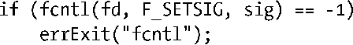
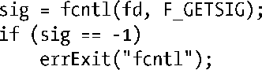
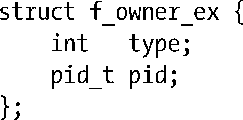

### 63.3.2　优化信号驱动I/O的使用

在需要同时检查大量文件描述符（比如数千个）的应用程序中——例如某种类型的网络服务端程序——同select()和poll()相比，信号驱动I/O能提供显著的性能优势。信号驱动I/O能达到这么高的性能是因为内核可以“记住”要检查的文件描述符，且仅当I/O事件实际发生在这些文件描述符上时才会向程序发送信号。结果就是采用信号驱动I/O的程序性能可以根据发生的I/O事件的数量来扩展，而与被检查的文件描述符的数量无关。

要想全部利用信号驱动I/O的优点，我们必须执行下面两个步骤。

+ 通过专属于Linux的fcntl() F_SETSIG操作来指定一个实时信号，当文件描述符上的I/O就绪时，这个实时信号应该取代SIGIO被发送。
+ 使用sigaction()安装信号处理例程时，为前一步中使用的实时信号指定SA_ SIGINFO标记（见21.4节）。

fcntl()的F_SETSIG操作指定了一个可选的信号，当文件描述符上的I/O就绪时会取代SIGIO信号被发送。

F_GETSIG操作完成的任务同F_SETSIG相反，它取回当前为文件描述符指定的信号。

（为了在头文件<fcntl.h>中得到F_SETSIG 和 F_GETSIG的定义，我们必须定义测试宏_GNU_SOURCE。）

使用F_SETSIG来改变用于通知“I/O就绪”的信号有两个理由，如果我们需要在多个文件描述符上检查大量的I/O事件，这两个理由都是必须的。

+ 默认的“I/O就绪”信号SIGIO是标准的非排队信号之一。如果有多个 I/O 事件发送了信号，而SIGIO被阻塞了——也许是因为SIGIO信号的处理例程已经被调用了——除了第一个通知外，其他后序的通知都会丢失。如果我们通过F_SETSIG来指定一个实时信号作为“I/O就绪”的通知信号，那么多个通知就能排队处理。
+ 如果信号处理例程是通过 sigaction()来安装，且在 sa.sa_flags 字段中指定了SA_SIGINFO 标志，那么结构体 siginfo_t 会作为第二个参数传递给信号处理例程（见21.4节）。这个结构体包含的字段标识出了在哪个文件描述符上发生了事件，以及事件的类型。

注意，需要同时使用F_SETSIG以及SA_SIGINFO才能将一个合法的siginfo_t结构体传递到信号处理例程中去。

如果我们做F_SETSIG操作时将参数sig指定为0，那么将导致退回到默认的行为：发送的信号仍然是SIGIO，而且结构体siginfo_t将不会传递给信号处理例程。

对于“I/O就绪”事件，传递给信号处理例程的结构体siginfo_t中与之相关的字段如下。

+ si_signo：引发信号处理例程得到调用的信号值。这个值同信号处理例程的第一个参数一致。
+ si_fd：发生I/O事件的文件描述符。
+ si_code：表示发生事件类型的代码。该字段中可出现的值以及它们的描述参见表63-7。
+ si_band：一个位掩码。其中包含的位和系统调用 poll()中返回的 revents 字段中的位相同。如表63-7所示，si_code中可出现的值同si_band中的位掩码有着一一对应的关系。

<b class="my_markdown">表63-7：结构体siginfo_t中si_code和si_band字段的可能值</b>

| si_code | si_band掩码值 | 描　　述 |
| :-----  | :-----  | :-----  | :-----  | :-----  |
| POLL_IN | POLLIN │ POLLRDNORM | 存在输入；文件结尾情况 |
| POLL_OUT | POLLOUT │ POLLWRNORM │ POLLWRBAND | 可输出 |
| POLL_MSG | POLLIN │ POLLRDNORM │ POLLMSG | 存在输出消息（不使用） |
| POLL_ERR | POLLERR | I/O错误 |
| POLL_PRI | POLLPRI │ POLLRDNORM | 存在高优先级输入 |
| POLL_HUP | POLLHUP │ POLLERR | 出现宕机 |

在一个纯输入驱动的应用程序中，我们可以进一步优化使用F_SETSIG。我们可以阻塞待发出的“I/O就绪”信号，然后通过sigwaitinfo()或sigtimedwait()（见22.10节）来接收排队中的信号。这些系统调用返回的siginfo_t结构体所包含的信息同传递给信号处理例程的siginfo_t结构体一样。以这种方式接收信号，我们实际是以同步的方式在处理事件，但同select()和poll()相比，这种方法能够高效地获知文件描述符上发生的I/O事件。

#### 信号队列溢出的处理

我们在22.8节中已经知道，可以排队的实时信号的数量是有限的。如果达到这个上限，内核对于“I/O就绪”的通知将恢复为默认的SIGIO信号。出现这种现象表示信号队列溢出了。当出现这种情况时，我们将失去有关文件描述符上发生I/O事件的信息，因为SIGIO信号是不会排队的。（此外，SIGIO的信号处理例程不接受siginfo_t结构体参数，这意味着信号处理例程不能确定是哪一个文件描述符上产生了信号。）

根据 22.8 节中所述，我们可以通过增加可排队的实时信号数量的限制来减小信号队列溢出的可能性。但是这并不能完全消除溢出的可能。一个设计良好的采用F_SETSIG来建立实时信号作为“I/O就绪”通知的程序必须也要为信号SIGIO安装处理例程。如果发送了SIGIO信号，那么应用程序可以先通过sigwaitinfo()将队列中的实时信号全部获取，然后临时切换到select()或poll()，通过它们获取剩余的发生I/O事件的文件描述符列表。

#### 在多线程程序中使用信号驱动I/O

从2.6.32版内核开始，Linux提供了两个新的非标准的fcntl()操作，可用于设定接收“I/O就绪”信号的目标，它们是F_SETOWN_EX和F_GETOWN_EX。

F_SETOWN_EX操作类似于F_SETOWN，但除了允许指定进程或进程组作为接收信号的目标外，它还可以指定一个线程作为“I/O就绪”信号的目标。对于这个操作，fcntl()的第三个参数为指向如下结构体的指针。

结构体中type字段定义了pid的类型，它可以有如下几种值。

##### F_OWNER_PGRP

字段pid指定了作为接收“I/O就绪”信号的进程组ID。与F_SETOWN不同的是，这里进程组ID指定为一个正整数。

##### F_OWNER_PID

字段pid指定了作为接收“I/O就绪”信号的进程ID。

##### F_OWNER_TID

字段pid指定了作为接收“I/O就绪”信号的线程ID。这里pid的值为clone()或getpid()的返回值。

F_GETOWN_EX为F_SETOWN_EX的逆操作。它使用fcntl()的第三个参数所指向的结构体f_owner_ex来返回之前由F_SETOWN_EX操作所定义的设置。

> 因为F_SETOWN_EX和F_GETOWN_EX操作以正整数来代表进程组ID，所以F_GETOWN_EX将不会遇到之前在描述F_GETOWN操作时说到的进程组ID小于4096时会出现的问题。

