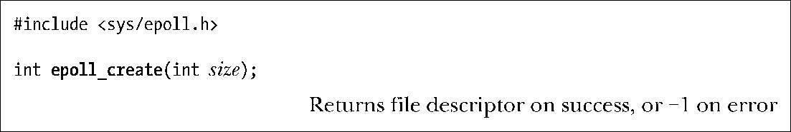

### 63.4.1　创建epoll实例：epoll_create()

系统调用epoll_create()创建了一个新的epoll实例，其对应的兴趣列表初始化为空。

参数size指定了我们想要通过epoll实例来检查的文件描述符个数。该参数并不是一个上限，而是告诉内核应该如何为内部数据结构划分初始大小。（从Linux 2.6.8版以来，size参数被忽略不用，因为内核实现做了修改意味着该参数之前提供的信息已经不再需要了。）

作为函数返回值，epoll_create()返回了代表新创建的epoll实例的文件描述符。这个文件描述符在其他几个epoll系统调用中用来表示epoll实例。当这个文件描述符不再需要时，应该通过close()来关闭。当所有与epoll实例相关的文件描述符都被关闭时，实例被销毁，相关的资源都返还给系统。（多个文件描述符可能引用到相同的epoll实例，这是由于调用了fork()或者dup()这样类似的函数所致。）

> 从2.6.27版内核以来，Linux支持了一个新的系统调用epoll_create1()。该系统调用执行的任务同epoll_create()一样，但是去掉了无用的参数size，并增加了一个可用来修改系统调用行为的flags参数。目前只支持一个flag标志：EPOLL_CLOEXEC，它使得内核在新的文件描述符上启动了执行即关闭（close-on-exec）标志（FD_CLOEXEC）。出于同样的原因，这个标志同4.3.1节中描述的open()的O_CLOEXEC标志一样有用。

