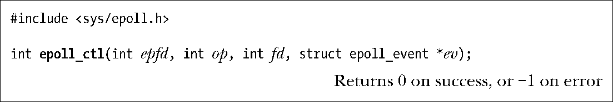
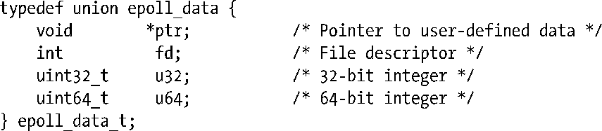
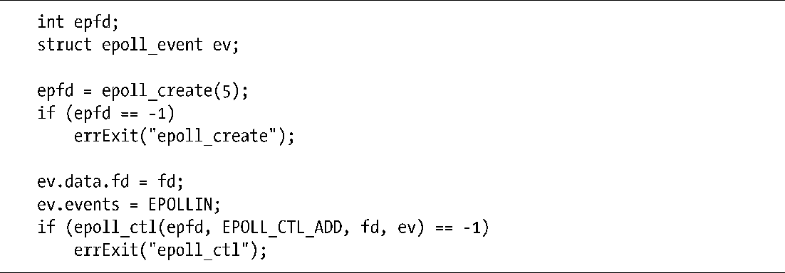

### 63.4.2　修改epoll的兴趣列表：epoll_ctl()

系统调用epoll_ctl()能够修改由文件描述符epfd所代表的epoll实例中的兴趣列表。

参数fd指明了要修改兴趣列表中的哪一个文件描述符的设定。该参数可以是代表管道、FIFO、套接字、POSIX消息队列、inotify实例、终端、设备，甚至是另一个epoll实例的文件描述符（例如，我们可以为受检查的描述符建立起一种层次关系）。但是，这里fd不能作为普通文件或目录的文件描述符（会出现EPERM错误）。

参数op用来指定需要执行的操作，它可以是如下几种值。

##### EPOLL_CTL_ADD

将描述符fd添加到epoll实例epfd中的兴趣列表中去。对于fd上我们感兴趣的事件，都指定在ev所指向的结构体中，下面会详细介绍。如果我们试图向兴趣列表中添加一个已存在的文件描述符，epoll_ctl()将出现EEXIST错误。

##### EPOLL_CTL_MOD

修改描述符fd上设定的事件，需要用到由ev所指向的结构体中的信息。如果我们试图修改不在兴趣列表中的文件描述符，epoll_ctl()将出现ENOENT错误。

##### EPOLL_CTL_DEL

将文件描述符fd从epfd的兴趣列表中移除。该操作忽略参数ev。如果我们试图移除一个不在epfd的兴趣列表中的文件描述符，epoll_ctl()将出现ENOENT错误。关闭一个文件描述符会自动将其从所有的epoll实例的兴趣列表中移除。

参数ev是指向结构体epoll_event的指针，结构体的定义如下。

结构体epoll_event中的data字段的类型为：

参数ev为文件描述符fd所做的设置如下。

+ 结构体 epoll_event 中的 events 字段是一个位掩码，它指定了我们为待检查的描述符 fd 上所感兴趣的事件集合。我们将在下一节中说明该字段可使用的掩码值。
+ data字段是一个联合体，当描述符fd稍后成为就绪态时，联合体的成员可用来指定传回给调用进程的信息。

程序清单63-4展示了一个使用epoll_create()和epoll_ctl()的例子。

程序清单63-4：使用epoll_create()和epoll_ctl()

#### max_user_watches上限

因为每个注册到 epoll 实例上的文件描述符需要占用一小段不能被交换的内核内存空间，因此内核提供了一个接口用来定义每个用户可以注册到 epoll 实例上的文件描述符总数。这个上限值可以通过 max_user_watches 来查看和修改。max_user_watches是专属于Linux系统的/proc/sys/fd/epoll目录下的一个文件。默认的上限值根据可用的系统内存来计算得出（参见epoll(7)的用户手册页）。

