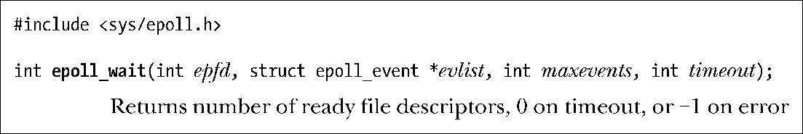
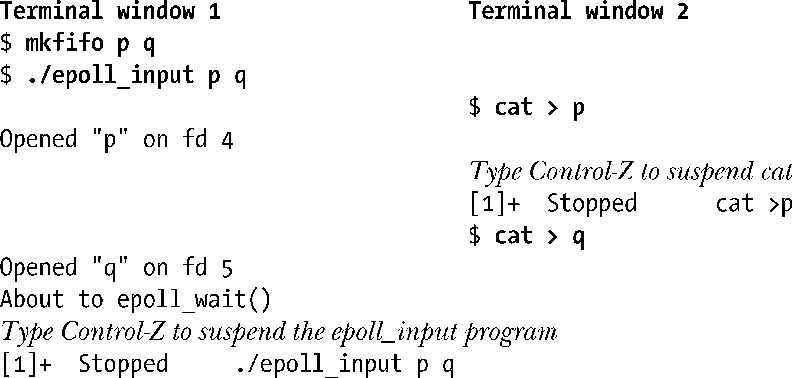
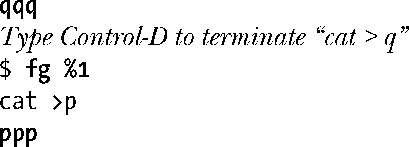
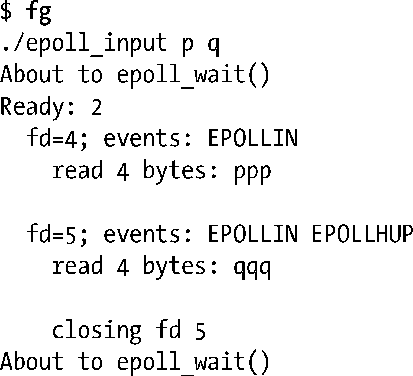
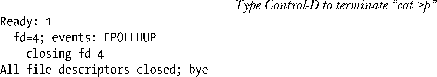
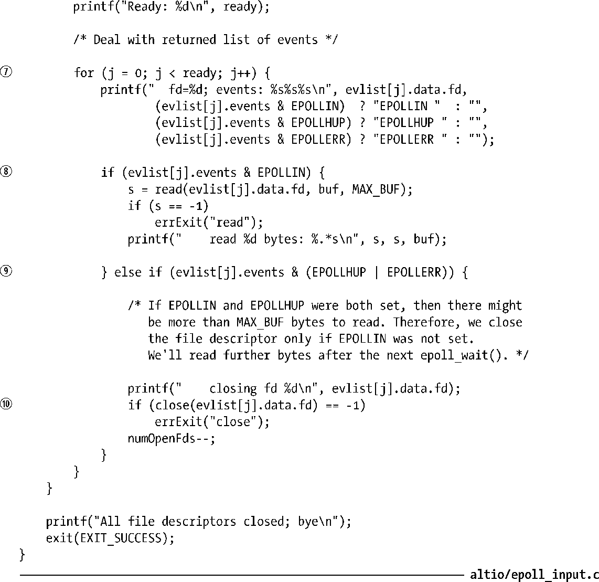

### 63.4.3　事件等待：epoll_wait()

系统调用epoll_wait()返回epoll实例中处于就绪态的文件描述符信息。单个epoll_wait()调用能返回多个就绪态文件描述符的信息。

参数evlist所指向的结构体数组中返回的是有关就绪态文件描述符的信息。（结构体epoll_event已经在上一节中描述。）数组evlist的空间由调用者负责申请，所包含的元素个数在参数maxevents中指定。

在数组evlist中，每个元素返回的都是单个就绪态文件描述符的信息。events字段返回了在该描述符上已经发生的事件掩码。Data 字段返回的是我们在描述符上使用 cpoll_ctl()注册感兴趣的事件时在ev.data中所指定的值。注意，data字段是唯一可获知同这个事件相关的文件描述符号的途径。因此，当我们调用epoll_ctl()将文件描述符添加到兴趣列表中时，应该要么将ev.data.fd设为文件描述符号（如程序清单63-4中所示），要么将ev.data.ptr设为指向包含文件描述符号的结构体。

参数timeout用来确定epoll_wait()的阻塞行为，有如下几种。

+ 如果timeout等于−1，调用将一直阻塞，直到兴趣列表中的文件描述符上有事件产生，或者直到捕获到一个信号为止。
+ 如果timeout等于0，执行一次非阻塞式的检查，看兴趣列表中的文件描述符上产生了哪个事件。
+ 如果timeout大于0，调用将阻塞至多timeout毫秒，直到文件描述符上有事件发生，或者直到捕获到一个信号为止。

调用成功后，epoll_wait()返回数组evlist中的元素个数。如果在timeout超时间隔内没有任何文件描述符处于就绪态的话，返回0。出错时返回−1，并在errno中设定错误码以表示错误原因。

在多线程程序中，可以在一个线程中使用epoll_ctl()将文件描述符添加到另一个线程中由epoll_wait()所监视的epoll实例的兴趣列表中去。这些对兴趣列表的修改将立刻得到处理，而epoll_wait()调用将返回有关新添加的文件描述符的就绪信息。

#### epoll事件

当我们调用epoll_ctl()时可以在ev.events中指定的位掩码以及由 epoll_wait()返回的evlist[].events中的值在表63-8中给出。除了有一个额外的前缀E外，大多数这些位掩码的名称同poll()中对应的事件掩码名称相同。（例外情况是EPOLLET 和 EPOLLONESHOT，下面我们会给出更详细的说明。）这种名称上有着对应关系的原因是当我们在 epoll_ctl()中指定输入，或通过epoll_wait()得到输出时，这些比特位表达的意思同对应的 poll()的事件掩码所表达的意思一样。

<b class="my_markdown">表63-8：epoll中events字段上的位掩码值</b>

| 位掩码 | 作为epoll_ctl()的输入？ | 由epoll_wait()返回？ | 描述 |
| :-----  | :-----  | :-----  | :-----  | :-----  | :-----  |
| EPOLLIN | ● | ● | 可读取非高优先级的数据 |
| EPOLLPRI | ● | ● | 可读取高优先级数据 |
| EPOLLRDHUP | ● | ● | 套接字对端关闭（始于Linux 2.6.17版） |
| EPOLLOUT | ● | ● | 普通数据可写 |
| EPOLLET | ● |  | 采用边缘触发事件通知 |
| EPOLLONESHOT | ● |  | 在完成事件通知之后禁用检查 |
| EPOLLERR |  | ● | 有错误发生 |
| EPOLLHUP |  | ● | 出现挂断 |

#### EPOLLONESHOT标志

默认情况下，一旦通过epoll_ctl()的EPOLL_CTL_ADD操作将文件描述符添加到epoll实例的兴趣列表中后，它会保持激活状态（即，之后对epoll_wait()的调用会在描述符处于就绪态时通知我们）直到我们显式地通过 epoll_ctl()的EPOLL_CTL_DEL 操作将其从列表中移除。如果我们希望在某个特定的文件描述符上只得到一次通知，那么可以在传给epoll_ctl()的ev.events中指定EPOLLONESHOT（从 Linux 2.6.2版开始支持）标志。如果指定了这个标志，那么在下一个epoll_wait()调用通知我们对应的文件描述符处于就绪态之后，这个描述符就会在兴趣列表中被标记为非激活态，之后的epoll_wait()调用都不会再通知我们有关这个描述符的状态了。如果需要，我们可以稍后通过 epoll_ctl()的EPOLL_CTL_MOD操作重新激活对这个文件描述符的检查。（这种情况下不能用EPOLL_CTL_ADD操作，因为非激活态的文件描述符仍然还在epoll实例的兴趣列表中。）

#### 程序示例

程序清单63-5展示了应该如何使用epoll API。命令行参数表示该程序期望得到一个或多个终端或者FIFO的路径名。该程序执行如下步骤。

+ 创建一个epoll实例①。
+ 打开由命令行参数指定的每个文件，以此作为输入②，并将得到的文件描述符添加到epoll实例的兴趣列表中③。将需要检查的事件集合设定为EPOLLIN。
+ 执行一个循环④，在循环中调用epoll_wait()⑤来检查epoll实例的兴趣列表中的文件描述符，并处理每个调用返回的事件。对于这个循环，请注意以下几点。
      + 在epoll_wait()调用之后，程序检查是否返回了 EINTR 错误码⑥。如果在 epoll_wait()调用执行期间程序被一个信号打断，之后又通过SIGCONT信号恢复执行，此时就可能出现这个错误（见21.5节）。如果出现这种情况，程序会重新调用epoll_wait()。
    + 如果epoll_wait()调用成功，程序就再执行一个内层循环检查evlist中每个已就绪的元素。对于evlist中的每个元素，程序不只是检查 events 字段中的EPOLLIN 标记⑧，EPOLLHUP和EPOLLERR⑨标记也要检查。后两种事件会在FIFO的对端关闭，或者当终端挂起时出现。如果返回的是EPOLLIN，程序从对应的文件描述符中读取一些输入并在标准输出上打印出来。否则，如果返回的是EPOLLHUP或EPOLLERR，程序就关闭对应的文件描述符⑩并递减打开文件数的统计量（numOpenFds）。
    + 当所有打开的文件描述符都被关闭后，循环终止（当numOpenFds等于0时）。

下面的 shell 会话演示了程序清单 63-5 中所示程序的使用。我们用到了两个终端窗口，在其中一个窗口上用该程序来检查两个FIFO文件的输入。（如44.7节中描述的，程序打开的每个FIFO文件，其读操作只会在另一个进程打开FIFO文件做写操作后才能完成）在另外一个窗口上，我们运行cat(1)程序将数据写到这些FIFO中去。

在上述步骤中，我们暂停了监测程序，这样我们可以在两个FIFO上产生输入，然后关闭其中一个FIFO的写端。

现在，我们将监测程序带入前台恢复其运行，此时epoll_wait()将返回两个事件。

上面输出结果中的两个空行是cat程序实例读取的换行符，写入 FIFO 中之后由监测程序读取并回显在终端输出上。

现在我们在第二个终端窗口输入 Ctrl-D 来终止剩下的 cat 程序实例，这将导致epoll_wait()再次返回，这次只有一个事件。

程序清单63-5：使用epoll API

