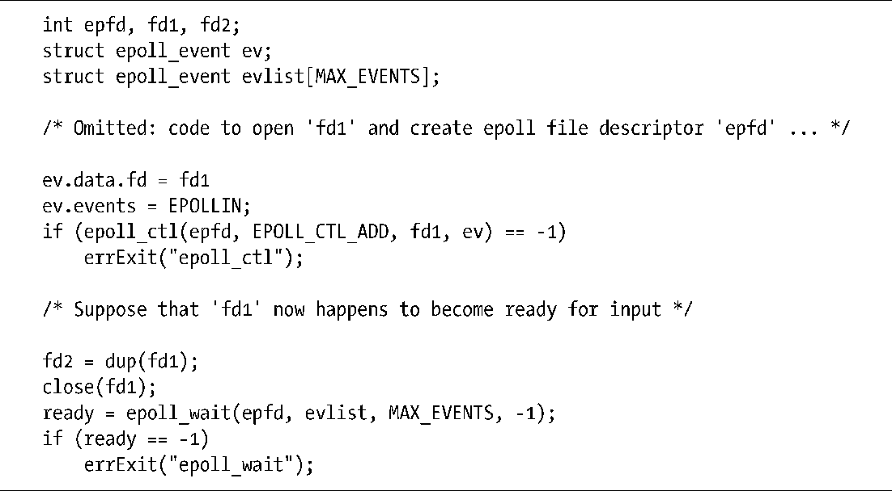

### 63.4.4　深入探究epoll的语义

现在我们来看看打开的文件同文件描述符以及 epoll 之间交互的一些细微之处。基于本次讨论的目的，回顾一下图5-2中展示的文件描述符，打开的文件描述（file description），以及整个系统的文件i-node表之间的关系。

当我们通过epoll_create()创建一个epoll实例时，内核在内存中创建了一个新的i-node并打开文件描述，随后在调用进程中为打开的这个文件描述分配一个新的文件描述符。同epoll 实例的兴趣列表相关联的是打开的文件描述，而不是 epoll 文件描述符。这将产生下列结果。

+ 如果我们使用dup()（或类似的函数）复制一个epoll文件描述符，那么被复制的描述符所指代的epoll兴趣列表和就绪列表同原始的epoll文件描述符相同。若要修改兴趣列表，在epoll_ctl()的参数epfd上设定文件描述符可以是原始的也可以是复制的。
+ 上一条观点同样也适用于 fork()调用之后的情况。此时子进程通过继承复制了父进程的epoll文件描述符，而这个复制的文件描述符所指向的epoll数据结构同原始的描述符相同。

当我们执行 epoll_ctl()的EPOLL_CTL_ADD 操作时，内核在 epoll兴趣列表中添加了一个元素，这个元素同时记录了需要检查的文件描述符数量以及对应的打开文件描述的引用。epoll_wait()调用的目的就是让内核负责监视打开的文件描述。这表示我们必须对之前的观点做改进：如果一个文件描述符是epoll兴趣列表中的成员，当关闭它后会自动从列表中移除。改进版应该是这样的：一旦所有指向打开的文件描述的文件描述符都被关闭后，这个打开的文件描述将从epoll的兴趣列表中移除。这表示如果我们通过 dup()（或类似的函数）或者fork()为打开的文件创建了描述符副本，那么这个打开的文件只会在原始的描述符以及所有其他的副本都被关闭时才会移除①。

这些语义可导致出现某些令人惊讶的行为。假设我们执行程序清单63-6中所示的代码。即使文件描述符 fd1 已经被关闭了，这段代码中的epoll_wait()调用也会告诉我们fd1已就绪（换句话说，evlist[0].data.fd的值等于fd1）。这是因为还有一个打开的文件描述符fd2存在，它所指向的文件描述信息仍包含在epoll的兴趣列表中。当两个进程持有对同一个打开文件的文件描述符副本时（一般是由于 fork()调用），也会出现相似的场景。执行 epoll_wait()操作的进程已经关闭了文件描述符，但另一个进程仍然持有打开的文件描述符副本。

程序清单63-6：epoll在文件描述符副本下的语义

