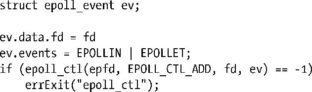

### 63.4.6　边缘触发通知

默认情况下epoll提供的是水平触发通知。这表示epoll会告诉我们何时能在文件描述符上以非阻塞的方式执行I/O操作。这同poll()和select()所提供的通知类型相同。

epoll API还能以边缘触发方式进行通知——也就是说，会告诉我们自从上一次调用epoll_wait()以来文件描述符上是否已经有I/O活动了（或者由于描述符被打开了，如果之前没有调用的话）。使用epoll的边缘触发通知在语义上类似于信号驱动I/O，只是如果有多个I/O事件发生的话，epoll会将它们合并成一次单独的通知，通过epoll_wait()返回，而在信号驱动I/O中则可能会产生多个信号。

要使用边缘触发通知，我们在调用epoll_ctl()时在ev.events字段中指定EPOLLET标志。

我们通过一个例子来说明epoll的水平触发和边缘触发通知之间的区别。假设我们使用epoll来监视一个套接字上的输入（EPOLLIN），接下来会发生如下的事件。

**1．** 套接字上有输入到来。

**2．** 我们调用一次epoll_wait()。无论我们采用的是水平触发还是边缘触发通知，该调用都会告诉我们套接字已经处于就绪态了。

**3．** 再次调用epoll_wait()。

如果我们采用的是水平触发通知，那么第二个epoll_wait()调用将告诉我们套接字处于就绪态。而如果我们采用边缘触发通知，那么第二个epoll_wait()调用将阻塞，因为自从上一次调用epoll_wait()以来并没有新的输入到来。

正如我们在 63.1.1 节中提到的，边缘触发通知通常和非阻塞的文件描述符结合使用。因而，采用epoll的边缘触发通知机制的程序基本框架如下。

**1．** 让所有待监视的文件描述符都成为非阻塞的。

**2．** 通过epoll_ctl()构建epoll的兴趣列表。

**3．** 通过如下的循环处理I/O事件。

（a）通过epoll_wait()取得处于就绪态的描述符列表。

（b）针对每一个处于就绪态的文件描述符，不断进行I/O处理直到相关的系统调用（例如read()、write()、recv()、send()或accept()）返回EAGAIN或EWOULDBLOCK错误。

#### 当采用边缘触发通知时避免出现文件描述符饥饿现象

假设我们采用边缘触发通知监视多个文件描述符，其中一个处于就绪态的文件描述符上有着大量的输入存在（可能是一个不间断的输入流）。如果在检测到该文件描述符处于就绪态后，我们将尝试通过非阻塞式的读操作将所有的输入都读取，那么此时就会有使其他的文件描述符处于饥饿状态的风险存在（即，在我们再次检查这些文件描述符是否处于就绪态并执行I/O操作前会有很长的一段处理时间）。该问题的一种解决方案是让应用程序维护一个列表，列表中存放着已经被通知为就绪态的文件描述符。通过一个循环按照如下方式不断处理。

**1．** 调用 epoll_wait()监视文件描述符，并将处于就绪态的描述符添加到应用程序维护的列表中。如果这个文件描述符已经注册到应用程序维护的列表中了，那么这次监视操作的超时时间应该设为较小的值或者是 0。这样如果没有新的文件描述符成为就绪态，应用程序就可以迅速进行到下一步，去处理那些已经处于就绪态的文件描述符了。

**2．** 在应用程序维护的列表中，只在那些已经注册为就绪态的文件描述符上进行一定限度的 I/O 操作（可能是以轮转调度（round-robin）方式循环处理，而不是每次epoll_wait()调用后都从列表头开始处理）。当相关的非阻塞 I/O 系统调用出现 EAGAIN 或EWOULDBLOCK 错误时，文件描述符就可以从应用程序维护的列表中移除了。

尽管采用这种方法需要做些额外的编程工作，但是除了能避免出现文件描述符饥饿现象外，我们还能获得其他益处。比如，我们可以在上述循环中加入其他的步骤，比如处理定时器以及用sigwaitinfo()（或其他类似的机制）来接收信号。

因为信号驱动 I/O 也是采用的边缘触发通知机制，因此也需要考虑文件描述符饥饿的情况。与之相反，在采用水平触发通知机制的应用程序中，考虑文件描述符饥饿的情况并不是必须的。这是因为我们可以采用水平触发通知在非阻塞式的文件描述符上通过循环连续地检查描述符的就绪状态，然后在下一次检查文件描述符的状态前在处于就绪态的描述符上做一些I/O处理就可以了。

