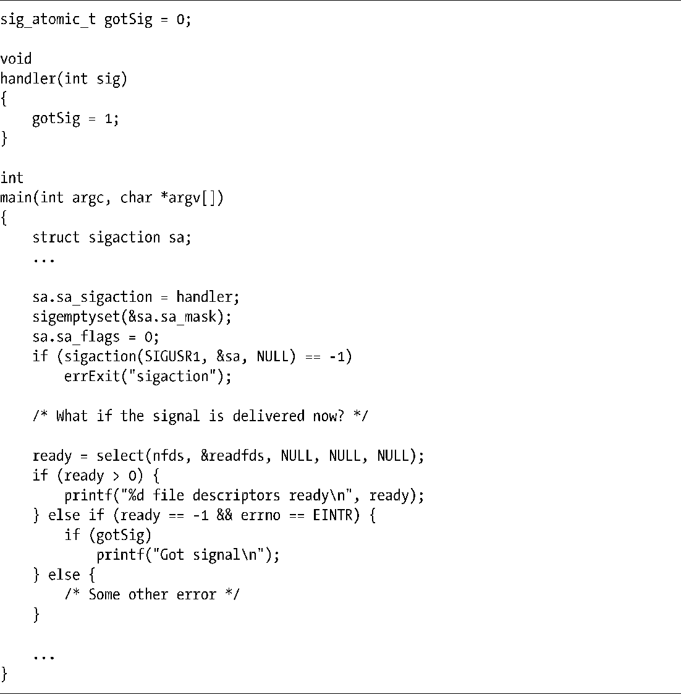

### 63.5　在信号和文件描述符上等待

有时候，进程既要在一组文件描述符上等待I/O就绪，也要等待待发送的信号。我们可以尝试通过select()来执行这样的操作，如程序清单63-7所示。

程序清单63-7：非阻塞信号和select()调用的错误用法

这段代码的问题在于，如果信号（本例中是SIGUSR1）到来的时机刚好是在安装信号处理例程之后且在select()调用之前，那么select()依然会阻塞。（这是竞态条件的一种形式。）现在我们来看看对于这个问题有什么解决方案。

> 从2.6.27版内核之后，Linux提供了一种新的技术可同时等待信号和文件描述符状态：这就是本书22.11节中介绍的signalfd。采用这种机制，我们可以通过由select()、poll()或者epoll_wait()所监视的文件描述符（同其他的文件描述符一起）来接收信号。

