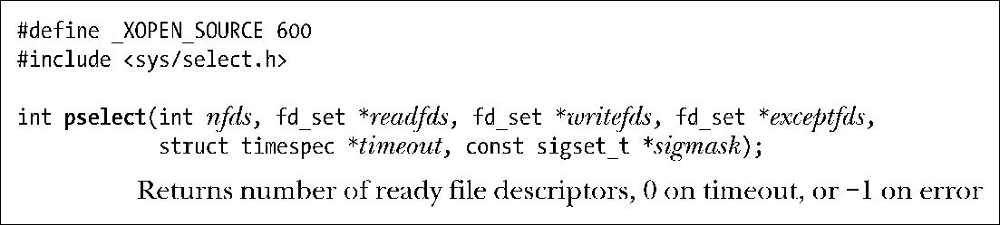
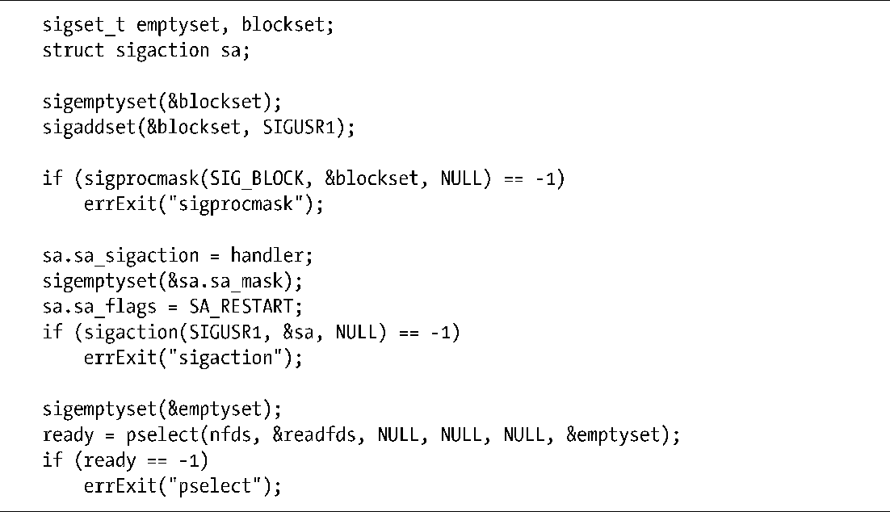

### 63.5.1　pselect()系统调用

系统调用pselect()执行的任务同select()相似。它们语义上的主要区别在于一个附加的参数——sigmask。该参数指定了当调用被阻塞时有哪些信号可以不被过滤掉。

更准确地说，假设我们这样调用pselect()：

这个调用等同于以原子方式执行下列步骤：

使用pselect()，我们可以将程序清单63-7中main()函数的第一部分替换为程序清单63-8中的代码。

除了参数sigmask外，select()和pselect()还有如下区别。

+ pselect()中的timeout参数是一个timespec结构体（见23.4.2节），允许将超时时间精度指定为纳秒级（select()为毫秒级）。
+ SUSv3中明确说明pselect()在返回时不会修改timeout参数。

如果我们将pselect()的sigmask参数指定为NULL，那么除了上述区别外pselect()就等同于select()（即pselect()不会操作进程的信号掩码）。

pselect()接口定义在POSIX.1g中，现在已经加入到SUSv3规范。并不是所有的UNIX实现都支持这一接口，Linux中也只是在2.6.16版内核后才加入。

> 之前，glibc提供有一个pselect()的库函数实现，但它并不能保证正确调用该接口所需要的原子性。这种原子性保证只有pselect()的内核实现才能做到。

程序清单63-8：使用pselect()

#### ppoll()和epoll_pwait()系统调用

在Linux 2.6.16版中还新增了一个非标准的系统调用ppoll()，它同poll()之间的关系类似于pselect()同select()。同样的，从2.6.19版内核开始，Linux 也新增了epoll_pwait()，这是对 epoll_wait()的扩展。对于这些新增系统调用的细节可以参见 ppoll(2)和epoll_pwait()的用户手册页。

