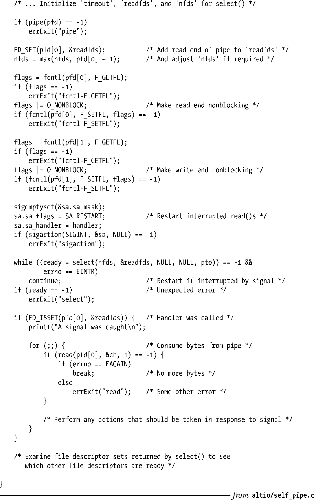

### 63.5.2　self-pipe技巧

由于pselect()并没有被广泛实现，可移植的应用程序必须采用其他手段来避免当等待信号并同时调用select()时出现的竞态条件。通常会用到如下方法。

**1．** 创建一个管道，将读端和写端都设为非阻塞的。

**2．** 在监视感兴趣的文件描述符时，将管道的读端也包含在参数readfds中传给select()。

**3．** 为感兴趣的信号安装一个信号处理例程。当这个信号处理例程被调用时，写一个字节的数据到管道中。关于这个信号处理例程，有以下几点需要注意。

+ 在第一步中已经将管道的写端设为了非阻塞态，这是为了防止出现由于信号到来的太快，重复调用信号处理例程会填满管道空间，结果造成信号处理例程的 write()操作阻塞（因而进程本身也就阻塞了）。（对于空间已满的管道，写操作失败并没有关系，因为上一次写操作已经表明了信号的传递。）
+ 信号处理例程是在创建管道之后安装的，这是为了防止在管道创建前就发送了信号从而产生竞态条件。
+ 在信号处理例程中使用 write()是安全的，因为 write()是异步信号安全函数之一，参见表21-1。

**4．** 在循环中调用select()，这样如果被信号处理例程中断的话，select()还可以重新得到调用。（严格来说在这种方式下重新调用 select()并不是必须的。这只是表示我们可以通过监视readfds来检查是否有信号到来，而不是通过检查返回的EINTR错误码。）

**5．** select()调用成功后，我们可以通过检查代表管道读端的文件描述符是否被置于 readfds中来判断信号是否到来。

**6．** 当信号到来时，读取管道中的所有字节。由于可能会有多个信号到来，我们需要用一个循环来读取字节直到 read()（非阻塞式）返回 EAGAIN 错误码。将管道中的数据全部读取完毕后，接下来就执行必要的操作以作为对发送的信号的回应。

这项技术通常被称为是self-pipe，程序清单63-9中的代码展示了这种技术的用法。

同样可以采用poll()和epoll_wait()来作为这种技术的变种。

程序清单63-9：采用self-pipe技巧

