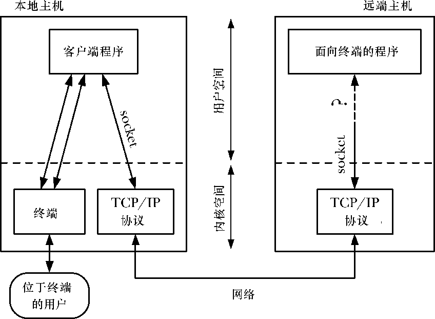
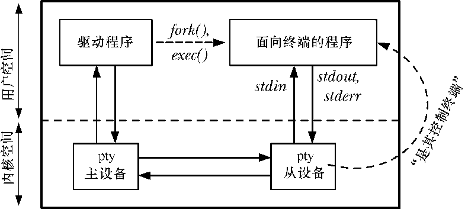
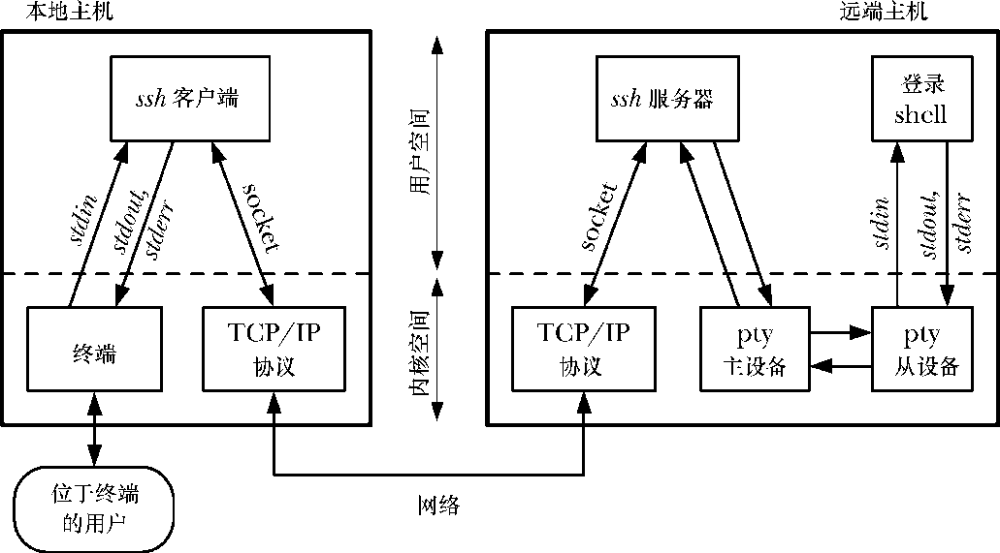

### 64.1　整体概览

图64-1展示了伪终端能够解决的一个问题：我们该如何使位于某台主机上的用户通过网络连接操作位于另一台主机上的面向终端的程序（比如vi）呢？

<b class="my_markdown">图64-1：待解决的问题：如何通过网络操作一个面向终端的程序？</b>

如图所示，通过网络通信，套接字提供了解决这个问题的驱动部分。但是，我们无法直接将面向终端程序的标准输入、输出以及错误信息连接到套接字上。这是因为面向终端程序期望连接的是一个终端——以此才能执行在第34章和62章中所描述的操作。这样的操作包括将终端置为非规范模式，将回显打开或关闭，以及设定终端前台进程组。如果某个程序尝试在一个套接字上执行这些操作，那么相关的系统调用就会失败。

此外，面向终端的程序期望终端驱动程序能对其输入和输出做特定类型的处理。举个例子，在规范模式下，当终端驱动程序在一行的开始处发现文件结尾符（通常是Ctrl-D）时，将导致下一次read()调用不会返回任何数据。

最后，面向终端的程序必须有一个控制终端。这允许程序通过打开/dev/tty来获取一个控制终端的文件描述符，并且也使得产生针对该程序的作业控制和终端相关的信号（例如SIGTSTP、SIGTTIN以及SIGINT）成为可能。

通过上面的描述，现在应该很清楚面向终端程序的定义了，它的范围非常广泛，涵盖了大量我们通常在交互式终端会话中运行的程序。

#### 伪终端主从设备

伪终端提供了网络连接到面向终端程序之间那缺失的一环。伪终端是一对互联的虚拟设备：主伪终端和从伪终端，有时被共称为伪终端对。伪终端对提供了一条IPC通道，这有点像双向管道——两个进程能分别打开主端和从端，并通过伪终端双向传输数据。

关于伪终端，关键点在于从设备表现得就像一个标准终端一样。所有可以施加于终端设备的操作同样也可以施加于伪终端从设备上。这里面有些操作对于伪终端来说没什么意义（例如，设定终端线速或者奇偶校验），但这并无大碍，因为伪终端从设备会悄悄地忽略它们。

#### 如何使用伪终端

图64-2展示了典型情况下两个程序是如何利用伪终端的。（图中的pty是伪终端的常用缩写形式，本章中我们在许多图表和函数名称中大量使用这种缩写。）面向终端程序的标准输入、输出以及错误输出都连接到伪终端从设备上，它也是程序的控制终端。在伪终端的另一侧，驱动程序作为用户的代理，提供对面向终端程序的输入并读取程序的输出。

<b class="my_markdown">图64-2：两个程序通过伪终端来通信</b>

通常，驱动程序同时读取输入并将输出写入到另一个 I/O 通道中。它的行为就如同一个中继，在伪终端和另一个程序间双向传递数据。为了实现这一点，驱动程序必须同时监控两个方向上的输入。这通常由I/O多路复用（select()或poll()）来实现，也可以采用一对进程或线程在两个方向上做数据传输。

一般情况下使用伪终端的应用程序会按照如下步骤来做。

**1．**  驱动程序打开伪终端主设备。

**2．**  驱动程序调用fork()来创建一个子进程。子进程执行如下的步骤。

a）调用setsid()来启动一个新的会话，使该子进程成为会话的头领进程（见34.3节）。该操作也使得子进程失去了它的控制终端。

b）打开同伪终端主设备相对应的从设备。由于子进程是会话的头领进程，且没有控制终端，伪终端从设备就成为子进程的控制终端了。

c）调用 dup()（或类似的函数）为从设备复制标准输入、输出以及错误输出的文件描述符。

d）调用exec()启动要连接到伪终端从设备的面向终端程序。

此时这两个程序就可以通过伪终端进行通信了。任何由驱动程序写到主设备的消息，都会在从设备这端作为面向终端程序的输入，任何由面向终端的程序写到从设备的消息都可以在主设备端由驱动程序读取。我们将在第64.5节进一步探究伪终端I/O的细节。

> 伪终端也能够用来连接任意的进程对（即，不必一定是父子进程）。所有要做的就是打开伪终端主设备的进程需要将相关联的从设备名称通知给另一个进程即可，可能是将名称写到一个文件上又或者是通过其他的IPC机制来传递。（当我们在前面的例子中调用fork()时，子进程自动从父进程中继承了足量的信息以此来获知从设备名。）

到目前为止，我们对使用伪终端的讨论都比较抽象。图64-3展示了一个具体的例子：ssh使用伪终端的方法。这个程序允许用户通过网络安全地在远程系统上运行登录会话。（实际上该图结合了图64-1和图64-2中的信息。）在远端主机上，伪终端主设备的驱动程序是ssh服务器（sshd），连接到伪终端从设备的面向终端的程序是登录shell。ssh服务器作为胶水，通过连接到 ssh 客户端的套接字将伪终端连接起来。一旦所有登录方面的细节全部完成，ssh服务器和客户端的主要用途就是在本地主机上的用户终端和远端主机上的shell之间双向传递字符。

<b class="my_markdown">图64-3：ssh是如何使用伪终端的</b>

> 我们忽略了很多ssh客户端和服务器的细节。比如，这些程序会双向加密穿越网络的数据。我们在远端主机上只展示了一个单独的ssh服务器进程，但实际上ssh服务器是一个并发的网络服务。它是一个守护进程，创建一个被动的TCP套接字来监听从ssh客户端发来的连接。对于每个连接，ssh服务器主进程通过fork创建子进程来处理所有关于客户登录方面的细节。（我们在图64-3中将这个子进程参照为ssh服务器。）除了上文提到的关于建立伪终端的细节，ssh服务器子进程验证用户，在远端机上更新登录账户日志（如第40章所述），然后执行登陆shell。

在某些情况下，可能会有多个进程连接到伪终端的从设备端。我们的ssh示例中已经对此做了图解。从设备会话的头领进程是shell，它创建进程组来执行由远端用户键入的命令。所有这些进程都将伪终端从设备作为它们的控制终端。同常规的终端一样，这些进程组之一可以作为伪终端从设备的前台进程组，且只有这个进程组可以通过从端读取和写入（如果比特位TOSTOP已经设定）。

#### 伪终端的应用

除了网络服务外，伪终端也在许多其他应用中得到了利用。下面包含了一些例子。

+ expect（1）程序使用伪终端来允许交互式面向终端程序可以从脚本文件中驱动。
+ 类似xterm这样的终端模拟器利用伪终端来提供带有终端窗口的终端相关功能。
+ screen（1）程序使用伪终端在单个物理终端（或终端窗口）同多个进程（例如多个shell会话）间实现多路复用。
+ script（1）程序使用到了伪终端，用来记录在shell会话中的所有输入和输出。
+ 当向文件或管道写输出时，有时候可以用伪终端来绕过由stdio实现的默认块缓冲机制，与之相对的是终端输出是行缓冲。（我们将在练习64-7中进一步探讨。）

#### System V（UNIX 98）和BSD伪终端

BSD和System V都提供了不同的接口来找出和打开伪终端对的两端。BSD的伪终端实现在历史上是有名的，因为它用在了许多基于套接字的网络应用中。基于兼容性的原因，许多UNIX实现最终都同时支持两种伪终端形式。

System V的接口在某种程度上比BSD接口要更易于使用，SUSv3伪终端规范就是基于System V接口的。（关于伪终端的规范首次出现是在SUSv1中。）由于历史原因，在Linux系统上这种类型的伪终端通常指的是UNIX 98伪终端，尽管UNIX 98标准（即SUSv2）规定伪终端应该是基于流式的，但Linux对伪终端的实现并不是如此。（SUSv3并不要求伪终端是基于流式的实现。）

Linux的早期版本只支持BSD风格的伪终端，但自从2.2版内核之后，Linux已经同时支持两种伪终端了。本章我们集中于对UNIX 98伪终端的讨论。我们将在64.8节中描述同BSD伪终端的差异。

