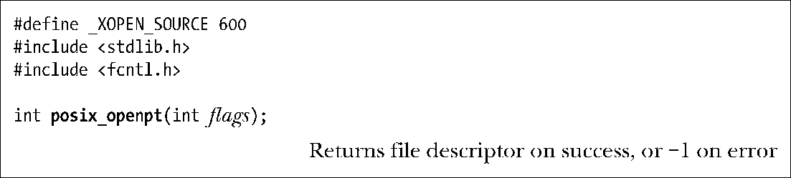
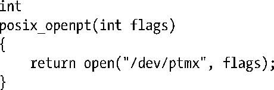

### 64.2.1　打开未使用的主设备：posix_openpt()

posix_openpt()函数找到并打开一个未使用的伪终端主设备，再返回稍后会用到的代表该设备的文件描述符。

参数flags由0或以下多个常量组成。

##### O_RDWR

同时以可读和可写方式打开设备。一般情况下我们总是在flags中包含这个常量。

##### O_NOCTTY

使该终端不要成为进程的控制终端。在 Linux 上，无论调用 posix_openpt()时O_NOCTTY是否被指定，伪终端主设备都不会成为进程的控制终端。（这合乎道理，因为伪终端主设备并不是一个真正的终端，它只是终端另一侧从设备的连接端。）但是，在某些伪终端实现中，如果我们希望在打开伪终端主设备时避免进程获得控制终端，则需要将该常量　 加上。

同open()一样，posix_openpt()使用最小的可用文件描述符来打开伪终端主设备。

调用posix_openpt()也会在/dev/pts文件夹中创建对应的伪终端从设备文件。当我们稍后介绍ptsname()时再来进一步讨论这个文件。

posix_openpt()是在SUSv3中新增的函数，由POSIX委员会引入。在最初的System V伪终端实现中，获取可用的伪终端主设备是通过打开伪终端主克隆设备/dev/ptmx来实现的。打开这个虚拟设备将自动搜寻并打开下一个未使用的伪终端主设备，将对应的文件描述符返回。Linux上也提供有这个设备，posix_openpt()按照以下方式来实现。

#### UNIX 98伪终端数量的限制

因为每一对使用中的伪终端都会占用一小段不能被交换的内核内存空间，因此内核对系统中UNIX 98伪终端的数量有一个限制。到2.6.3版内核之前，这个限制由内核配置选项（CONFIG_UNIX98_PTYS）控制。默认值为256，但我们可以把这个限制修改为0到2048之间的任意值。

到Linux 2.6.4版之后，内核选项CONFIG_UNIX98_PTYS被废弃以支持更为灵活的方法。相反，对伪终端数量的限制定义在特定于Linux的/proc/sys/kernel/pty/max文件中。该文件的默认值为 4096，可以设定为最大 1048576 的任何值。还有一个相关的只读文件/proc/sys/kernel/ pty/nr，这个文件记录当前系统中有多少UNIX 98伪终端正在使用中。

