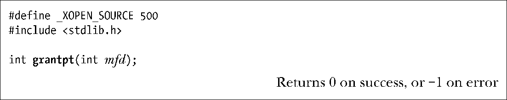

### 64.2.2　修改从设备属主和权限：grantpt()

SUSv3规定grantpt()可以用来修改由文件描述符mfd所代表的伪终端主设备相关联的从设备的属主和权限。在Linux上，调用grantpt()并不是必需的。但是在某些实现中需要用到grantpt()，可移植性良好的程序应该在posix_openpt()之后调用grantpt()。

在需要grantpt()的系统中，该函数创建一个子进程来执行设定用户ID为root的程序。这个程序通常称为pt_chown，在伪终端从设备上执行下列操作。

+ 将从设备的属主修改为与调用进程相同的有效用户ID。
+ 将从设备的组修改为tty。
+ 修改从设备的权限，使拥有者有读和写权限，组拥有写权限。

修改终端组为 tty 并设定组的写权限是因为wall（1）和write（1）是设定组ID程序，归属于tty组。

在Linux 上，伪终端从设备自动按照以上方式配置，这就是为什么不需要调用grantpt()的原因（出于可移植性考虑，仍然应该调用）。

> 因为可能会创建子进程的缘故，SUSv3中说如果调用程序为SIGCHLD信号安装了处理例程，则grantpt()的行为是未定义的。

