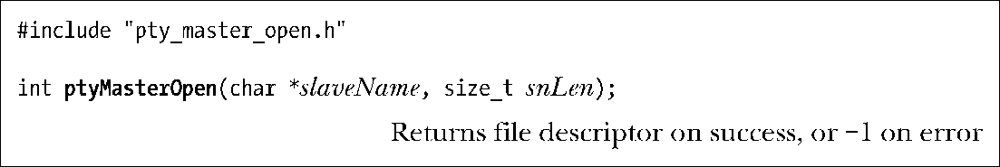
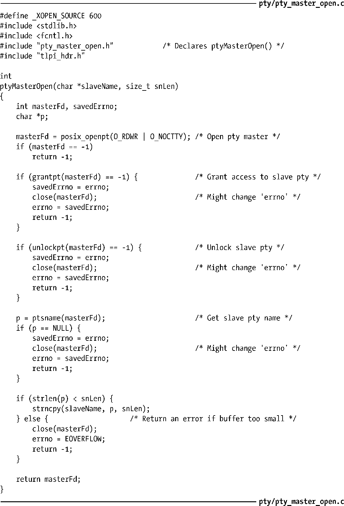

### 64.3　打开主设备：ptyMasterOpen()

我们现在来实现函数ptyMasterOpen()。该函数使用前面几节中介绍过的函数来打开伪终端主设备并获取对应的从设备名称。我们实现这样一个函数的原因有两方面。

+ 大多数程序都以几乎相同的方式来执行这些步骤，因此将它们封装为一个单独的函数更加方便。
+ 我们实现的ptyMasterOpen()函数隐藏了所有特定于UNIX 98规范的细节。在64.8节中我们将采用BSD风格的伪终端重新实现这个函数。本章余下的部分提供的代码能够工作于任意一种伪终端实现中。

函数ptyMasterOpen()打开一个未使用的伪终端主设备，调用grantpt()并通过 unlockpt()对其解锁，然后将对应的伪终端从设备名拷贝到slaveName所指向的缓冲区中。调用者必须通过参数 snLen 指定缓冲区的空间大小。我们在程序清单 64-1 中给出了这个函数的实现。

> 省略参数slaveName和snLen也是同样可行的，我们可以让ptyMasterOpen()的调用者直接调用ptsname()来获取伪终端从设备名称。但是，我们这里使用slaveName和snLen参数是因为BSD风格的伪终端实现并没有提供和ptsname()功能相同的函数，而我们为BSD风格的伪终端实现的功能相同的函数（程序清单64-4）封装了BSD中用来获取从设备名称的技术。

程序清单64-1：ptyMasterOpen()的实现

