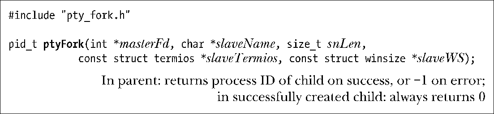

### 64.4　将进程连接到伪终端：ptyFork()

如图64-2所示，现在我们准备通过伪终端来实现一个函数，完成所有在两个进程间建立连接的任务。函数ptyFork()创建一个子进程，通过伪终端对连接到父进程上。

ptyFork()的实现见程序清单64-2。该函数执行如下的步骤。

+ 通过调用ptyMasterOpen()（见程序清单64-1）①打开伪终端主设备。
+ 如果参数slaveName不为NULL，拷贝伪终端从设备名到这个缓冲区中②。（如果slaveName不为NULL，那么它必须指向一段长度至少为snLen字节的缓冲区。）如果合适的话，调用者可以用这个名字来更新登录账户文件（见第40章）。更新登录账户文件对于那些提供登录服务的应用来说会很合适——比如ssh、rlogin以及telnet。另一方面，像script(1)这样的程序（见64.6节）不会更新登录账户文件，因为它们并不提供登录服务。
+ 调用fork()来创建一个子进程③。
+ 父进程在完成fork()调用之后所做的就是确保将伪终端主设备的文件描述符通过指向整型变量的指针masterFd④返回给调用者。
+ fork()调用之后，子进程执行如下的步骤。
      + 调用setsid()创建一个新会话（见34.3节）⑤。子进程是这个新会话的头领进程，并失去其控制终端（如果有的话）。
    + 关闭伪终端主设备的文件描述符，因为子进程中已经不再需要它了⑥。
    + 打开伪终端从设备⑦。由于在上一步中子进程失去了控制终端，这一步将导致伪终端从设备成为子进程的控制终端。
    + 如果定义了TIOCSCTTY宏，在伪终端从设备的文件描述符上执行一次TIOCSCTTY ioctl()操作⑧。这段代码使我们的ptyFrok()函数能工作在BSD平台上，这里只有显式地执行TIOCSCTTY操作才能获取控制终端（见34.4节）。
    + 如果参数slaveTermios不为NULL，调用tcsetattr()来设定从设备的终端属性，设定的值从该参数指向的termios结构体中获取⑨。使用这个参数对某些特定的交互式程序（例如script(1)）来说很方便，这些程序使用伪终端并需要将从设备的属性值设定为同程序运行的终端一样。
    + 如果参数slaveWS不为空，执行一次TIOCSWINSZ ioctl()操作来设定伪终端从设备的窗口大小，设定的值从该参数指向的winsize结构体中获取⑩。执行该步骤的理由同上。
    + 调用dup2()复制从设备文件描述符，使其成为子进程的标准输入、输出以及标准错误输出。此时，子进程就可以加载执行任意的程序了。被执行的程序可以使用标准的文件描述符来同伪终端通信。被执行的程序可以执行所有面向终端的常规操作，这些操作都可以在运行于常规终端下的程序中执行。

同fork()一样，ptyFork()在父进程中返回子进程的ID，在子进程中返回0，如果失败则返回−1。

最终，由ptyFork()创建的子进程会终止。如果父进程没有在同一时刻终止的话，那么就必须等待子进程退出以避免出现僵尸进程。但是这一步通常可以省略，因为采用伪终端的应用程序通常都会设计成父子进程同时终止退出。

> 由BSD衍生而来的系统提供了两个相关的非标准函数来同伪终端打交道。第一个是openpty()，它打开一个伪终端对，返回主设备和从设备的文件描述符，以可选的方式返回从设备名称。同样，也能够以可选的方式通过类似于slaveTermios和slaveWS参数设定终端的属性和窗口大小。另一个函数是forkpty()，除了并没有提供类似于snLen参数外，和我们这里实现的ptyFork()一样。在Linux上，这两个函数都由glibc提供，都在openpty(3)手册页中做了文档说明。

程序清单64-2：实现ptyFork()

