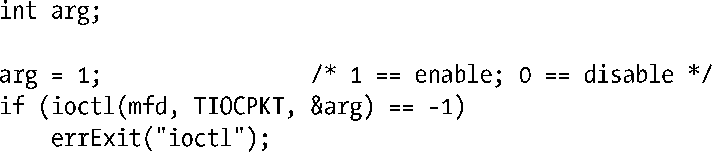

### 64.5　伪终端I/O

一对伪终端同一个双向管道很相似。任何写入到伪终端主设备的数据都会在从设备端作为输入出现，而任何写入到从设备端的数据也会在主设备端作为输入出现。

伪终端对同双向管道之间的区别在于伪终端的从设备端表现得就像一个终端设备一样。从设备端解释输入的方式就和一个普通的控制终端解释键盘输入的方式一样。比如，如果我们写入一个Ctrl-C字符（通常代表中断字符）到伪终端主设备上，则从设备端将为其前台进程组产生一个 SIGINT 信号。如同一个常规的终端一样，当伪终端从设备工作于规范模式下时（默认情况），输入是按行来缓冲的。换句话说，只有当我们向伪终端主设备写入一个换行符时，向从设备端读取输入的程序才会看到一行输入。

同管道一样，伪终端的缓冲能力也是有限的。如果我们将极限耗尽，那么未来的写操作都会阻塞，直到伪终端另一端的进程读取了一些字节后才能再次写入。

> 在Linux上，伪终端的双向缓冲能力大约为4kB。

如果我们关闭所有代表伪终端主设备的文件描述符，那么：

+ 如果从设备有一个控制进程，会发送SIGHUP信号到那个进程（见34.6节）；
+ 向从设备端读取的read()将返回文件结尾EOF（0）；
+ 写入到从设备端的write()操作会失败，错误码为EIO。（在其他一些UNIX实现中，这种情况下write()失败的错误码为ENXIO。）

如果我们关闭所有代表伪终端从设备的文件描述符，那么：

+ 向主设备端读取的read()操作会失败，错误码为EIO（在其他一些UNIX实现中，此时read()会返回文件结尾EOF）；
+ 写入到主设备端的write()操作会成功，除非从设备的输入队列已满，这种情况下write()会阻塞。如果随后重新打开从设备，这些写入的字节都可以被读取。

对于最后一种情况，不同的UNIX实现之间差异很大。在某些UNIX实现中，write()会失败，伴随的错误码为EIO。在其他一些实现中write()却会成功，但是输出的字节会被丢弃（即，如果重新打开从设备端的话这些字节也不能被读取）。一般来说，这些不同之处并不会产生什么问题。通常情况下，位于主设备端的进程通过read()是否返回文件结尾或者失败来检测从设备端是否已经关闭。此时，进程将不再对主设备做进一步的写操作。

#### 信包模式

信包模式是当伪终端从设备上与软流控相关的事件发生时，自动通知给运行在伪终端主设备上进程的机制。这些事件包括：

+ 刷新输入或输出队列；
+ 停止或开启终端输出（Ctrl-S/Ctrl-Q）；
+ 开启或关闭流控。

信包模式能帮助处理提供网络登录服务的伪终端应用（例如Telnet和rlogin）。

信包模式可以通过对代表伪终端主设备的文件描述符上执行TIOCPKT ioctl()来开启。

当启动了信包模式后，从伪终端主设备读取要么返回一个单字节非零控制符，这是一个比特掩码，表示从设备端的状态是否改变，要么返回零字节，紧跟着是写入到从设备端的单个或多字节数据。

当工作于信包模式的伪终端状态发生改变时，select()会提示主设备端发生异常情况（通过参数exceptfds），而 poll()会在revents域中返回POLLPRI。（select()和poll()的说明请参见第63章。）

信包模式在SUSv3规范中并不是标准模式，其中的细节在不同的UNIX实现中有所区别。更多关于Linux下的信包模式，包括用来通知状态改变的比特掩码值，可以在tty_ioctl(4)的手册页中找到。

