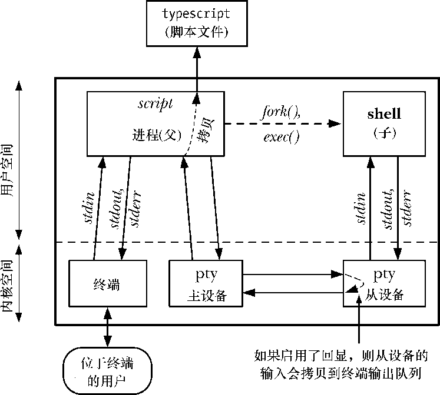
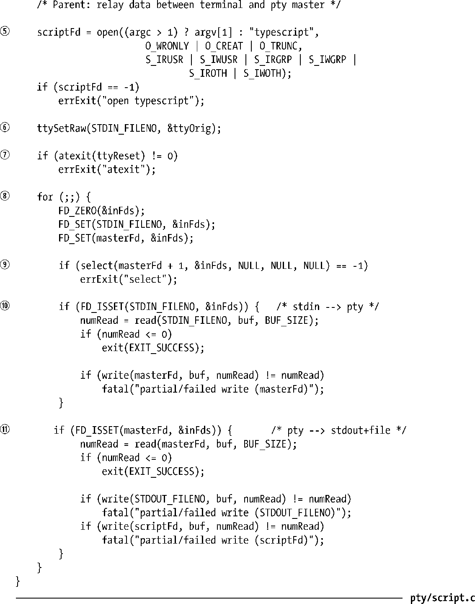
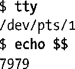
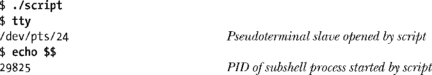
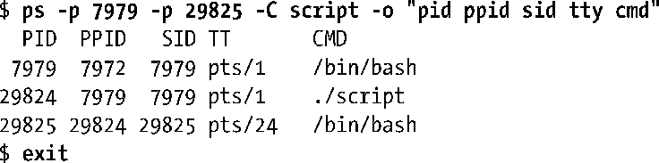
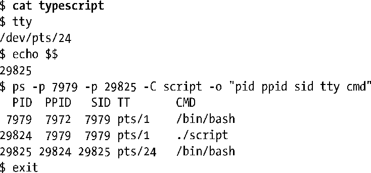

### 64.6　实现script(1)程序

现在我们准备来实现一个简化版的标准script(1)程序。该程序开启一个新的shell会话，从该会话中记录所有的输入和输出到文件中。本书中展示的大部分 shell 会话都是用script程序来记录的。

在普通的登录会话中，shell是直接连接到用户的终端上的。当我们运行script程序时，它将自己置于用户的终端和shell之间，然后使用一对伪终端在自己和 shell 之间创建通信信道（见图64-4）。shell连接到伪终端从设备上。script进程连接到伪终端主设备端。script进程对用户表现为一个代理，接收键入到终端的输入然后写到伪终端主设备上，从伪终端主设备读取输出，再写入到用户的终端上。

<b class="my_markdown">图64-4：script程序</b>

此外，script程序会生成一个输出文件（默认名为typescript），该文件包含所有输出到伪终端主设备的字节。这样就达到了不仅记录了由shell会话产生的输出，而且还包含了用户提供的输入的效果。输入也被记录了，这是因为同常规的终端设备一样，内核通过将输入拷贝到终端输出队列来回显输入字符（见图64-1）。但是，当关闭终端回显功能后，比如读取密码的程序，伪终端从设备的输入就不会拷贝到从设备输出队列中，因而也就不会拷贝到script程序的输出文件中。

我们实现的script程序请参见程序清单64-3。该程序执行以下步骤。

+ 获取程序运行下的终端属性和窗口大小①。这些数据将传递给接下来的ptyFrok()函数，该函数使用这些数据为伪终端从设备设定对应的属性值。
+ 调用我们的ptyFork()函数（见程序清单64-2）来创建子进程，通过伪终端对连接到父进程上②。
+ ptyFork()调用之后，子进程执行一个 shell④。关于shell的选择是由SHELL环境变量来决定的③。如果 SHELL 环境变量没有设定或其值是空字符串，那么子进程将执行/bin/sh。
+ ptyFork()调用之后，父进程执行如下的步骤。
      + 打开script输出文件⑤。如果提供有命令行参数，使用命令行参数作为输出文件名，否则使用默认的typescript作为文件名。
    + 将终端设为原始模式（通过ttySetRaw()函数来设定，见程序清单62-3），这样所有的输入字符都会直接传递给script程序，而不会被终端驱动程序修改⑥。同样，script程序的输出字符也不会被终端驱动程序修改。
    + 调用atexit()安装一个退出处理例程，当程序终止退出时将终端重置为原来的模式⑦。
    + 通过一个循环在终端和伪终端主设备间双向传送数据⑧。在每一轮循环迭代中，首先使用select()（见63.2.1节）来监视终端和伪终端主设备上的输入⑨。如果终端有输入，就读取一些输入并写入到伪终端主设备中⑩。同样的，如果伪终端主设备端有输入的话，程序就读取一些输入并写入到终端以及输出文件中。循环持续执行直到遇到文件结尾或者检测到在被监视的文件描述符上出现错误时，循环终止。

> 处于原始模式下的终端并不意味着原始的、未经过解释的控制字符会传递给shell，或者伪终端从设备的其他任何前台进程组，也不代表该进程组的输出会以原始方式传递给用户的终端。相反，是在从设备中对终端特殊字符做解释（除非该从设备也被显式地设置为原始模式）。通过将用户终端设为原始模式，我们可以避免对输入输出字符做两轮解释。

程序清单64-3：script(1)的简单实现

在下面的shell会话中，我们逐步说明如何使用程序清单64-3中的程序。首先，我们显示出xterm所使用的伪终端名称，登录shell就运行于其之上，以及登录shell的进程ID号。这些信息稍后会很有帮助。

然后启动script程序，该程序也会启动一个子shell进程。再一次的，我们显示出承载shell运行的终端名称以及shell的进程ID号。

现在我们使用ps(1)命令来显示有关两个shell以及script进程间的相关信息，最后关闭由script程序启动的shell。

ps(1)的输出显示了登录shell、script进程以及由script启动的子shell之间的父子进程关系。

此时我们已经返回到了登录shell中。打开typescript文件，其中记录了所有script程序运行时产生的输入和输出。

