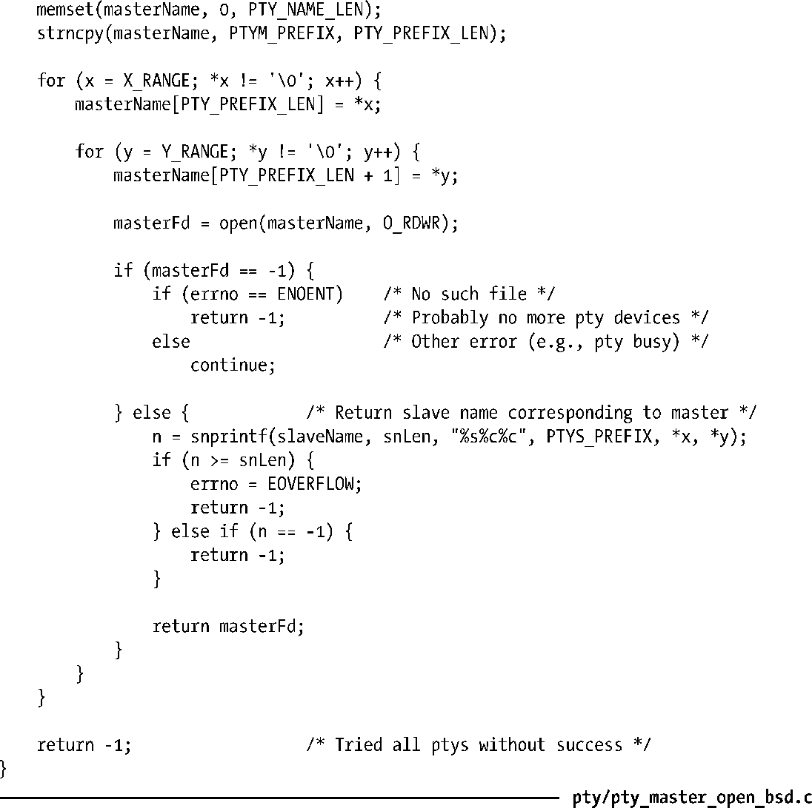

### 64.8　BSD风格的伪终端

本章大部分内容都集中于讨论UNIX 98伪终端，因为这是在SUSv3标准中规定的伪终端风格，因而所有新的程序都应该遵守。但是有时候我们还是会在老的程序中，或者当我们从其他UNIX实现向Linux移植程序时会遇到BSD风格的伪终端。因此现在我们就来探讨一下BSD伪终端的细节。

> Linux已经不再使用BSD风格的伪终端了。从Linux2.6.4版以来，BSD风格的伪终端作为可选的内核组件可以通过 CONFIG_LEGACY_PTYS 在内核配置选项中设定。

BSD伪终端同UNIX98伪终端的区别仅仅只在如何找到并打开伪终端主从设备的细节上。一旦主从设备都已经打开，操作BSD伪终端的方式同UNIX98伪终端一样。

在UNIX98伪终端中，我们获取未使用的伪终端主设备是通过调用posix_openpt()，该函数会打开/dev/ptmx——伪终端主设备的克隆。我们可以通过ptsname()获取相应的伪终端从设备名称。与之相反，BSD伪终端的主从设备已经在/dev下预先创建好了。每个主设备的名称按照/dev/ptyxy的形式呈现，这里x会由[p-za-e]范围内的16个字符来替换，而y由[0-9a-f]范围内的16个字符来替换。与特定的伪终端主设备相对应的从设备名形式为/dev/ttyxt。因此，举个例子，/dev/ptyp0和/dev/ttyp0就组成了一对BSD风格的伪终端。

> 不同的UNIX实现对于BSD风格的伪终端，所提供的数量和名字都有所不同。在有些实现中默认提供32对。大多数实现中至少会提供32对名称形式为/dev/pty[pq][0-9a-f]的BSD伪终端。

要找出未使用的伪终端对，我们通过一个循环来尝试打开每一个主设备，直到能够成功打开其中一个为止。当执行这个循环时，调用open()时可能会遇到两个错误。

+ 如果给定的主设备名不存在，open()调用将失败，错误码为ENOENT。通常这表示我们已经遍历了系统中整个主设备名的组合，但是找不到一个空闲的设备（即，在上述列出的设备名范围内找不到指定的名称）。
+ 如果主设备正在使用中，open()调用也会失败，此时错误码为EIO。我们可以忽略这个错误直接尝试打开下一个设备。

> 在HP-UX 11系统中，当尝试打开一个正在使用中的BSD伪终端主设备时，open()失败的错误码为EBUSY。

一旦找到了可用的主设备，我们就可以获取对应的从设备名称。这只要用tty来替换主设备名中的pty就可以了。之后我们就可以通过open()来打开从设备了。

> 对于BSD伪终端，这里并没有等价于grantpt()的函数来修改从设备的属主和权限。如果我们需要修改的话，那么就必须显式地调用chown()（只有特权级程序才可以这么做）和chmod()。或者写一个设定用户ID的程序（就像pt_chown一样）来为一个非特权级程序执行这样的任务。

程序清单64-4给出了ptyMasterOpen()的另一种实现，这里使用的是BSD风格的伪终端。如果要让我们的script程序（见64.6节）能工作在BSD伪终端上的话，所有要做的就是用这个实现替换之前的ptyMasterOpen()。

程序清单64-4：使用BSD伪终端的ptyMasterOpen()实现

