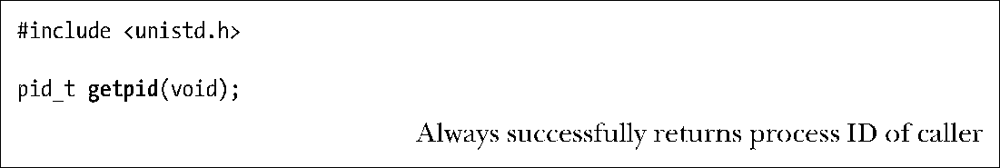
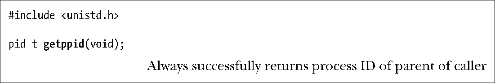

### 6.2　进程号和父进程号

每个进程都有一个进程号（PID），进程号是一个正数，用以唯一标识系统中的某个进程。对各种系统调用而言，进程号有时可以作为传入参数，有时可以作为返回值。比如，系统调用kill()（20.5节）允许调用者向拥有特定进程号的进程发送一个信号。当需要创建一个对某进程而言唯一的标识符时，进程号就会派上用场。常见的例子是将进程号作为与进程相关文件名的一部分。

系统调用getpid()返回调用进程的进程号。

getpid()返回值的数据类型为pid_t，该类型是由SUSv3所规定的整数类型，专用于存储进程号。

除了少数系统进程外，比如init进程（进程号为1），程序与运行该程序进程的进程号之间没有固定关系。

Linux内核限制进程号需小于等于32767。新进程创建时，内核会按顺序将下一个可用的进程号分配给其使用。每当进程号达到32767的限制时，内核将重置进程号计数器，以便从小整数开始分配。

> 一旦进程号达到32767，会将进程号计数器重置为300，而不是1。之所以如此，是因为低数值的进程号为系统进程和守护进程所长期占用，在此范围内搜索尚未使用的进程号只会是浪费时间。
> 在Linux2.4版本及更早版本中，进程号的上限32767，由内核常量PID_MAX所定义。在Linux 2.6版本中，情况有所改变。尽管进程号的默认上限仍是32767，但可以通过Linux系统特有的/proc/sys/kernel/pid_max文件来进行调整（其值=最大进程号+1）。在32位平台中，pid_max文件的最大值为32768，但在64位平台中，该文件的最大值可以高达到222（约400万），系统可能容纳的进程数量会非常庞大。

每个进程都有一个创建自己的父进程。使用系统调用getppid()可以检索到父进程的进程号。

实际上，每个进程的父进程号属性反映了系统上所有进程间的树状关系。每个进程的父进程又有自己的父进程，以此类推，回溯到1号进程——init进程，即所有进程的始祖。使用pstree(1)命令可以查看到这一“家族树”（family tree）。

如果子进程的父进程终止，则子进程就会变成“孤儿”，init进程随即将收养该进程，子进程后续对getppid()的调用将返回进程号1（参照26.2节）。

通过查看由Linux系统所特有的/proc/PID/status文件所提供的PPid字段，可以获知每个进程的父进程。

