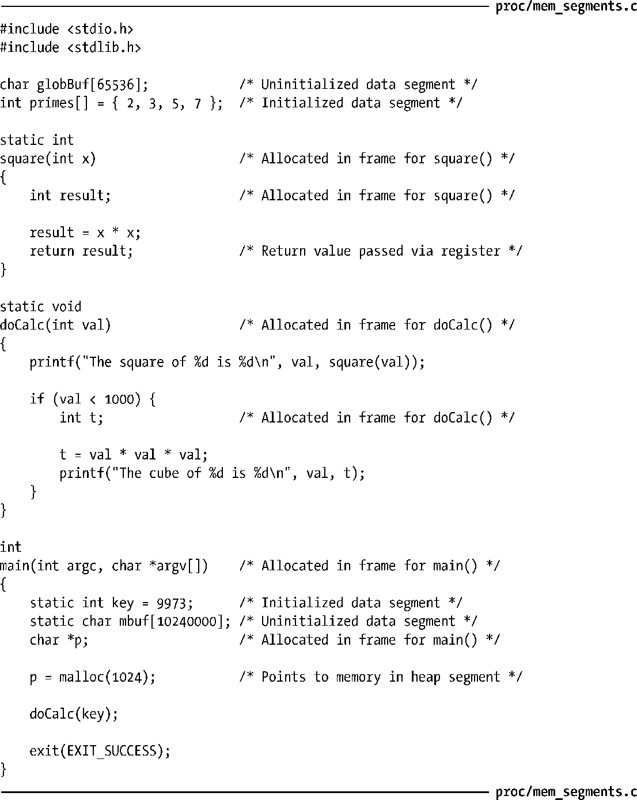
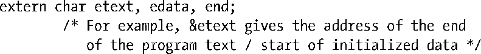
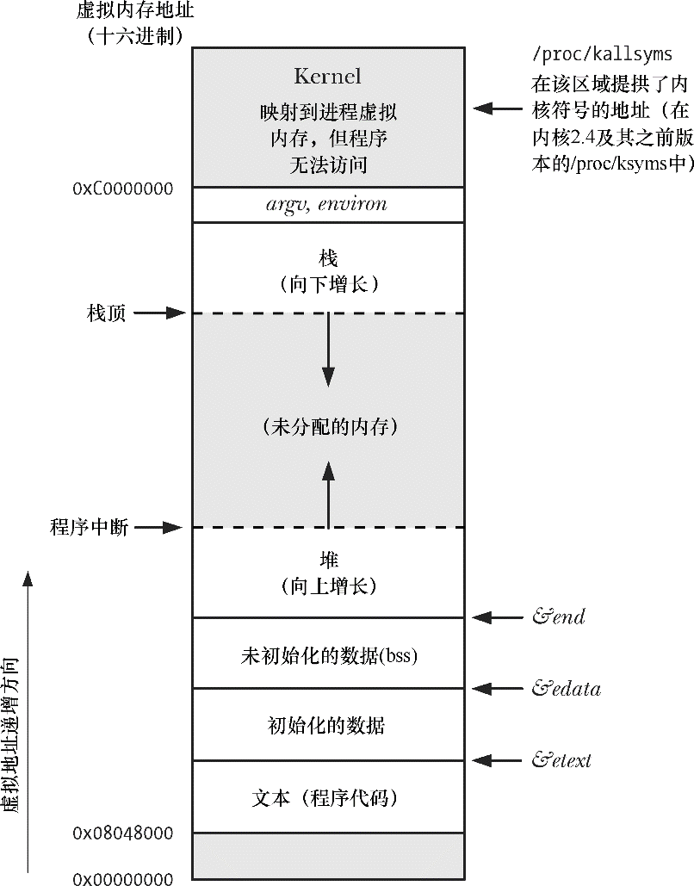

### 6.3　进程内存布局

每个进程所分配的内存由很多部分组成，通常称之为“段（segment）”。如下所示。

+ 文本段包含了进程运行的程序机器语言指令。文本段具有只读属性，以防止进程通过错误指针意外修改自身指令。因为多个进程可同时运行同一程序，所以又将文本段设为可共享，这样，一份程序代码的拷贝可以映射到所有这些进程的虚拟地址空间中。
+ 初始化数据段包含显式初始化的全局变量和静态变量。当程序加载到内存时，从可执行文件中读取这些变量的值。
+ 未初始化数据段包含了未进行显式初始化的全局变量和静态变量。程序启动之前，系统将本段内所有内存初始化为0。出于历史原因，此段常被称为BSS段，这源于老版本的汇编语言助记符“block started by symbol”。将经过初始化的全局变量和静态变量与未经初始化的全局变量和静态变量分开存放，其主要原因在于程序在磁盘上存储时，没有必要为未经初始化的变量分配存储空间。相反，可执行文件只需记录未初始化数据段的位置及所需大小，直到运行时再由程序加载器来分配这一空间。
+ 栈（stack）是一个动态增长和收缩的段，由栈帧（stack frames）组成。系统会为每个当前调用的函数分配一个栈帧。栈帧中存储了函数的局部变量（所谓自动变量）、实参和返回值。6.5节将深入讨论栈帧。
+ 堆（heap）是可在运行时（为变量）动态进行内存分配的一块区域。堆顶端称作program break。

对于初始化和未初始化的数据段而言，不太常用、但表述更清晰的称谓分别是用户初始化数据段（user-initialized data segment）和零初始化数据段（zero-initialized data segment）。

size(1)命令可显示二进制可执行文件的文本段、初始化数据段、非初始化数据段（bss）的段大小。

> 正文中使用的术语“段（segment）”不应与一些硬件体系架构，比如x86-32中使用的硬件分段（segmentation）相混淆。相反，本文中的段是对UNIX系统中进程虚拟内存的逻辑划分。有时，会使用术语“区（section）”来替代段，因为在当下风行的可执行文件格式（ELF）规范中，采用的术语与“区”更趋一致。
> 本书会在多处涉及这种情况：库函数返回的指针指向静态分配的内存。这意味着，该内存既可在初始化数据段中分配，也可在非初始化数据段中分配。（某些情况下，库函数转而会在堆上对内存做一次性动态分配，然而，这一实现细节与这里所要表达的意思无关。）库函数有时会通过静态分配的内存来返回信息，了解这一情况至关重要，因为这片内存的存在独立于函数调用，后续对同一函数的调用可能会将其覆盖（有时，后续对相关函数的调用也有相同的效应）。使用静态分配的内存会使函数不可重入（nonreentrant）。21.1.2节和31.1节将深入讨论重入（reentrancy）问题。

程序清单6-1展示了不同类型的C语言变量，并以注释说明每种变量分属于哪个段。这些说明正确的前提是假定使用了非优化的编译器，且在应用程序二进制接口（ABI）中，是通过栈来传递所有参数的。实际上，优化编译器会将频繁使用的变量分配于寄存器中，或者索性将变量彻底剔除①。此外，一些ABI需要通过寄存器，而不是栈，来传递函数实参和结果。尽管如此，本例只是意在展示C语言变量和进程各段间的映射关系。

程序清单6-1：程序变量在进程内存各段中的位置

> 应用程序二进制接口（ABI）是一套规则，规定了二进制可执行文件在运行时应如何与某些服务（诸如内核或函数库所提供的服务）交换信息。ABI特别规定了使用哪些寄存器和栈地址来交换信息以及所交换值的含义，一旦针对某个特定ABI进行了编译，其二进制可执行文件应能在ABI相同的任何系统上运行。与之相反，标准化的API（如SUSv3）仅能通过编译源代码来保证应用程序的可移植性。

虽然SUSv3未作规定，但在大多数UNIX实现（包括Linux）中C语言编程环境提供了3个全局符号（symbol）：etext、edata和end，可在程序内使用这些符号以获取相应程序文本段、初始化数据段和非初始化数据段结尾处下一字节的地址。使用这些符号，必须显式声明如下：

图6-1展示了各种内存段在 x86-32 体系结构中的布局，该图的顶部标记为 argv、environ的空间用来存储程序命令行实参（通过C语言中main()函数的argv参数获得）和进程环境列表（稍后讨论），图中十六进制的地址会因内核配置和程序链接选项差异而有所不同。图中标灰的区域表示这些范围在进程虚拟地址空间中不可用，也就是说，没有为这些区域创建页表（page table）（参考以下关于虚拟内存管理的讨论）。

<b class="my_markdown">图6-1：在Linux/x86-32中典型的进程内存结构</b>

48.5 节将更为详细地重新讨论进程内存布局的课题，还将论及共享内存和共享库在进程虚拟内存中的放置位置。

