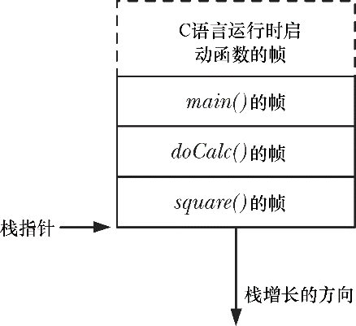

### 6.5　栈和栈帧

函数的调用和返回使栈的增长和收缩呈线性。X86-32体系架构之上的Linux（和多数其他Linux和UNIX实现），栈驻留在内存的高端并向下增长（朝堆的方向）。专用寄存器——栈指针（stack pointer），用于跟踪当前栈顶。每次调用函数时，会在栈上新分配一帧，每当函数返回时，再从栈上将此帧移去。

> 虽然栈向下增长，但仍将栈的增长端称为栈顶，因为抽象地说来，情况本就如此。栈的实际增长方向是个（属于硬件范畴的）实现细节。在HP PA-RISC的Linux实现中，栈的增长方向就是向上的。
> 就虚拟内存而言，分配栈帧后，栈段的大小将会增长，但在大多数（Linux）实现中，释放这些栈帧后，栈的大小并未减少（在分配新的栈帧时，会对这些内存重新加以利用）。当谈论栈段的增长和收缩时，只是从逻辑视角来看待栈帧在栈中的增减情况。

有时，会用用户栈（user stack）来表示此处所讨论的栈，以便与内核栈区分开来。内核栈是每个进程保留在内核内存中的内存区域，在执行系统调用的过程中供（内核）内部函数调用使用。（由于用户栈驻留在不受保护的用户内存中，所以内核无法利用用户栈来达成这一目的。）

每个（用户）栈帧包括如下信息。

+ 函数实参和局部变量：由于这些变量都是在调用函数时自动创建的，因此在C语言中称其为自动变量。函数返回时将自动销毁这些变量（因为栈帧会被释放），这也是自动变量与静态（以及全局）变量主要的语义区别：后者与函数执行无关，且长期存在。
+ （函数）调用的链接信息：每个函数都会用到一些CPU寄存器，比如程序计数器，其指向下一条将要执行的机器语言指令。每当一函数调用另一函数时，会在被调用函数的栈帧中保存这些寄存器的副本，以便函数返回时能为函数调用者将寄存器恢复原状。

因为函数能够嵌套调用，所以栈中可能有多个栈帧。（若一函数递归调用自身，则该函数在栈中将有多个栈帧。）参考程序清单6-1，在square()函数执行期间，栈中包含的帧如图6-3所示。

<b class="my_markdown">图6-3：一个进程栈的示例</b>

