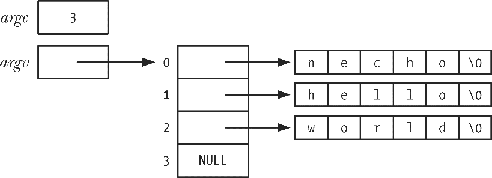
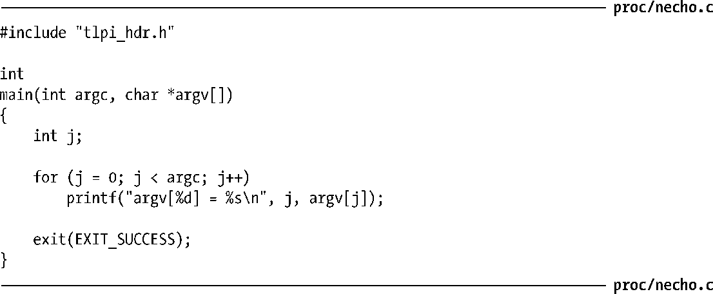

### 6.6　命令行参数（argc, argv）

每个C语言程序都必须有一个称为main()的函数，作为程序启动的起点。当执行程序时，命令行参数（command-line argument）（由shell逐一解析）通过两个入参提供给main()函数。第一个参数int argc，表示命令行参数的个数。第二个参数char *argv[]，是一个指向命令行参数的指针数组，每一参数又都是以空字符（null）②结尾的字符串。第一个字符串，亦即argv[0]指向的，（通常）是该程序的名称。argv中的指针列表以NULL指针结尾（即argv[argc]为NULL）。

argv[0]包含了调用程序的名称，可以利用这一特性玩个实用的小技巧。首先为同一程序创建多个链接（即名称不同），然后让该程序查看argv[0]，并根据调用程序的名称来执行不同任务。gzip(1)、gunzip(1)和zcat(1)命令是该技术应用的一个例子，这些命令链接的都是同一可执行文件。（使用该技术，必须小心处理如下情况：用户通过链接调用程序，但链接名又在该程序的意料之外。）

图6-4展示了执行程序清单6-2中程序所传入参argc和argv的数据结构。该图使用C语言符号“\0”来表示每个字符串末尾的终止空字节。

<b class="my_markdown">图6-4：命令“necho hello world”的argc和argv值</b>

程序清单6-2中的程序回显了其命令行参数，逐一按行输出，前面还冠以要显示的argv成员名称。

程序清单6-2：回显命令行参数

因为argv列表以NULL值终止，所以可以将程序清单6-2中的程序主体改写如下，且每行只输出一个命令行实参：

argc/argv参数机制的局限之一在于这些变量仅对main()函数可用。在保证可移植性的同时，为使这些命令行参数能为其他函数所用，必须把argv以参数形式传递给这些函数，或是设置一个指向argv的全局变量。

要想从程序内任一位置访问这些信息的部分或者全部内容，还有两个方法，但是会破坏程序的可移植性。

+ 通过linux系统专有的/proc/PID/cmdline 文件可以读取任一进程的命令行参数，每个参数都以空（null）字节终止。（程序可以通过/proc/self/cmdline文件访问自己的命令行参数。）
+ GNU C语言库提供有两个全局变量，可在程序内任一位置使用以获取调用该程序时的程序名称（即命令行的第一个参数）。第一个全局变量program_invocation_name，提供了用于调用该程序的完整路径名。第二个全局变量program_invocation_short_name，提供了不含目录的程序名称，即路径名的基本名称（basename）部分，定义_GNU_SOURCE宏后即可从<errno.h>中获得对这两个全局变量的声明。

正如图6-1所示，argv和environ数组，以及这些参数最初指向的字符串，都驻留在进程栈之上的一个单一、连续的内存区域。（下一节将描述environ参数，该参数用于存储程序的环境列表。）此区域可存储的字节数有上限要求，SUSv3规定使用ARG_MAX常量（定义于<limits.h>）或者调用sysconf（_SC_ARG_MAX）函数以确定该上限值（将在11.2节描述sysconf()函数），并且SUSv3还要求ARG_MAX常量的下限为_POSIX_ARG_MAX（4096）个字节，而大多数UNIX实现的限制都远高于此。但SUSv3并未规定对ARG_MAX限制的实现中是否要将一些开销字节计算在内（比如终止空字符、字节对齐、argv和environ指针数组）。

> Linux中的ARG_MAX参数值曾一度固定为32个页面（在Linux/x86-32中即为131072个字节），且包含了开销字节。自内核2.6.23版本开始，可以通过资源限制RLIMIT_STACK来控制argv和environ参数所使用的空间总量上限，在这种情况下，允许argv和environ参数使用的空间上限要比以前大出许多，具体限额为资源软限制RLIMIT_STACK的四分之一，RLIMIT_STACK在调用execve()时已经生效。更多详细信息请参照execve(2)手册页。

许多程序（包括本书中的几个例子）使用getopt()库函数解析命令行选项（即以“-”符号开头的参数）。附录（Appendix）B将描述getopt()函数。

