### 6.7　环境列表

每一个进程都有与其相关的称之为环境列表（environment list）的字符串数组，或简称为环境（environment）。其中每个字符串都以名称=值（name=value）形式定义。因此，环境是“名称-值”的成对集合，可存储任何信息。常将列表中的名称称为环境变量（environment variables）。

新进程在创建之时，会继承其父进程的环境副本。这是一种原始的进程间通信方式，却颇为常用。环境（environment）提供了将信息从父进程传递给子进程的方法。由于子进程只有在创建时才能获得其父进程的环境副本，所以这一信息传递是单向的、一次性的。子进程创建后，父、子进程均可更改各自的环境变量，且这些变更对对方而言不再可见。

环境变量的常见用途之一是在shell中。通过在自身环境中放置变量值，shell就可确保把这些值传递给其所创建的进程，并以此来执行用户命令。例如，环境变量SHELL被设置为shell程序本身的路径名，如果程序需要执行shell时，大多会将此变量视为需要执行的shell名称。

可以通过设置环境变量来改变一些库函数的行为。正因如此，用户无需修改程序代码或者重新链接相关库，就能控制调用该函数的应用程序行为。getopt()函数就是其中一例（附录B），可通过设置POSIXLY_CORRECT环境变量来改变此函数的行为。

大多数shell使用export命令向环境中添加变量值。


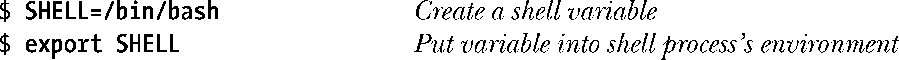
在bash shell和Korn shell中，可以简写为：


在C shell中，使用的则是setenv命令：


上述命令把一个值永久地添加到shell环境中，此后这个shell创建的所有子进程都将继承此环境。在任一时刻，可以使用 unset 命令撤销一个环境变量（在 C shell 中则使用unsetenv命令）。

在Bourne shell和其衍生shell（诸如bash shell和Korn shell）中，可使用下列语法向执行某应用程序的环境中添加一个变量值，而不影响其父shell（和后续命令）：

```go
$ NAME=value program

```

此命令仅向执行特定程序的子进程环境添加了一个（环境变量）定义。如果希望（多个变量对该程序有效），可以在program前放置多对赋值（以空格分隔）。

> env命令在运行程序时使用了一份经过修改的shell环境列表副本。可同时为shell环境列表副本增加和移除环境变量定义，以修改此环境列表。详细内容请参阅env(1)手册。

printenv命令显示当前的环境列表，此处是其输出的一例：


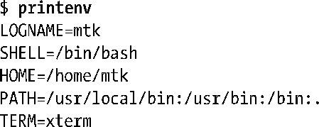
后续章节中将适时描述大多数上述环境变量的用途（也可参阅environ(7)手册）。

由以上输出可知，环境列表的排列是无序的，列表中的字符串顺序不过是最易于实现的排列形式。一般而言，无序的环境列表不是问题，因为通常都是访问单个的环境变量，而非环境列表中按序排列的一串。

通过Linux专有的/proc/PID/environ文件检查任一进程的环境列表，每一个“NAME=value”对都以空字节终止。

#### 从程序中访问环境

在C语言程序中，可以使用全局变量char **environ访问环境列表。（C运行时启动代码定义了该变量并以环境列表位置为其赋值。）environ与argv参数类似，指向一个以NULL结尾的指针列表，每个指针又指向一个以空字节终止的字符串。图6-5所示为与上述printenv命令输出环境相对应的环境列表数据结构。

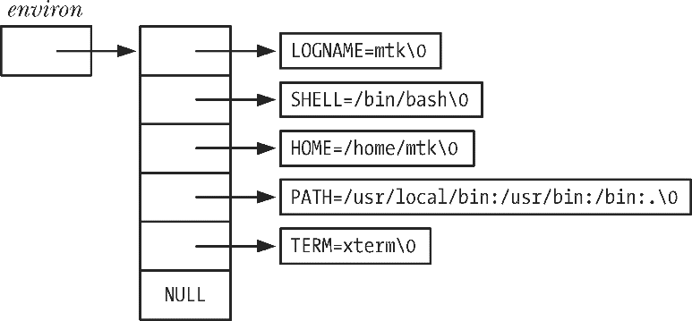
<center class="my_markdown"><b class="my_markdown">图6-5：进程环境列表数据结构的示例</b></center>

程序清单6-3中的程序通过访问environ变量来展示该进程环境中的所有值。该程序的输出结果与printenv命令的输出结果相同。程序中的循环利用指针来遍历environ变量。虽然可以把environ当成数组来使用（正如程序清单6-2中argv的用法），但这多少有些生硬，因为环境列表中各项的排列不分先后，而且也没有变量（相当于argc）用来指定环境列表的长度。（出于同样原因，也没有对图6-5中的environ数组诸元素进行编号。）

程序清单6-3：显示进程环境


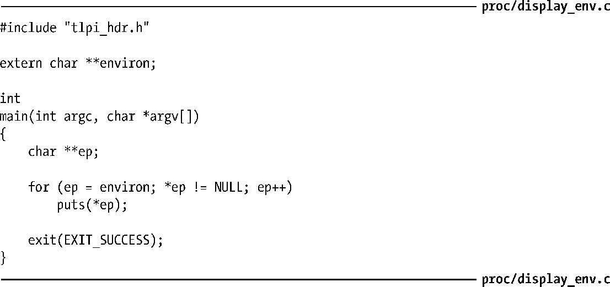
另外，还可以通过声明main()函数中的第三个参数来访问环境列表：


该参数随即可被视为environ变量来使用，所不同的是，该参数的作用域在main()函数内。虽然UNIX系统普遍实现了这一特性，但还是要避免使用，因为除了局限于作用域限制外，该特性也不在SUSv3的规范之列。

getenv()函数能够从进程环境中检索单个值。


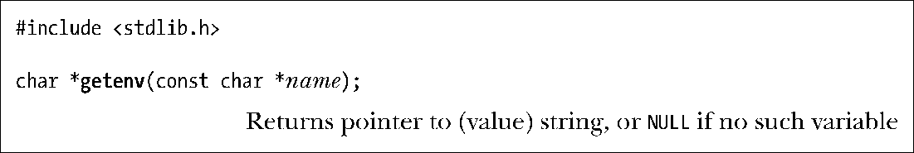
向getenv()函数提供环境变量名称，该函数将返回相应字符串指针。因此，就前面所示的环境（列表）示例来看，如果指定SHELL为参数name，那么将返回/bin/bash。如果不存在指定名称的环境变量，那么getenv()函数将返回NULL。

以下是使用getenv()函数时可移植性方面的注意事项。

+ SUSv3规定应用程序不应修改getenv()函数返回的字符串，这是由于（在大多数UNIX实现中）该字符串实际上属于环境的一部分（即name=value字符串的value部分）。若需要改变一个环境变量的值，可以使用setenv()函数或putenv()函数（见下文）。
+ SUSv3允许getenv()函数的实现使用静态分配的缓冲区返回执行结果，后续对getenv()、setenv()、putenv()或者unsetenv()的函数调用可以重写该缓冲区。虽然glibc库的getenv()函数实现并未这样使用静态缓冲区，但具备可移植性的程序如需保留getenv()调用返回的字符串，就应先将返回字符串复制到其他位置，之后方可对上述函数发起调用。

#### 修改环境

有时，对进程来说，修改其环境很有用处。原因之一是这一修改对该进程后续创建的所有子进程均可见。另一个可能的原因在于设定某一变量，以求对于将要载入进程内存的新程序（“execed”）可见。从这个意义上讲，环境不仅是一种进程间通信的形式，还是程序间通信的方法。（第27章将深入描述这一点，还将解释在同一进程中exec()函数如何使当前程序被一新程序所替代。）

putenv()函数向调用进程的环境中添加一个新变量，或者修改一个已经存在的变量值。


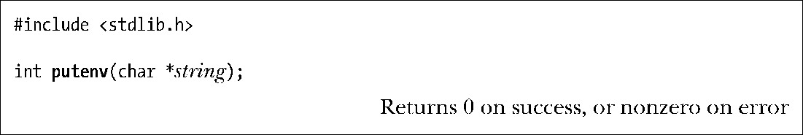
参数string是一指针，指向name=value形式的字符串。调用putenv()函数后，该字符串就成为环境的一部分，换言之，putenv函数将设定environ变量中某一元素的指向与string参数的指向位置相同，而非string参数所指向字符串的复制副本。因此，如果随后修改string参数所指的内容，这将影响该进程的环境。出于这一原因，string参数不应为自动变量（即在栈中分配的字符数组<sup class="my_markdown">③</sup>），因为定义此变量的函数一旦返回，就有可能会重写这块内存区域。

注意，putenv()函数调用失败将返回非0值，而非−1。

putenv()函数的glibc库实现还提供了一个非标准扩展。如果string参数内容不包含一个等号（=），那么将从环境列表中移除以string参数命名的环境变量。

setenv()函数可以代替putenv()函数，向环境中添加一个变量。


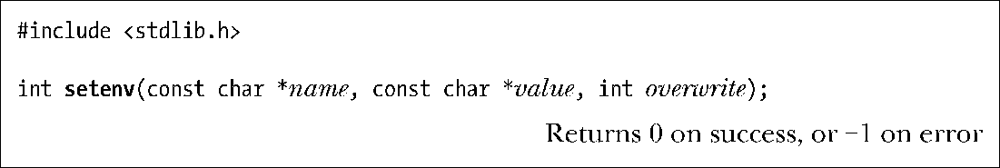
setenv()函数为形如name=value的字符串分配一块内存缓冲区，并将name和value所指向的字符串复制到此缓冲区，以此来创建一个新的环境变量。注意，不需要（实际上，是绝对不要）在name的结尾处或者value的开始处提供一个等号字符，因为setenv()函数会在向环境添加新变量时添加等号字符。

若以name标识的变量在环境中已经存在，且参数overwrite的值为0，则setenv()函数将不改变环境，如果参数overwrite的值为非0，则setenv()函数总是改变环境。

这一事实——setenv()函数复制其参数（到环境中）——意味着与putenv()函数不同，之后对name和value所指字符串内容的修改将不会影响环境。此外，使用自动变量作为setenv()函数的参数也不会有任何问题。

unsetenv()函数从环境中移除由name参数标识的变量。


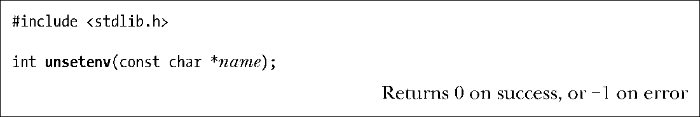
同setenv()函数一样，参数name不应包含等号字符。

setenv()函数和unsetenv()函数均来自BSD，不如putenv()函数使用普遍。尽管起初的POSIX.1标准和SUSv2并未定义这两个函数，但SUSv3已将其纳入规范。

> 在glibc 2.2.2之前版本中，unsetenv()函数原型的返回值为void类型，这与最初的BSD实现中unsetenv的函数原型相同，一些UNIX实现目前仍然沿用BSD原型。

有时，需要清除整个环境，然后以所选值进行重建。例如，为了以安全方式执行set-user-ID程序（38.8节），就需要这样做。可以通过将environ变量赋值为NULL来清除环境。


这也正是clearenv()库函数的工作内容。


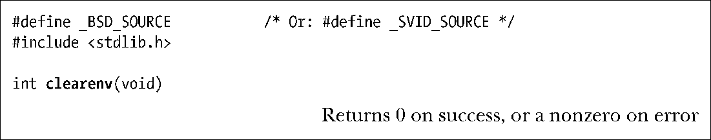
在某些情况下，使用setenv()函数和clearenv()函数可能会导致程序内存泄露。前面已然提及：setenv()函数所分配的一块内存缓冲区，随之会成为进程环境的一部分。而调用clearenv()时则没有释放该缓冲区（clearenv()调用并不知晓该缓冲区的存在，故而也无法将其释放）。反复调用这两个函数的程序，会不断产生内存泄露。实际上，这不大可能成为一个问题，因为程序通常仅在启动时调用clearenv()函数一次，用于移除继承自其父进程（即调用exec()函数来启动当前程序的程序）环境中的所有条目。

> 许多UNIX实现都支持clearenv()函数，但是SUSv3没有对此函数进行规范。SUSv3规定如果应用程序直接修改environ变量，正如clearenv()函数所做的那样，则不对setenv()、unsetenv()和getenv()的行为进行定义。（这一作法的根本原因在于禁止符合SUSv3标准的应用程序直接修改环境，意在使UNIX实现能完全控制其实现环境变量时所采用的数据结构。）SUSv3允许应用程序清空自身环境的唯一方法是首先获取所有环境变量的列表（通过environ变量获得所有环境变量的名称），然后逐一调用unsetenv()移除每个环境变量。

#### 程序示例

程序清单6-4展示了本节讨论的所有函数的用法。该应用程序首先清空环境，然后向环境中逐一添加命令行参数所提供的环境变量定义；之后，如果环境中尚无名为GREET的变量，就向环境中添加该变量；接着，从环境中移除名为BYE的变量；最后打印当前环境列表。此处为该程序运行时输出结果的一例：


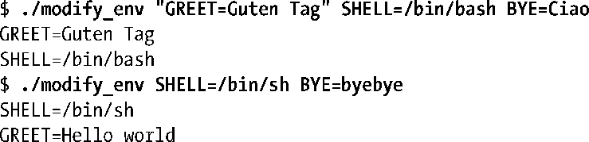
如果将environ参数赋值为NULL（正如程序清单6-4中clearenv()函数调用的所作所为），那么可以预见如下形式的循环（如程序清单6-4中使用的循环）将失败，因为*environ是无效的。


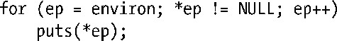
然而，如果setenv()函数和putenv()函数发现environ参数为NULL，则会创建一个新的环境列表，并使environ参数指向此列表，结果上面的循环操作又将正确运行。

程序清单6-4：修改进程环境


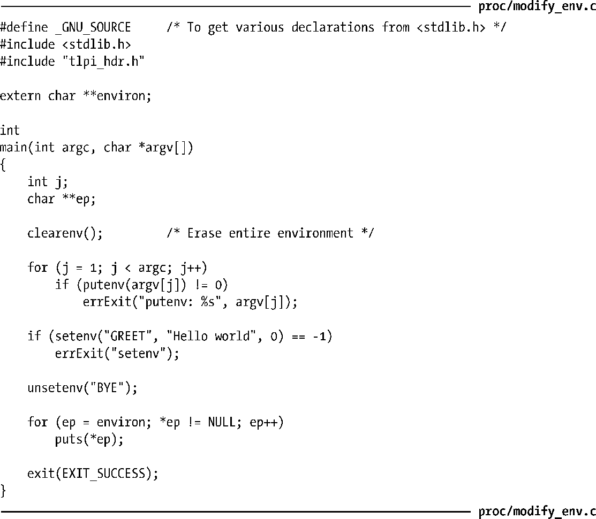
