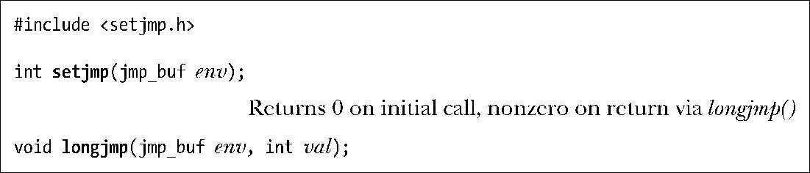
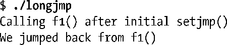
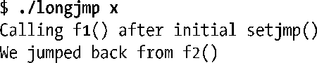
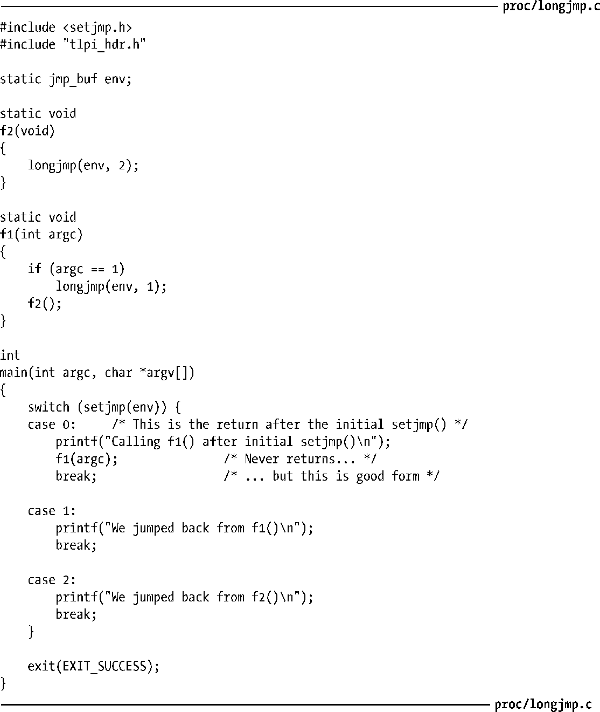
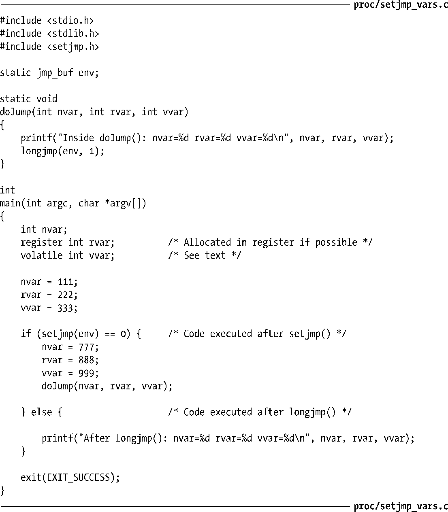
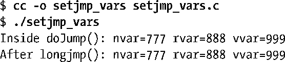
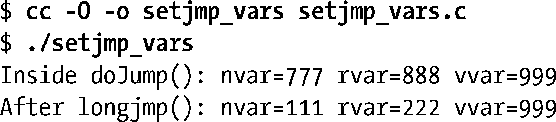
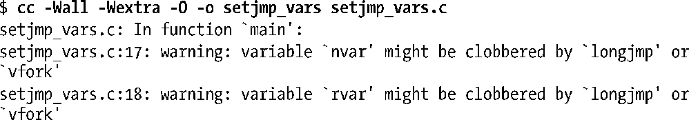

### 6.8　执行非局部跳转：setjmp()和longjmp()

使用库函数setjmp()和longjmp()可执行非局部跳转（nonlocal goto）。术语“非局部（nonlocal）”是指跳转的目标为当前执行函数之外的某个位置。

C语言，像许多其他编程语言一样，包含goto语句。这就好比打开了潘多拉的魔盒。若无止境的滥用，将使程序难以阅读和维护。不过偶尔也能一显身手，令程序更简单、更快速，或是兼而有之。

C语言的goto语句存在一个限制，即不能从当前函数跳转到另一函数。然而，偶尔还是需要这一功能的。考虑错误处理中经常出现的如下场景：在一个深度嵌套的函数调用中发生了错误，需要放弃当前任务，从多层函数调用中返回，并在较高层级的函数中继续执行（也许甚至是在main()中）。要做到这一点，可以让每个函数都返回一个状态值，由函数的调用者检查并做相应处理。这一方法完全有效，而且，在许多情况下，是处理这类场景的理想方法。然而，有时候如果能从嵌套函数调用中跳出，返回该函数的调用者之一（当前调用者或者调用者的调用者，等等），编码会更为简单。setjmp()和longjmp()就提供了这一功能。

> 由于在C语言中，所有函数作用域的层级相同（即标准C语言不支持嵌套函数申明，尽管gcc将此功能作为其扩展功能），所以goto语句不能应用于函数间跳转。给定两个函数X和Y，编译器无从知晓当调用Y时，X函数的栈帧是否在栈上，所以也无法判断从Y函数跳转（goto）到X函数是否可行。支持嵌套函数声明的语言，比如Pascal语言，允许goto从一个嵌套函数跳转到其调用者，编译器得以根据函数的静态作用域来确定函数动态作用域的某些信息。因此，编译器若在词法解析时获悉函数Y嵌套于函数X之内④，也必然能够推断当调用Y时，X函数的栈帧一定已然在栈中存在（即动态作用域），并能为函数Y产生goto代码，从Y中跳转到X函数的某处。

setjmp()调用为后续由 longjmp()调用执行的跳转确立了跳转目标。该目标正是程序发起setjmp()调用的位置。从编程角度看来，调用longjmp()函数后，看起来就和从第二次调用setjmp()返回时完全一样。通过查看setjmp()返回的整数值，可以区分setjmp调用是初始返回还是第二次“返回”。初始调用返回值为0，后续“伪”返回的返回值为longjmp()调用中val参数所指定的任意值。通过对val参数使用不同值，能够区分出程序中跳转至同一目标的不同起跳位置。

如果指定longjmp()函数的val参数值为0，而longjmp函数对此又不做检查，就会导致模拟setjmp()时返回值为0，如同初次调用setjmp()函数返回时一样。出于这一原因，如果指定val参数值为0，则longjmp()调用实际会将其替换为1。

这两个函数的入参env为成功实现跳转提供了黏合剂。setjmp()函数把当前进程环境的各种信息保存到env参数中。调用longjmp()时必须指定相同的env变量，以此来执行“伪”返回。由于对setjmp()函数和longjmp()函数的调用分别位于不同函数（否则，使用简单的goto即可），所以应该将env参数定义为全局变量，或者将env作为函数入参来传递，后一种做法较为少见。

调用setjmp()时，env除了存储当前进程的其他信息外，还保存了程序计数寄存器（指向当前正在执行的机器语言指令）和栈指针寄存器（标记栈顶）的副本。这些信息能够使后续的longjmp()调用完成两个关键步骤的操作。

+ 将发起longjmp()调用的函数与之前调用setjmp()的函数之间的函数栈帧从栈上剥离。有时又将此过程称为“解开栈（unwinding the stack）”，这是通过将栈指针寄存器重置为env参数内的保存值来实现的。
+ 重置程序计数寄存器，使程序得以从初始的setjmp()调用位置继续执行。同样，此功能是通过env参数中的保存值（程序计数寄存器）来实现的。

#### 程序示例

程序清单6-5展示了setjmp()和longjmp()函数的用法。该程序通过setjmp()的初始调用建立了一个跳转目标，接下来的switch（针对setjmp()调用的返回值）用于检测是初次从setjmp()调用返回还是在调用longjmp()后返回。当setjmp()调用返回值为0时，亦即对setjmp()的初始调用完成后，将调用f1()函数，f1()函数根据argc参数值（即命令行参数个数）来决定是立刻调用longjmp()函数还是继续去调用f2()函数。如果是调用f2()函数，则f2()函数将马上调用longjmp()函数。两处对longjmp()的调用都会使进程恢复到调用setjmp()的位置。程序在两处调用中为val参数设定了不同值，以供main()函数的switch语句区分发生跳转的函数，并打印相应信息。

在不带任何命令行参数的情况下运行程序清单6-5中的程序，结果如下所示：

指定命令行参数，会使程序跳转发生在函数f2()中：

程序清单6-5：展示函数setjmp()和longjmp()的用法

#### 对setjmp()函数的使用限制

SUSv3和C99规定，对setjmp()的调用只能在如下语境中使用。

+ 构成选择或迭代语句中（if、switch、while等）的整个控制表达式。
+ 作为一元操作符!（not）的操作对象，其最终表达式构成了选择或迭代语句的整个控制表达式。
+ 作为比较操作（==、!=、<等）的一部分，另一操作对象必须是一个整数常量表达式，且其最终表达式构成选择或迭代语句的整个控制表达式。
+ 作为独立的函数调用，且没有嵌入到更大的表达式之中。

注意：C语言赋值语句不在上述列表之列。以下形式的语句是不符合标准的：

之所以规定这些限制，是因为作为常规函数的setjmp()实现无法保证拥有足够信息来保存所有寄存器值和封闭表达式中用到的临时栈位置，以便于在longjmp()调用后此类信息能得以正确恢复。因此，仅允许在足够简单且无需临时存储的表达式中调用setjmp()。

#### 滥用longjmp()

如果将env缓冲区定义为全局变量，对所有函数可见（这也是通常用法），那么就可以执行如下操作序列。

**1．** 调用函数x()，使用setjmp()调用在全局变量env中建立一个跳转目标。

**2．** 从函数x()中返回。

**3．** 调用函数y()，使用env变量调用longjmp()函数。

这是一个严重错误，因为longjmp()调用不能跳转到一个已经返回的函数中。思考一下，在这种情况下，longjmp()函数会对栈打什么主意——尝试将栈解开，恢复到一个不存在的栈帧位置，这无疑将引起混乱。如果幸运的话，程序会一死（crash）了之。然而，取决于栈的状态，也可能会引起调用与返回间的死循环，而程序好像真地从一个当前并未执行的函数中返回了。（在多线程程序中有与之相类似的滥用，在线程某甲中调用setjmp()函数，却在线程某乙中调用longjmp()。）

> SUSv3规定，如果从嵌套的信号处理器（signal handler）（即信号某甲的处理器正在运行时，又发起对信号某乙处理器的调用）中调用longjmp()函数，则该程序的行为未定义。

#### 优化编译器的问题

优化编译器会重组程序的指令执行顺序，并在CPU寄存器中，而非RAM中存储某些变量。这种优化一般依赖于反映了程序词法结构的运行时（run-time）控制流程。由于setjmp()和longjmp()的跳转操作需在运行时才能得以确立和执行，并未在程序的词法结构中有所反映，故而编译器在进行优化时也无法将其考虑在内。此外，某些应用程序二进制接口（ABI）实现的语义要求longjmp()函数恢复先前setjmp()调用所保存的CPU寄存器副本。这意味着longjmp()操作会致使经过优化的变量被赋以错误值。程序清单6-6中的程序行为就是其中一例。

程序清单6-6：编译器的优化和longjmp()函数相互作用的示例

以常规方式编译程序清单6-6中的程序，输出结果符合预期。

然而，若以优化方式编译该程序，结果就有些出乎预料了。

此处，在longjmp()调用后，nvar和rvar参数被重置为setjmp()初次调用时的值。起因是优化器对代码的重组受到longjmp()调用的干扰。作为候选优化对象的任一局部变量可能都难免会遇到这类问题，一般包含指针变量和char、int、float、long等任何简单类型的变量。

将变量声明为volatile，是告诉优化器不要对其进行优化，从而避免了代码重组。在上面的程序输出中，无论编译优化与否，声明为volatile的变量vvar都得到了正确处理。

因为不同的优化器有着不同的优化方法，具备良好移植性的程序应在调用setjmp()的函数中，将上述类型的所有局部变量都声明为volatile。

若在GNU C语言编译器中加入–Wextra（产生额外的警告信息）选项，setjmp_vars.c程序的编译结果将显示有帮助的警告信息如下：

> 无论优化与否，查看编译setjmp_vars.c程序所产生的汇编语言输出都是有益的。cc –S命令产生一个以.s为扩展名的文件，内容为程序的汇编代码。

#### 尽可能避免使用setjmp()函数和longjmp()函数

如果说goto语句会使程序难以阅读，那么非局部跳转会让事情的糟糕程度增加一个数量级，因为它能在程序中任意两个函数间传递控制。因此，应当慎用setjmp()函数和longjmp()函数。在设计和编码时花点心思来避免使用这两个函数，这通常是值得的。程序更具可读性，可能会更具可移植性。话虽如此，但在编写信号处理器时，这些函数偶尔还会派上用场——讨论信号时将重新论及这些函数的变体（参见21.2.1节中的sigsetjmp()函数和siglongjmp()函数）。

