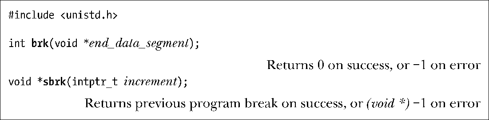

### 7.1.1　调整program break：brk()和sbrk()

改变堆的大小（即分配或释放内存），其实就像命令内核改变进程的program break位置一样简单。最初，program break正好位于未初始化数据段末尾之后（如图6-1所示，与&end位置相同）。

在program break的位置抬升后，程序可以访问新分配区域内的任何内存地址，而此时物理内存页尚未分配。内核会在进程首次试图访问这些虚拟内存地址时自动分配新的物理内存页。

传统的UNIX系统提供了两个操纵program break的系统调用：brk()和sbrk()，在Linux中依然可用。虽然代码中很少直接使用这些系统调用，但了解它们有助于弄清内存分配的工作过程。

系统调用brk()会将program break设置为参数end_data_segment所指定的位置。由于虚拟内存以页为单位进行分配，end_data_segment实际会四舍五入到下一个内存页的边界处。

当试图将program break设置为一个低于其初始值（即低于&end）的位置时，有可能会导致无法预知的行为，例如，当程序试图访问的数据位于初始化或未初始化数据段中当前尚不存在的部分时，就会引发分段内存访问错误（segmentation fault）（SIGSEGV信号，在20.2节描述）。program break可以设定的精确上限取决于一系列因素，这包括进程中对数据段大小的资源限制（36.3节中描述的RLIMIT_DATA），以及内存映射、共享内存段、共享库的位置。

调用sbrk()将program break在原有地址上增加从参数increment传入的大小。（在Linux中，sbrk()是在brk()基础上实现的一个库函数。）用于声明increment的intptr_t类型属于整数数据类型。若调用成功，sbrk()返回前一个program break的地址。换言之，如果program break增加，那么返回值是指向这块新分配内存起始位置的指针。

调用sbrk(0)将返回program break的当前位置，对其不做改变。在意图跟踪堆的大小，或是监视内存分配函数包的行为时，可能会用到这一用法。

> SUSv2定义了brk()和sbrk()，标记为Legacy（传统）。但SUSv3删除了这些定义。

